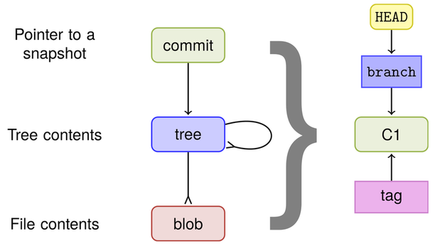
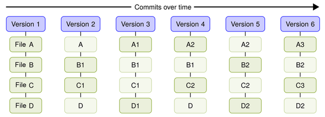
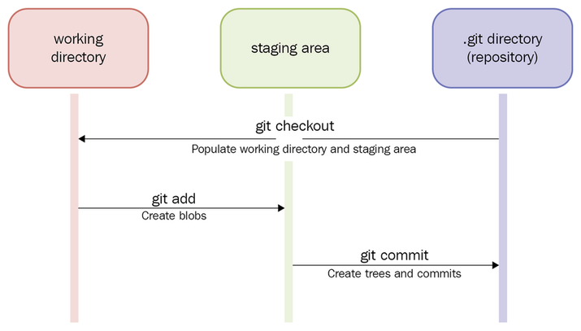
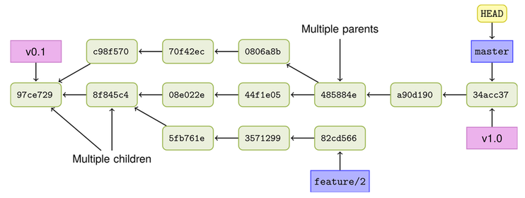
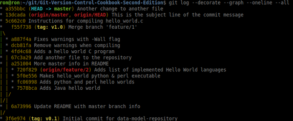
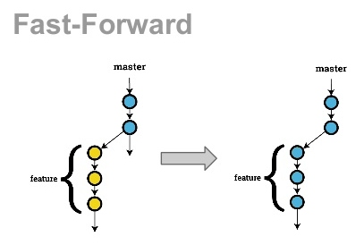
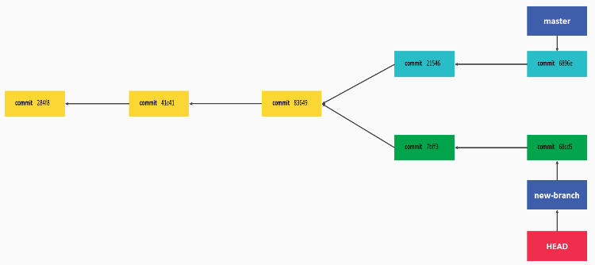
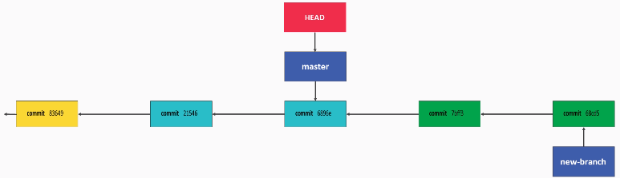
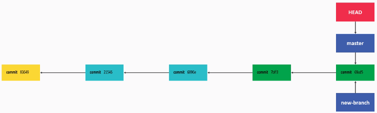

[toc]

**GitHub token**:  ac6d335057be0a7f3594db430d2751ec84114d94
**created Jul 19, 2020**

## Navigating GIT

In this section:
- objects
- stages
- the DAG (history)
- Extracting bug fixes
- listing changed files
- finding commits in history
- searching history code

### The GIT object storage model

Git uses a **key:vale** object storage model. There are 4 object types in Git:
- blobs - these are files
- trees - these are directories
- commits - a snapshot of the root tree with the changed files encalsulated in it, along with pointers to unchanged files.
- tags - a tag is used to mark a specific commit as a point in the development of a branch. it is commonly used to mark a release.

The objects point to each other like this:

The above graphic also illustrates that HEAD always points to the current branch, which in turn always points to the latest commit in that branch. And the commit points to a snapshot of the root tree.

So effectively, `HEAD` points to the latest commit in the current branch.

The following graphic better illustrates the commit part:

### Git objects

#### The `commit` object

The commit object is a snapshot of the entire root tree that containts any changed files in their entirety, plus pointers to all unchanged files.

To display a commit use the `cat-file` command:

    $ git cat-file -p HEAD  # use HEAD to get the latest commit
    tree 34fa038544bcd9aed660c08320214bafff94150b
    parent 5c662c018efced42ca5e9cce709787c40a849f34
    author John Doe <john.doe@example.com> 1386933960 +0100
    committer John Doe <john.doe@example.com> 1386941455 +0100

The commit object contains the root tree, parent (the commit right before this one), the author and timestamp, and the committer and timestamp.

#### The `tree` objects

Here is the tree object (root tree) from the commit above:

    $ git cat-file -p 34fa038544bcd9aed660c08320214bafff94150b
    100644 blob f21dc2804e888fee6014d7e5b1ceee533b222c15    README.md
    040000 tree abc267d04fb803760b75be7e665d3d69eeed32f8    a_sub_directory
    100644 blob b50f80ac4d0a36780f9c0636f43472962154a11a    another-file.txt
    100644 blob 92f046f17079aa82c924a9acf28d623fcb6ca727    cat-me.txt
    100644 blob bb2fe940924c65b4a1cefcbdbe88c74d39eb23cd    hello_world.c

As you can see, the tree contains other trees (subdirectories) and blobs (files).

Instead of getting the hash of the tree from HEAD like we did above, We can also request the tree from the latest commit this way:

    `git cat-file -p HEAD^{tree}`.

#### The `blob` object

Here is how to look at one of the blob objects above:

    `$ git cat-file -p 92f046f17079aa82c924a9acf28d623fcb6ca727`
    Not really that exciting, huh?

It merely displays the contents of the file.

#### The `branch` objects

You cannot print a branch using `cat-file` like the other objects. But to see that the branch object merely points to the latest commit, first follow the path thru the **.git** folder to find the branch in **.git/refs/heads/master**, then simply **cat** that out:

    $ cat .git/refs/heads/master
    13dcada077e446d3a05ea9cdbc8ecc261a94e42d

It just points to the latest commit, the same as `HEAD`. And thus, the commit itself points to the root tree snapshot of that commit.

#### The `tag` object

To view a tag, first display available tags using `git tag`:

    $ git tag
    v0.1
    v1.0

Then use `cat-file` on that tag:

    $ git cat-file -p v1.0
    object f55f7383b57ad7c11cf56a7c55a8d738af4741ce
    type commit
    tag v1.0
    tagger John Doe <john.doe@example.com> 1526017989 +0200

    We got the hello world C program merged, let's call that a release 1.0

The object referenced above is the latest commit on master. Following is the tag name, the tagger and timestamp, and the tag message itself.

The `git cat-file -p` command is used to print an object. It is not used in normal operations, but it is useful to see how the objects are tied together.

Finally, you can use `git ls-tree` to view the contents of trees and subtrees. For instance: `git ls-tree HEAD` or `git ls-tree master` will show you the entire root tree and subtrees, effectively the entire repo.

Also, you can use `git show` to see a different view of objects:

    $ git show HEAD
    commit a355bbcb0ffccc3a5b47255742606411996abcb2 (HEAD -> master)
    Author: ron fish <roninhockley@nikkyrron.com>
    Date:   Sun Jun 2 21:04:33 2019 -0500

        Another change to another file

    diff --git a/another-file.txt b/another-file.txt
    index b50f80a..35d3110 100644
    --- a/another-file.txt
    +++ b/another-file.txt
    @@ -1 +1,3 @@
     This is just another file
    +Another line
    +Whoops almost forgot this

### The 3 stages of commits and the DAG

This is illustrated in the following graphic:

#### Viewing the development flow (DAG)

The DAG is the _directed acyclic graph_ which represents the development of a branch over time. It is constructed under the principle that commits are tied to their parent commits:

To view history on the command line, use `git log`:

    git log -3
    commit 34acc370b4d6ae53f051255680feaefaf7f7850d
    Author: John Doe <john.doe@example.com>
    Date:   Fri Dec 13 12:26:00 2013 +0100

    This is the subject line of the commit message.

    It should be followed by a blank line then the body, which is this text. Here
    you can have multiple paragraphs etc. and explain your commit. It's like an
    email with subject and body, so try to get people's attention in the subject

    commit a90d1906337a6d75f1dc32da647931f932500d83
    Author: John Doe <john.doe@example.com>
    Date:   Fri Dec 13 12:17:42 2013 +0100

    Instructions for compiling hello_world.c

    commit 485884efd6ac68cc7b58c643036acd3cd208d5c8
    Merge: 44f1e05 0806a8b
    Author: John Doe <john.doe@example.com>
    Date:   Fri Dec 13 12:14:49 2013 +0100

    Merge branch 'feature/1'

    Adds a hello world C program.

  There are several ways to enhance the output, such as `git config --global color.ui auto` which turns on colors (they are probly on by default), or, even better; `git log --decorate --graph --oneline --all` which shows a tree representation:

  

  ### Extracting bug fixes to create a release note

Since the purpose of a release is commonly to fix bugs, you can extract all commits that address a bug and compile from that release notes for the next release.

In practice what this means is you select all commits since the last release and single out the ones that have a string similar to `Fixes-bug: XXXX`, indicating that the commit is a bug fix. Then, with some grep and sed commands, you present them in a nice list with each line formatted.

Here is an example of what comes back when doing `git log --grep "Bug: "`. This is what we want to transform:

    commit f86a488e32906593903acb31a93a82bed8d87915
    Author: Stefan Lay <stefan.lay@sap.com>
    Date:   Mon Dec 2 17:24:09 2013 +0100

        Implement rebase.autostash

        This feature was introduced in native git with version 1.8.4.

        Bug: 422951
        Change-Id: I42f194174d64d7ada6631e2156c2a7bf93b5e91c
        Signed-off-by: Matthias Sohn <matthias.sohn@sap.com>

Here is the format we want to transform the output into:

`Commit-id: Commit subject Fixes-bug: xxx`

Here is an example of a one-liner that does that:

    $ git log --grep "Bug: " v3.1.0.201310021548-r..HEAD --pretty="%h|%s%n%b" | grep -E "\||Bug: " | sed -e 's/|/: /' -e 's/Bug:/Fixes-bug:/'

The command works as follows:
- run git log and grep for **"Bug: "**, starting with the commit of the last release, all the way to HEAD.
- Next is the **--pretty** option for formatting the output to make it easier for parsing out only the lines that contain the big statement
- next we grep out the lines with Bug in them
- we feed those lines to sed to format the output

Here is the result:

    f86a488: Implement rebase.autostash
    Fixes-bug: 422951
    7026658: CLI status should support --porcelain
    Fixes-bug: 419968
    e0502eb: More helpful InvalidPathException messages (include reason)
    Fixes-bug: 413915
    f4dae20: Fix IgnoreRule#isMatch returning wrong result due to missing reset
    Fixes-bug: 423039
    7dc8a4f: Fix exception on conflicts with recursive merge
    Fixes-bug: 419641
    99608f0: Fix broken symbolic links on Cygwin.
    Fixes-bug: 419494
    ...

 ### Extracting all changed files using `git diff`

 Using `git diff` with **--name-only** will produce only the names of all files with the requested range, which in the below example is **v3.1.0.201310021548-r** to **HEAD**:

     $ git diff --name-only v3.1.0.201310021548-r..HEAD
    org.eclipse.jgit.packaging/org.eclipse.jgit.target/jgit-4.3.target
    org.eclipse.jgit.packaging/org.eclipse.jgit.target/jgit-4.4.target
    org.eclipse.jgit.pgm.test/tst/org/eclipse/jgit/pgm/DescribeTest.java
    org.eclipse.jgit.pgm.test/tst/org/eclipse/jgit/pgm/FetchTest.java
    org.eclipse.jgit.pgm/src/org/eclipse/jgit/pgm/Describe.java
    ...

### Other filters using `git diff`

By default, `git diff` returns files that have been changed, but there are several filters to further specify _how_ they were changed:

    $ git diff --name-only --diff-filter=D  v3.1.0.201310021548-r..HEAD
    org.eclipse.jgit.junit/src/org/eclipse/jgit/junit/SampleDataRepositoryTestCase.java
    org.eclipse.jgit.packaging/org.eclipse.jgit.target/org.eclipse.jgit.target.target
    org.eclipse.jgit.test/tst/org/eclipse/jgit/internal/storage/file/GCTest.java

The above example uses **--diff-filter=D** for deleted files.

There are these filters available:
- =A - added
- =C - copied
- =D - deleted
- =M - modified
- =R - renamed

There is also a nice GUI app called **gitk** which can search thru git and display details.

### Finding commits by keywork

To find all commits containing a specific keyword (Performance) in this example:

    $ git log --grep "Performance" --oneline --all
    e3f19a529 Performance improvement on writing a large index
    83ad74b6b SHA-1: collision detection support
    48e245fc6 RefTreeDatabase: Ref database using refs/txn/committed
    087b5051f Skip redundant 'OR-reuse' step in tip commit bitmap setup
    9613b04d8 Merge "Performance fixes in DateRevQueue"
    84afea917 Performance fixes in DateRevQueue
    7cad0adc7 DHT: Remove per-process ChunkCache
    d9b224aeb Delete DiffPerformanceTest
    e7a3e590e Reuse DiffPerformanceTest support code to validate algorithms
    fb1c7b136 Wait for JIT optimization before measuring diff performance

### Searching history code

To find commits by a certain string, such as all commits that have changes made to a line containing a method named **isOutdated**:

    $ git log -G"isOutdated" --oneline
    f32b861 JGit 3.0: move internal classes into an internal subpackage
    c9e4a78 Add isOutdated method to DirCache
    797ebba Add support for getting the system wide configuration
    ad5238d Move FileRepository to storage.file.FileRepository
    4c14b76 Make lib.Repository abstract and lib.FileRepository its implementation
    c9c57d3 Rename Repository 'config' as 'repoConfig'
    5c780b3 Fix unit tests using MockSystemReader with user configuation
    cc905e7 Make Repository.getConfig aware of changed config

Git searches the history (DAG) looking thru patches for the string.

**NOTE**: The -G option will show commits where the string was added, removed or both. The **-S** option will only show added or removed, NOT added _and_ removed - meaning something else on the same line as the string was changed.

## GIT configuration

In this section:
- configuration layers
- querying the configuration
- templates
- aliases

### Config layers

There are 3 configuration "layers" in git:
- SYSTEM - system wide, found in `/etc/gitconfig`
- GLOBAL - global for the user, found in `~/.gitconfig`
- LOCAL - local to the current repo, found in `.git/config`

### Querying the config

Use `git config --list` to see all 3 layers in a mashup:

    ron@ron:~/git/jgit$ git config --list
    user.email=roninhockley@nikkyrron.com
    user.name=ron fish
    core.repositoryformatversion=0
    core.filemode=true
    core.bare=false
    core.logallrefupdates=true
    remote.origin.url=https://git.eclipse.org/r/jgit/jgit
    remote.origin.fetch=+refs/heads/*:refs/remotes/origin/*
    branch.master.remote=origin
    branch.master.merge=refs/heads/master

Use `git config --list --system` to see a specific layer:

    ron@ron:~/git/jgit$ git config --list --global
    user.email=roninhockley@nikkyrron.com
    user.name=ron fish

    ron@ron:~/git/jgit$ git config --list --local
    core.repositoryformatversion=0
    core.filemode=true
    core.bare=false
    core.logallrefupdates=true
    remote.origin.url=https://git.eclipse.org/r/jgit/jgit
    remote.origin.fetch=+refs/heads/*:refs/remotes/origin/*
    branch.master.remote=origin
    branch.master.merge=refs/heads/master

### Templates

As an individual user, you can create a commit template globally that is applicable to all repos that you commit to:

Put content you want to appear at the top of each commit, for example:

    Short description of commit

    Longer explanation of the motivation for the change

    Fixes-Bug: Enter bug-id or delete line
    Implements-Requirement: Enter requirement-id or delete line

Save this to a txt file.

Use `git config --global commit.template $HOME/.gitcommitmsg.txt` to apply the tempate.
Now all your commits will start like this:

    $ git commit

    Short description of commit

    Longer explanation of the motivation for the change

    Fixes-Bug: Enter bug-id or delete line
    Implements-Requirement: Enter requirement-id or delete line

    # Please enter the commit message for your changes. Lines starting
    # with '#' will be ignored, and an empty message aborts the commit.
    # On branch master
    # Changes to be committed:
    #   (use "git reset HEAD <file>..." to unstage)
    #
    #  modified:   another-file.txt
    #
    ~
    ~
    ".git/COMMIT_EDITMSG" 13 lines, 396 characters

#### Configure commit hooks, exclude files etc

The folder `/usr/share/git-core/templates` has template examples that you can copy into a directory such as `~/.git_template`:

    $ mkdir ~/.git_template

    $ mkdir ~/.git_template/{hooks,info}

    $ cd ~/.git_template/hooks
    $ cp /usr/share/git-core/templates/hooks/* .

That hook file contains:

    #!/bin/sh
    MSG_FILE="$1"
    echo "\nHi from the template commit-msg hook" >> $MSG_FILE

It will simply add the echo string to the commit msg.

Creating an exclude file is easy:

    $ echo "*.txt" > ~/.git_template/info/exclude

That will exclude all **.txt** files.

Now to activate the template directory add a global config:

    $ git config --global init.templatedir ~/.git_template

Now all git repos we create with either `git init` or `git clone` will use the tempates.

### GIT aliases

In GIT, an alias is the same as in bash, a shorthand you create for oft used commands.

The process is simple:

    $ git config --global alias.co checkout
    $ git config --global alias.br branch
    $ git config --global alias.ci commit
    $ git config --global alias.st status

That created 4 aliases.

Another great use of aliases is for "missing commands" such as _unstage_.

    $ git config --global alias.unstage 'reset HEAD --'

Now you can simply use that alias to remove an item from staging:

    $ git unstage README.md
    Unstaged changes after reset:
    M       README.md

#### Create an alias for displaying your commits

Here is an alias that will use `ll` with several options to display your commits nicely:

    $ git config --global alias.ll "log --pretty=format:"%C(yellow)%h%Cred%d %Creset%s %Cgreen(%cr) %C(bold blue)<%an>%Creset" --numstat"

Now just enter `git ll`:

## Branching, merging and options

### In this section
- managing local branches
- branches with remotes
- forcing a merge commit
- using git `reuse recorded resolution` (rerere) to merge git conflicts
- computing the difference between branches
- orphan branches

### Create a local branch

To create a local branch off of HEAD:

    $ git branch newBugFix
    $ git branch
    * master
     newBugFix

To add a description to the branch:

`$ git branch --edit-description newBugFix`

This will open an editor to enter your description text.

To retrieve the description for a branch:

    $ git config --get branch.newBugFix.description
    Refactoring the Hydro controller

    The hydro controller code is currently horrible and needs to be refactored.

#### Create a branch off a specific commit

Using the hash of the commit you want to branch from:

    $ git checkout -b lastBugFix 979e346
    Switched to a new branch 'lastBugFix'

### Branches with remotes

By cloning a remote repo you are able to create a local branch that tracks a remote branch. Here is the command to do that:

    $ git checkout -b remoteBugFix --track origin/stable-3.2
    Branch remoteBugFix set up to track remote branch stable-3.2 from origin.
    Switched to a new branch 'remoteBugFix'

The above command will create a local branch **remoteBugFix** which tracks remote branch **origin/stable-3.2**. In the name, the remote is named _origin_, this is usually the case, because it is where the source originated from.

If we do `git show HEAD` while on our local branch _remoteBugFix_, and then do the same thing after checking out the _origin/stable-3.2_,  the commit hash will match.

Once you are using a local branch and tracking a remote branch, `git status` will show you how different your local is from the origin:

    ron@ron:~/git/jgit$ git status
    On branch remoteBugFix
    Your branch is up to date with 'origin/stable-3.2'.

    nothing to commit, working tree clean

To demonstrate when your local branch is different than origin, we will point HEAD a few commits back.

First, use `git log` to display last 10 commits and pick one:

    $ git log -10 origin/stable-3.2 --oneline
    f839d383e (HEAD -> remoteBugFix, origin/stable-3.2) Prepare post 3.2.0 builds
    699900c30 (tag: v3.2.0.201312181205-r) JGit v3.2.0.201312181205-r
    0ff691cdb Revert "Fix for core.autocrlf=input resulting in modified file..."
    1def0a125 Fix for core.autocrlf=input resulting in modified file and unsmudge
    0ce61caef Canonicalize worktree path in BaseRepositoryBuilder if set via config
    be7942f2b Add missing @since tags for new public methods in Config
    ea04d2329 Don't use API exception in RebaseTodoLine
    3a063a0ed Merge "Fix aborting rebase with detached head" into stable-3.2
    e90438c0e Fix aborting rebase with detached head
    2e0d17885 Add recursive variant of Config.getNames() methods

Now we choose the bottom commit:

    $ git reset --hard 2e0d178
    HEAD is now at 2e0d178 Add recursive variant of Config.getNames() methods

Now when we use `git status` it will show that we are behind 9 commits:

    $ git status

    On branch remoteBugFix
    Your branch is behind 'origin/stable-3.2' by 9 commits, and can be fast-forwarded.
      (use "git pull" to update your local branch)

      nothing to commit, working directory clean

**NOTE**: The message says we can _fast-forward_ our branch. This means we can advance HEAD without merging.

#### Fast forward merge

A fast-forward merge is possible if master is still at the same HEAD that you branched off from to create your branch. The HEAD object for master will simply be repointed to HEAD for your branch. Your branch commits are simply added in to master in linear fashion:

As shown above on the right, GIT just advanced the HEAD without merging.

### Forcing a merge commit using `--no-ff`

Sometimes you may want to merge a commit, even if a fast forward is possible. One reason is that with a commit,  you get a history of the changes from feature being added to master.

To force a merge use the `--no-ff` flag like this:

$ git merge origin/stable-3.2 --no-ff --edit --quiet

    Auto-merging org.eclipse.jgit.test/tst/org/eclipse/jgit/test/resources/SampleDat
    Removing org.eclipse.jgit.test/tst/org/eclipse/jgit/internal/storage/file/GCTe
    Auto-merging org.eclipse.jgit.packaging/org.eclipse.jgit.target/jgit-4.3.target

Now you can have a commit message indicating a feature/hotfix was merged into master.

## Some easier explanations of common git usage

### Browsing project history

The command for this is `git log`. This will show commits starting with most recent.

#### Popular options with git log

- `git log -5` show 5 most recent commits
- `git log -p` like **git-diff** this shows changes made (patches)
- `git log --pretty=oneline` show each commit on one line
- `git log --pretty=full` show more info on each commit
- `git log --pretty=fuller` show even more info on each commit
- `git log --since "2 months"` show commits going back 2 months
- `git log --until "2 months"` show commits from start until 2 months ago

### Undoing mistakes

#### Amending a commit

To correct a mistake such as a bad commit message or you didn't add all files you wanted, you can _amend_ the commit:

Use `git commit --amend` - this will basically reopen your last commit and allow you to edit the message if you want or just make the commit. If you needed to add more files, simply edit, and add the files to stage them, then do the amend and the new file(s) will be added to the amended commit. The original commit is effectively replaced by doing the amend.

#### Reverting a commit

To revert an entire commit, first use `git log` to get the hash for the commit to revert.

Then, use `git revert <hash>` to revert the commit.

### Using remote repositories

This means you clone a remote repository with the intention of contributing back to it.

After cloning the repo, you can use `git remote` to show all remote repos currently configured. By convention you will usually see one named _origin_ which indicates where the repo originated from.

You can add a remote by using `git remote add <remote name> URL`.

The basic day to day flow is:

`git fetch origin` - pull the origin branch of whatever branch you are on. this does not merge, it will show you what commit head is on though
`git merge origin/master master` - merge origin with your local branch (in this case master)
**OR**
`git pull` - do both fetch and merge in one command

Do your changes, add and commit them. When ready to send them back upstream into origin:
`git push origin master` - push your local branch (in this case master) to the origin branch.

### Git rebase

Rebasing allows you to merge in changes made to master since you branched off of it. It does so without a merge commit. When done, the history will have your changes and changes to master on one straight line.

The next 3 graphics illustrate what happens during a rebase:

First we have a branch and master, and as you can see they have diverged in 2 directions.

What we want is to have the changes in master since you branched be part of your branch as you are working on it.

After runnung `git rebase master` from your branch, you see that your branch is now based (rebased) from the head of master.

The one remaining step is to checkout master, and run `git merge <branch>`. At that point, as seen below, HEAD for master will move to the head of your branch.

Now you can simply merge your branch back into master with less risk of conflicts, plus the history will be cleaner.

**NOTE:**  NEVER rebase master into your branch...only rebase from your branch to master.

### Forking a repository

If you want to contribute to a repository for which you have no write access, you can fork that repo, meaning create your own copy, and make changes there.

Then, when your changes are done, you request the changes be merged back into upstream.

This is commonly used on open source projects where contribution is worldwide with way too many committers to allow write access for all to the origin.

#### Keeping fork current with upstream

To keep your fork up to date with upstream use `git remote add` like so:

`git remote add <name of remote> <origin URL>`

You can choose any name for remote, usually _upstream_ is used.

To merge in upstream master with your local fork:
- checkout master on your local copy
- run `git fetch upstream` to pull the new commits down
- run `git merge upstream/master` to merge in to your local master branch

### Squashing commits

_Squashing_ commits means you combine several commits together into one.

For example, you have been working on a bugfix, and have made several small commits toward that same bug. Rather than have several commits with possibly short meaningless commit messages, you can combine them together into one commit with a single more meaningful message.

Here are the steps, assuming you have 5 commits to combine:
1. use `git log -5 -p` to verify the commits in the log
2. use `git reset --soft HEAD` to move HEAD back to right before your changes. the commits will be gone, but the changes you made are still in place.
3. use `git diff --staged` to verify all changes are present for the commit.
4. use `git commit -v` to see your changes and write your commit message.

You now have a consolidated commit with all the changes and a more robust commit message when you finally merge your changes.

**NOTE:** You should NOT squash commits after they have been pushed as this is rewriting history for the master branch. Only squash commits on a private unmerged branch.

### Tags in GIT

Tags are used to mark significant commits such as releases.
- `git tag` will list all tags in the repo
- `git tag --list <glob>` search for tags matching the glob pattern

There are 2 types of tags in git:
- lightweight - immovable static pointers to a commit
- annotated - contain more info such as message, author and date

Create a lightweight tag with `git tag "1.0"`
Create an annotated tag with `git tag -a "1.0" -m "this is a message for the tag"`

For tags to be seen by others you must push them: `git push origin 1.0` to push a tag named _1.0_ to the origin. To push all tags use `git push origin --tags`.

### Git aliases

Just like in bash it is an alias to do specified commands in one go

A simple example of an alias:

`git config --global alias.st status`  now you can type `st` to do status

### Pull requests

A pull request allows developers to collaborate on a feature, hotfix, etc before it is merged into master. The workflow is:

- create the commit in a branch locally
- push the commit to the same branch on the remote
- create the pull request on Bitbucket or GitHub

### Git stash

The `git stash` command is used to stash off work you are currently doing, and do something else like a sudden hotfix, then return to what you were previously doing, the work you stashed away.

To do a stash use `git stash save "<message>"` to include a message about the stash.

The `git stash` command basically "wipes clean" your working tree so you go do something else, and commit that something without your stashed work getting in the way.

**NOTE**: To include untracked files in a stash, use `git stash -u save`.
(untracked files are files you created or copied into the directory for example).

You can list your stashes by using `git stash list`.

Once you are done and ready to resume your stashed work, use `git stash list` to find your stashed off work. The list will identify the stashes with an index:

stash@{0}: on master: <message you wrote if you used the save subcommand>
stash@{1}: on master: <message for this stash>
...

**resuming work with apply**

To resume work on a stash use either `git stash apply` to apply the topmost stash in the list (most recent) or `git stash apply stash@{0}` to specify the exact stash, and then your working tree is back where it was.

**HOWEVER** any staged changes will be unstaged. To have everything completely as it was, use `git stash apply` with the --index option.

**NOTE**:  `git stash apply` without specifying the stash will resume the most recent stash.

After finishing the work related to that stash, you need to implicitly remove that stash with `git stash drop stash@{0}`. If you do not specify the stash, it will drop the most recent stash. **NOTE**: When you remove stashes, the indexes will shift, so index{1} will become 0.

**use `git pop` to combine apply and drop in one go**

Use `git pop stash{1}` to apply the stash, then when it is committed it will be already dropped.

Finally, there is `git stash clear` which will drop all stashes in one go.

#### Create a branch with stashed work

You can create a new branch and have everything you stashed be moved to that new branch.

`git stash branch <branchname>` will create a new branch, transfer all the work you were doing to that new branch, then apply and drop all stashes, all in one go.

The end result then is you have all modified and staged files but in a new branch.
