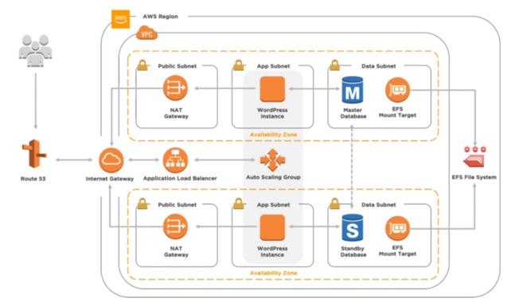

[toc]

### The solution being build in this course
A wordpress app spanning multiple AZ. redundant and resilient across data centers using app servers on an auto scaling group:

**guide for well architected framework**

[https://aws.amazon.com/architecture/well-architected](https://aws.amazon.com/architecture/well-architected)

Key concepts:
- availability and fault tolerance
- reliable virtual networks
- multi-tier application
- deployment automation
- multi-region solution

## Key Concepts and Core Services
- IAM 
- audit logging with CloudTrail
- Alerts with CloudWatch
- DDoS protection with Shield
- Change Management with Config
- managing service limits

### IAM

The **principal** could be a user or app which passes thru authentication with either user/pw or programmatic keys (for app use, non interactively). 

Once this passes, it is on to a request for an action or a resource. The request is driven by API. 

Either command line, or the web interface uses the same API.

Once the request is received, it is authorized via **access policy** assigned directly to a user, a group, or a role which an app could assume, to perform the actions or access the resources in the request.

Configure IAM users to perform duties, don't user the root user.
Some ways to assign permissions:
 - Create a user, add to group that has the policies needed
 - assign policies directly to a user
 - add user as a **trusted entity** to a role

**NOTE**: when viewing policies on the AWS website you can click to show json, and see the policy as it is defined programmatically.

