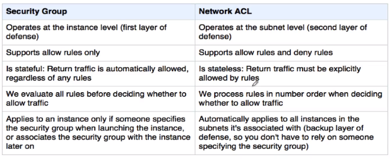
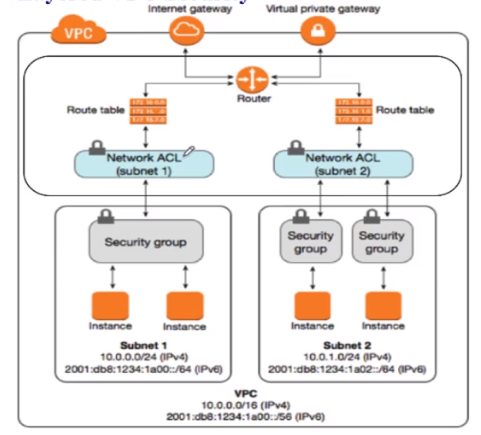

[toc]

## Section 1: Intro

blah blah blah

## Section 2: Intro to Cloud Computing and AWS Global Infrastructure

blah blah blah

## Section 3: Free Tier and IAM Foundation

know it

## Section 4: Core Knowledge - VPC, Sec Group, N ACL, Elastic IP, NAT, VPN, VPC Peering

### Virtual Private Cloud (VPC) Intro

VPCs are region specific and usually span multiple AZs (availability zones), with a subnet on each zone.

VPC components:
- CIDR and subnets of your choice, among the following ranges:
  - 10.0.0.0/16-28
  - 172.16.0.0/16-28
  - 192.168.0.0/16-28
- an _implied router_ that handles routing within the subnets or to the Internet gateway/Virtual Private Gateway
- route tables
- an internet gateway (IGW) that connects the VPC to the internet or other services
- security groups are virtual firewalls operating at the instance level, the last line of defense for instances
- Network Access Control Lists (N. ACLs) operate at the subnet level, the first line of defense for instances
- Virtual Private Gateway is a gateway for HQ to connect to their VPC, like a VPN sitting in your VPC

**IPv6 addresses**

All IPv6 addresses are public on AWS, as such they are allocated by AWS if needed.

### Implied router and route tables

All VPCs have an implied router by default to handle routing within all subnets of the VPC.
- it can have up to **200** route tables, and each table up to **50** route entries
- each subnet must be associated with exactly **one** route table at a given time, a route table however can be associated with multiple subnets
  - you can move the subnet to another route table
- if not specified, a subnet will be associated with the **main (default)** route table
- the main route table can be edited, but not deleted.
- you can redesignate another route table as the new main table. _main_ is like a flag given to one router
- every route table has one mandatory entry, such as **10.0.0.0/16** to route to all other subnets, this entry cannot be changed or removed.

!! Any communication issues between instances in the same VPC will NEVER be due to routing problems. Always check either Security Groups or NACLs.

 ### IP addressing, Internet Gateway, Subnet types

 On an VPC, the CIDR cannot be changed once created. If you run out of addresses you can add a secondary CIDR and it will automatically go into the route table.

- The subnet mask must be /16 thru /28
- CIDR ranges between subnets cannot overlap.
- on any CIDR, the host addresses cannot be 0-3 and cannot be the last (255, 127, etc. depending on the mask). Those are reserved by AWS. .0 is the network address, .1 is the router, .2 is for DNS, and .3 is reserved for future use. The last number is also reserved.

The Internet Gateway is the route out for all subnets and instances out to the internet.
- it is horizontally scaled, redundant and highly available all managed by AWS.
- When an instance is assigned a public IP (Elastic IP) the EIP is not assigned to the instance itself, but rather it is conigured on the IGW.
- The IGW uses NAT to route all ingress traffic to instances with Elastic IPs assigned to them. In other words, instances only ever have private addresses assigned directly to them.
  - Accordingly, _metadata_ for instances will never show a public IP.

### VPC Types, Intro to Security Groups

#### VPC types

There are 2 types of VPC
- the **default VPC** created in every region for your account
  - has default CIDR block, Sec Group, N ACL, and route table settings
  - has a default IGW

- a custom VPC that you create yourself
  - created by AWS account owner
  - you can decide the IPv4 CIDR block to use. If using IPv6 block, it is chosen by AWS.
  - will have a default SG, NACL, implied router, and a route table
  - will not have an IGW by default, create if needed

  - you will have a choice about _tenancy_, to choose either **default** or **dedicated**.

  **explanation**

  When launching an instance there are 2 options available for tenancy;
  - _single tenancy_ means you have paid for dedicated hardware for your instances
  - _multi-tenancy_ which means your instance will share hardware with other account holders.

Therefore, when creating a VPC:
    - choosing _default_ means instances launched on this VPC will use the tenancy option selected at launch of the instance itself.
    - dedicated means that instances launched in this VPC will be expressly running on _single tenancy dedicated hardware_.

#### Security Groups

Some facts about Security Groups:
- The security group functions at the ENI (virtual NIC) level of the EC2 instance.
- All security groups are **bi-directional**, and can have _ingress_ and _egress_ rules associated with them.
- An instance can have up to 5 SGs associated with it.
- security groups are _stateful_ meaning if traffic is allowed in one direction, the return traffic is expressly allowed
- you cannot create _deny_ rules in a SG, only _allow_ rules. there is an implicit deny at the end of all SGs.
- when creating a custom security group, by default it will have no inbound rules, meaning nothing can come in since there is always an implicit deny at the end of any security group ruleset. The outbound will be anything allowed to anywhere.

All VPCs when created have one default security group which cannot be deleted. It will have one _inbound_ and one _outbound_ rule by default:
- _inbound_ allows all traffic from any instance associated with the same security group. When looking at the rule, the source will have the security groups ID as its value.
- _outbound_ will have one rule with all traffic allowed to any destination **0.0.0.0/0**.

### Security Group Mastery

- an instance cannot be created without being assigned to a security group.
- all VPCs will have one default security group which cannot be deleted.
- security groups are VPC resources, as such multiple instances in a VPC can have a common security group assigned to them, even across AZs.
- changes to security groups are immediately applied
- security group names can be the source or destination for a rule in another security group
- security groups cannot have deny rules added. to blacklist IPs from the internet you need to use the NACL
- all rules are evaluated before allowing or denying traffic

### Network Access Control Lists

A network access control list (NACL) operates at the subnet level, and it is implemented by the implied router.

- NACLs only affect traffic into or out of a given subnet. Traffic between instances on the same subnet will not involve the NACL.
- NACLs are **stateless**. Allowed traffic in one direction does not implicitly allow return traffic in the other direction. It must be added as a rule.
- NACLs can have both allow and deny rules.
- The NACL is a set of rules, each having a number. It works like a firewall, when inbound traffic comes in, all rules from lowest to highest number are checked for a match, if none match, it hits the implicit deny at the bottom.
- you can insert rules between existing rules as long as there is enough space between the two rule numbers. As such you should number your rules with enough gap to leave space for later rule insertions.
- A NACL ends with an explicit **deny all**, which you cannot delete
- A subnet must be associated with a NACL. If you do not specify one, a default one will be created.
  - the default NACL will allow ALL traffic inbound and outbound.
- you can create a custom NACL if you prefer. Upon creation it will, by default, **deny** all traffic in or outbound.

!!! Remember: All VPCs have a mandatory route allowing traffic between instances within the VPC. Communication issues between instances in the same VPC will never be due to the route tables. Always check either the Security Groups or, if it is between different subnets, the NACL.

**NACLs vs Security Groups**

### NACLs and Security Groups

Here is an illustration showing where the routing, NACL, and security groups lay in a VPC:

- NACLs are the subnet guards and the first line of defense for your instances
- Security groups are the instance guards and the second line of defense (defense in depth) for your instances
- AWS highly recommends further software firewalling on the instances for intrusion detection.
- changes to NACLs or security groups take effect immediately.
- NACLs can allow you to blacklist blocks of addresses from the internet since they allow deny rules.

### NACLs vs Security Groups - TCP/IP Headers

An explanation of TCP/IP headers coming into or leaving the subnet.
For example, an internet user accessing a web server in a public subnet:

**INCOMING PACKET**
- destination (web server) IP: 11.1.1.1 this is the public IP of the web server
- destination port: 80
- internet user IP: 20.1.1.5 this is the public IP of the internet user router after NAT
- source port: 5456 (from the browser, an ephemeral port in the range 1024-65535)
- payload: the data coming in from the browser

**OUTGOING PACKET**
- destination (user) IP: 20.1.1.5
- destination port: 5456 the same ephemeral port from browser
- source IP: 11.1.1.1 the public IP of the web server
- source port: 80
- payload: the data going out from the web server

In the above scenario, the public IP of the webserver will be NATed to the private IP of the webserver when coming in, and will be NATed back to the public IP when going out. The public IPs of instances are contained in the implied router, they are not placed on the instance, the instance only has knowledge of its private IP.

This information must be understood in order to correctly write rules for security groups and NACLs.

Security Group rule format:

**INBOUND**

| Type          | Protocol     | Port range      | Source                    |
| ------------- | ------------ | --------------- | ------------------------- |
| DNS/HTTP/ICMP | TCP/UDP/ICMP | 22,3306,443 etc | IP, IP range, Sec Grp etc |

**OUTBOUND**

| Type          | Protocol     | Port range      | Destination               |
| ------------- | ------------ | --------------- | ------------------------- |
| DNS/HTTP/ICMP | TCP/UDP/ICMP | 22,3306,443 etc | IP, IP range, Sec Grp etc |

NACL rule format:

**INBOUND**

| Rule # | Type        | Protocol | Port range | Source    | ALlow/Deny |
| ------ | ----------- | -------- | ---------- | --------- | ---------- |
| 100    | All traffic | ALL      | ALL        | 0.0.0.0/0 | ALLOW      |
| *      | ALL Traffic | ALL      | ALL        | 0.0.0.0/0 | DENY       |

**OUTBOUND**

| Rule # | Type        | Protocol | Port range | Source    | ALlow/Deny |
| ------ | ----------- | -------- | ---------- | --------- | ---------- |
| 100    | All traffic | ALL      | ALL        | 0.0.0.0/0 | ALLOW      |
| *      | ALL Traffic | ALL      | ALL        | 0.0.0.0/0 | DENY       |

### Network address translation (NAT)

#### The NAT Instance

When creating a VPC, there are 2 options for instances running in private subnets to access the internet. The first is the _NAT Gateway_, which is a managed service prodided by AWS, and the other is a _NAT Instance_, managed by you. The _NAT Instance_ is an instance running in a public subnet of the same VPC, with a special AMI image that has a software NAT router running on it.

**NOTE:** Normally every instance in a VPC has a _source/destination check_ which ensures that traffic coming in to it is destined for itself, and that outgoing traffic comes from itself. For a NAT instance to work, the _source/destination check_ must be **disabled**.

The route table for a private instance will point the non-VPC addresses **(0.0.0.0/0)** to this NAT instance rather than to an IGW. The NAT instance will then act as a proxy and forward the traffic out, and receive and reverse the NAT translation for the return traffic.

Since a NAT instance is an instance, and needs the same protection from outside as other instances, it needs to be assigned to a security group. The security group must allow the in/outbound connections needed to both perform NAT forwarding for the private instances, and to allow SSH admin access to the NAT instance from HQ or a data center for example.

Instances running on public subnets do not use the NAT instance, since they have access to the IGW via the route table entry that directs **0.0.0.0/0** traffic to the IGW.

The security group for the NAT instance must have at least 2 inbound rules; one for the private subnet, and another for the admin SSH traffic. It must also have an outbound rule to **0.0.0.0/0** for ports 80 and 443 in order to route packets to the internet on behalf of the private instances.

Since security groups are stateless, the return traffic is implicitly allowed.

**NAT Instance vs NAT Gateway**

- A NAT instance is provisioned and managed by you, and it works with both public IPs and Elastic IPs.
- A NAT gateway is provisioned and managed by AWS, and it only works with Elastic IPs. It is not assigned a security group.
