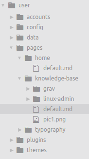

To post to this knowledge use the workflow defined below:

- open template in Atom with 'ctrl-alt-n'
- set visible to `true` in the yaml frontmatter block
- set the title to whatever you want to appear in the menu nav
- set the category to `KB`
- use a relevant tag such as those below or add a new one:
  - linux
  - bash
  - kvm
  - aws
  - docker
- start writing and when done save to a new folder under the knowledge-base folder with naming convention in lowercase and separated by dashes (example: linux-admin)
- name the file `default.md`

To clarify, all posts in this knowledge base are files in their own folder. The folder is created first then the file is always named `default.md`

The file hierarchy looks like below. This article is highlighted by the cursor:

And right below the filename is the image above, they are placed in the same folder and linked to in markdown with just the filename as the link, like below:

``

GitHub token:    `f15824f2ad260582a3ee80c954c78b38770320b4`
