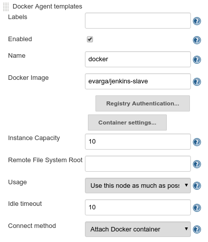

[toc]
## Docker

### Building images to use with Jenkins

There are fundamentally 2 ways to create a new image.

- `docker commit dee2cb192c6c ubuntu_with_git` - change a running container somehow and commit the changes to the originating image with a new name
- `docker build -t ubuntu_with_python .`  create a Dockerfile to build the image

## Jenkins

### Set up jenkins container

You can just run the official jenkins image with the necessary volume and port assignment:

    docker run -d -p 49001:8080 \
    -v $HOME/jenkins_home:/var/jenkins_home \
    --name jenkins jenkins/jenkins:2.150.3
**NOTE:** This will build a standalone jenkins server using WinStone for http. There are separate images for Tomcat based jenkins.

Or you can build a custom image off the official image if you want to do something like add plugins. This is how, for instance, you could have multiple versions of jenkins for teams to use, rather than have one master with plugin hell going on.

Just create a base image first with all necessary items common to all teams, then each team can build off that with the team-specific plugins added at build time.

For example, this groovy script can be run at build time for a custom jenkins image:

    import jenkins.model.*
    Jenkins.instance.setNumExecutors(5)
Place it in the Dockerfile like so:

    FROM jenkins/jenkins:2.150.3
    COPY executors.groovy
    /usr/share/jenkins/ref/init.groovy.d/executors.groovy
    RUN /usr/local/bin/install-plugins.sh docker-plugin

Now the jenkins master container will have the docker plugin already installed.

#### further steps for production

Authentication for a larger envirionment would probably need more granularity than the jenkins default of everyone doing everything and using the local jenkins user database, it would either come from LDAP or AD most likely.

Also backups consisting of the jenkins_home volume, which contains everything unique in a jenkins container.

### A small pipeline example

This is a script for a pipeline job called **hello world**

    pipeline {
         agent any
         stages {
              stage("Hello") {
                   steps {
                        echo 'Hello World'
                   }
              }
         }
    }

### Dynamically configured docker agents

This method will have jenkins create a new container for every build in the pipeline.

For this example, the jenkins master is a docker container. The dynamic build slaves will run on the same docker host.

#### configure docker to listen on IP

To facilitate jenkins being able to connect to the docker service we change a line in the `/lib/systemd/system/docker.service` to include the following:

</br>

ExecStart=/usr/bin/dockerd **-H 0.0.0.0:2375** -H fd:// --containerd=/run/containerd/containerd.sock

The important part is in bold.

#### configure docker agent on jenkins master

**NOTE:** The master needs to be configured to not run any jobs so that the jobs will run on the docker agents. Set the master under **Manage Nodes** to _# of executors: 0_.

Go to **Manage Jenkins, Configure System, Cloud** and select _Add a new cloud_.


Next, add the agent template to define the image to use:



In the above example, a popular image from evarga is used. You could, of course, either build your own based on his dockerfile, or just go from scratch.

## The continuous integration pipeline

The term _pipeline_ refers to a sequence of automated operations representing a part of the SDLC process.
- operation grouping - these are stages (aka _gates_ or _quality gates_). if one stage fails, teams are quickly notified and no further stages are run.
- visibility - all aspects of the process are visualized, helping in quick failure analysis
- feedback - teams learn about problems when they occur for quicker reaction

Pipelining is a concept common to most CI tools. However, the naming can differ. In jenkins it is referred to as the pipeline.

### The jenkins pipeline structure

The jenkins pipeline is made up of _stages_ and _steps_.
- stage - a group of steps. Stages such as **build**, **test** and **deploy** for example
- step - a single operation instructing jenkins to do something such as checkout from repo

Here is the _hello world_ pipeline with multiple stages:

    pipeline {
        agent any
        stages {
             stage('First Stage') {
                  steps {
                       echo 'Step 1. Hello World'
                  }
             }
             stage('Second Stage') {
                  steps {
                       echo 'Step 2. Second time Hello'
                       echo 'Step 3. Third time Hello'
                  }
             }
        }
    }

This pipeline will execute 3 steps in 2 separate stages.

### Pipeline syntax

There are 2 syntax methods for writing jenkins pipelines, _declarative_ and _Groovy-based DSL_.
- declarative - an easier method limited to the most important keywords.
- DSL - a more scripted approach with more complexity and flexibility.

Here is a more complex declarative pipeline, with descriptive comments of what is happening in each section:

    pipeline {
         agent any    # use any agent
         triggers { cron('* * * * *') }   # triggered by cron definition (every minute)
         options { timeout(time: 5) }   # stop execution if it takes more than 5 mins
         parameters {
              booleanParam(name: 'DEBUG_BUILD', defaultValue: true,   #ask for parameter input
              description: 'Is it the debug build?')                  #for bool value
         }
         stages {
              stage('Example') {
                   environment { NAME = 'Ron' }   # set an environment variable
                   when { expression { return params.DEBUG_BUILD } } # run if DEBUG_BUILD true
                   steps {
                        echo "Hello from $NAME"   # Print "Hello from Ron"
                        script {
                             def browsers = ['chrome', 'firefox']   # execute a for loop
                             for (int i = 0; i < browsers.size(); ++i) {
                                  echo "Testing the ${browsers[i]} browser."
                             }
                        }
                   }
              }
         }
         post { always { echo 'I will always say Hello again!' } }  # run echo always, regardless of success
    }

A declarative pipeline is always specified inside the `pipeline` block and contains _sections_ _directives_ and _steps_:

**Sections** define the pipeline structure and usually contain one or more directives or steps, and use the following keywords:
- stages - a series of one or more stages
- steps - a series of one or more instructions
- post - a series of one or more instructions run at the end of the pipeline. They are marked with a condition such as; _always_ _success_ or _failure_. They are usually used for sending notifications after the build.

**Directives** express the config of a pipeline or its parts:
- agent - specifies where the execution will take place, and can define a _label_ to match agents, or _docker_ to specify a container to be dynamically provisioned
- triggers - automated ways to trigger the pipeline such as _cron_ or _pollSCM_ to check a repo for changes.
- options - pipeline specific options such as _timeout_, or _retry_ a number of times after failure.
- environment - a set of key values used as environment variables during the build.
- parameters - a list of user-input parameters
- stage - logical grouping of steps
- when - a conditional determining whether to run the stage

**Steps** are the operations that jenkins will perform.
- sh - execute the shell command, you can define almost any operation using it
- custom - something like echo, usually wrappers over the sh command. plugins can also define operations
- script - execute  a block of groovy code for things like flow control

The pipeline syntax is very generic and usable for almost any process.

The most common use case is implementing the CI server.

### The commit pipeline

The starting point of the CD process, triggered on every push to the main repo.

Upon a checkin of code by a developer, a fundamental commit pipeline has 3 stages:
- checkout - download the code from repo
- compile - compile the source code
- unit test - run a suite of unit tests

### Create a CI project with spring and gradle

This project is a calculator app built with Jave Spring.  It will have a pipeline of 3 stages:
- **checkout** - check out the jave spring source code from git
- **compile** - compile the code with `gradlew compileJava`
- **unit test** - test the code with `gladlew test`

The pipeline was first written in the jenkins GUI interface, then moved to a Jenkinsfile and checked into the repo, where jenkins will read it from and execute.

#### Checkout stage

Created the **calculator** git repo on Github. Then I cloned it locally and verified jenkins could access the repo.

Added this stage to the project in jenkins:

    pipeline {
         agent any
         stages {
              stage("Checkout") {
                   steps {
                        git url: 'https://github.com/roninhockley/calculator.git'
                   }
              }
         }
    }

**NOTE:** This stage is not required in the Jenkinsfile as the checkout will have already been done.

#### Compile stage

I then went to http://start.spring.io/ and used the GUI there to build the skeleton for the Java Spring app. Then downloaded the skeleton code to the git repo and pushed it.

Added the compile stage to jenkins:

    stage("Compile") {
         steps {
              sh "./gradlew compileJava"
         }
    }

#### Unit test stage

This involved creating the logic for the calculator, along with the unit test code.

The logic code:

    package com.nikkyrron.calculator;
    import org.springframework.stereotype.Service;

    @Service
    public class Calculator {
         int sum(int a, int b) {
              return a + b;
         }
    }

Next a web service controller:

    package com.nikkyrron.calculator;
    import org.springframework.beans.factory.annotation.Autowired;
    import org.springframework.web.bind.annotation.RequestMapping;
    import org.springframework.web.bind.annotation.RequestParam;
    import org.springframework.web.bind.annotation.RestController;

    @RestController
    class CalculatorController {
         @Autowired
         private Calculator calculator;

         @RequestMapping("/sum")
         String sum(@RequestParam("a") Integer a,
                    @RequestParam("b") Integer b) {
              return String.valueOf(calculator.sum(a, b));
         }
    }

Finally, the unit test code:

    package com.nikkyrron.calculator;
    import org.junit.Test;
    import static org.junit.Assert.assertEquals;

    public class CalculatorTest {
         private Calculator calculator = new Calculator();

         @Test
         public void testSum() {
              assertEquals(5, calculator.sum(2, 3));
         }
    }

I then pushed the code to git repo, and added the unit test stage to jenkins:

    stage("Unit test") {
         steps {
              sh "./gradlew test"
         }
    }

Here is the final pipeline in Jenkins:

    pipeline {
         agent any
         stages {
              stage("Checkout") {
                   steps {
                        git url: 'https://github.com/roninhockley/calculator.git'
                   }
              }
              stage("Compile") {
                   steps {
                        sh "./gradlew compileJava"
                   }
              }
              stage("Unit test") {
                   steps {
                        sh "./gradlew test"
                   }
              }

         }
    }
**The benefits of using a Jenkinsfile**

Rather than have the pipeline defined on the Jenkins master itself, it can be written into a file called the Jenkinsfile, then checked into version control.

The Jenkinsfile is a file containing the pipeline definition. The file is stored in the project's source code repo along with the source code itself. The obvious benefits include:
- protected in the event of a jenkins failure
- all changes are versioned and can have code review
- easily accessible by the developers who can control the tools defined in the pipeline
- access to the pipeline is restricted in the same way as the code itself

The Jenkinsfile:

    pipeline {
         agent any
         stages {
              stage("Compile") {
                   steps {
                        sh "./gradlew compileJava"
                   }
              }
              stage("Unit test") {
                   steps {
                        sh "./gradlew test"
                   }
              }
         }
    }

While this is a minimal project, it is, in many cases, sufficient for the continuous integration process.

### Improve the calculator commit pipeline with code quality stages

#### Code coverage testing

Code coverage testing is used to assess _how much_ of the code is being tested. It runs all tests and generates a report showing the _untested_ sections. The build can be marked failure if too much code remains untested.

Three popular tools are **JaCoCo, Clover, and Cobertura**. We will use JaCoCo.
- add JaCoCo to the Gradle config
- add the code coverage stage to the pipeline
- push JaCoCo reports in jenkins

**Steps**

- Add `apply plugin: "jacoco"` to the **build.gradle** file.
- add the following to **build.gradle** to set minimum code coverage to _20%_:

    jacocoTestCoverageVerification {
         violationRules {
              rule {
                   limit {
                        minimum = 0.2
                   }
              }
         }
    }

- add the following stage to the Jenkinsfile:

    stage("Code coverage") {
         steps {
              sh "./gradlew jacocoTestReport"
              publishHTML (target: [
                   reportDir: 'build/reports/jacoco/test/html',
                   reportFiles: 'index.html',
                   reportName: "JaCoCo Report"
              ])
              sh "./gradlew jacocoTestCoverageVerification"
         }
    }

**NOTE:** the stage above requires the **HTML Publisher** plugin for jenkins.

#### Static code analysis

After adding code coverage testing, there are tests for the code quality itself. Is it well written and maintainable?

Statis code testing does not execute the code, instead it checks for syntax quality against certain rules.

3 popular tools for this are **Checkstyle, Findbugs, and PMD**. We will use Checkstyle.

** Static code analysis using Checkstyle**
- add the Checkstyle config
- add the Checkstyle stage
- publish the Checkstyle report in jenkins

**Steps**

- Create folder path **config/checkstyle** in the calculator git folder and add the following to checkstyle.xml:

    <?xml version="1.0"?>
    <!DOCTYPE module PUBLIC
         "-//Puppy Crawl//DTD Check Configuration 1.2//EN"
         "http://www.puppycrawl.com/dtds/configuration_1_2.dtd">

    <module name="Checker">
         <module name="TreeWalker">
              <module name="JavadocType">
                   <property name="scope" value="public"/>
              </module>
         </module>
    </module>

-  Add `apply plugin: 'checkstyle'` to **build.gradle**
- add the following stage to the Jenkinsfile:

    stage("Static code analysis") {
         steps {
              sh "./gradlew checkstyleMain"
              publishHTML (target: [
              reportDir: 'build/reports/checkstyle/',
              reportFiles: 'main.html',
              reportName: "Checkstyle Report"
        ])
         }
    }

**NOTE:** A more robust server-based tool is **Sonarqube** which combines the code coverage and analysis process together.

### Triggers and notifications

#### Triggers

Rather than having to start each build from jenkins, the builds can run automatically with triggers. An automatic action that starts a build is called a **pipeline trigger**.

There are many options in jenkins for triggers, but they all come down to 3 types:
- external
- polling SCM (source control management)
- scheduled build

**External triggers**

An external trigger means that jenkins is called by a **notifier**, which is another pipeline build, the SCM system, or any remote script.

In the case of GitHub for example, setting up the external trigger involves:
- installing the github plugin in jenkins
- generating a secret key for jenkins
- setting a webhook on github with the jenkins address and key

There is also a more generic way using the jenkins REST API. It requires a _token_ setting in jenkins.

**NOTE:** For either the github or REST call the jenkins server must be publicly accessible.

**Polling SCM**

A slightly less intuitive approach is polling the SCM system for changes. Jenkins periodically calls the SCM to check for changes in the source code.

There are however 2 good cases for this:
- jenkins is firewalled and not accessible by SCM
- commits are frequent and builds are long, which would overload the server if triggered immediately

Since jenkins is already configured to access github for our calculator project, the setup for polling is simpler, by simply adding the **triggers** statement to the jenkinsfile, just after the `agent` line:

    triggers {
         pollSCM('H/5 * * * *')
    }

The example above is standard cron syntax and will poll every 5 minutes.
**NOTE:** The **H/5** will spread it out evenly to reduce stress on jenkins.

**Scheduled build**

This simply means the job is set to run on a specific schedule, defined by the `cron` keyword instead of `pollSCM`. This method is rarely used for the commit pipeline, but is well suited for nightly builds such as complex integration testing.

#### Notifications

There are several ways to announce build status, and new notification types can be added via plugins.

The most popular notification types are:
- email
- group chat
- team spaces

**email**

Notifications via email is the most common method, involves setting SMTP server details in `Configure System` and using the `mail to` statement in the `post` section of the pipeline as follows:

    post {
         always {
              mail to: 'team@company.com',
              subject: "Completed Pipeline: ${currentBuild.fullDisplayName}",
              body: "Your build completed, please check: ${env.BUILD_URL}"
         }
    }
**NOTE:** There are several options besides `always`:

- always - always send
- changed - send only if pipeline status has changed
- failure - only if the pipeline status is `failed`
- success - only if the pipeline status is `success`
- unstable - only if the pipeline status is `unstable`


**group chat**

Apps such as slack or hipchat are worth considering for adding build notifications. The process for each is the same:
- install plugin
- configure the plugin
- add instruction to pipeline as follows:

    post {
         failure {
              slackSend channel: '#dragons-team',
              color: 'danger',
              message: "The pipeline ${currentBuild.fullDisplayName} failed."
         }
    }

**team spaces**

This involves methods such as installing big screens called _build radiators_ which display the current pipeline status on a big screen.

There are also plugins for things like RSS, SMS, mobile, and desktop notifiers.

### Team development workflows

Questions like when the CI pipeline should be run, or which branches should trigger it, or whether there are branches at all, are issues that make up the development workflow.

There are basically 3 types of workflows:
- trunk-based workflow - the simplets possible strategy
- branching workflow - used when the code is kept in several different branches
- forking workflow - popular with open source projects where commit access is restricted

#### Trunk-based workflow

Simply put, in this workflow there is one master branch and all commits go directly there.

#### Branching workflow

The code is kept in several different branches such as feature, develop and master. Developers work on new code in feature branches, and jenkins will test the code in the branches.

When all tests are successful, the developers can rebase the branch to master then submit a pull request so the team can review changes and, finally, merge the code into master.

Jenkins will run the build on master with new changes merged to ensure success, which is likely since it was already tested on the feature branch.

#### Forking workflow

In a forking workflow, developers fork the entire repo to a new repo, rather than creating branches. This is popular with open source projects since they involve worldwide participation without having write access.

In this workflow, when changes are ready the developers will submit a pull request to have their changes merged to the origin repo's master branch.

### Workflow effect on the CI process

How do the above mentioned workflows affect the CI configuration? Each of the workflows implies a different CI approach.

#### Trunk based

This will stress the CI process with frequent pipeline failures. It causes the dev team to stop and fix the problems immediately.

#### Branching

This method solves the stress of the broken master branch issue but introduces another one. With everyone developing on their own branch where is the integration?

When features take a while to develop, the feature and master branches will diverge, and merge conflicts arise. This begins to strain the limits of calling it continuous integration.

#### Forking

This involved managing the CI process by every repo owner, which in and of itself is not usually a problem, but it does have the same issue as branching.

Different organizations take different approaches to these issues, and the closest to perfection is a hybrid using branching with the philosophy of trunk-based. This means very small branches and frequent integration to master.

Facilitating this requires either very small features or using _feature toggles_.

**feature toggles**

The feature toggle method involves putting new features directly in the main code in master, but with conditionals like so:

- a boolean such as **feature_toggle** is set to _True_
- code is added in `if` statements to run when True
- development is done from master with True.
- releases are done with **feature toggle** set to false.
- when the feature development is complete, the boolean and all `if` statements are removed, which automatically triggers the new features without having to merge any branch into master.

The benefit of this approach is all development being done in trunk, which allows for continuous integration of all code and mitigates merge conflicts from branches.

### Jenkins multi-branch pipelines

If using any form of branching, jenkins has the **Multibranch Pipeline** which will test code in branches before merging it into master. This is a good way to keep the master code base green.

The Multibranch Pipeline in jenkins will check for branches being created or removed at a set interval, and will either create or delete the dedicated pipeline specified in the Jenkinsfile.

## Automated acceptance testing

Acceptance testing is performed to determine whether the software meets the business requirements or contracts. It is black box testing against a complete system from a user perspective. If the results are positive it should mean the acceptance of the software when delivered.

Other terms for acceptance testing are:
- user acceptance testing (UAT)
- end user testing
- beta testing

### The artifact repository

Artifacts are things like compiled libraries or components which are later used to build complete app. They should be stored on separate servers due to the nature of the files and the access needed.

- large file sizes
- versioning, where some with detected bugs may not be kept
- each artifact should point to exactly one revision of the source code, and the binary creation process should be repeatable
- packages - artifacts are stored in compiled and compressed form, so that these time consuming steps are not repeated
- access control - users are restricted differently that with source code
- clients - users can be developers outside the team or organization
- use cases - artifact binaries guarantee that exactly the same built version is deployed to every environment to ease rollbacks if failures occur

The most popular artifact repos are **JFrog Artifactory** and **Sonatype Nexus**.

The following diagram illustrates the artifact repo's role in the CD process:


As the last step of the build stage, a binary is built and pushed to the artifact repo. All subsequent stages pull and use that binary.

The process of moving the binary to the next stage is called _promotion_.

As binary formats differ by programming language and technologies, there are various types of binaries, such as JAR files for Java, Gem files for Ruby, and for our case working with docker we will be producing docker images. The tool for storing these images is Docker registry.

### Implement local docker registry

The 2 more common methods of using docker registry are either the cloud-based Docker Hub, or a private docker registry.

Installing the docker registry app is just a matter of running a docker image named `registry`. If running it on the same docker host as jenkins no further steps are necessary.

If running on a dedicated server, the server must be secured with SSL/TLS with a cert.
**NOTE** Not strictly required, you can add an exception to any docker host via `/etc/docker/daemon.json`. This is covered further down in this book.

Since we are running it local to jenkins we can run it with:

`docker run -d -p 5000:5000 --restart=always --name registry registry:2`

**NOTE:** Repository servers such as Artifactory and Nexus implement the docker registry API. These servers can store docker images along with other artifacts as well.

Cloud services such as GCE and AWS offer docker registries also.

Next I retagged my `roninhockley/slave` image and pushed it to the loca repo and reconfigured the docker agent template in jenkins to be `localhost:5000/slave` and now it pulls the agent from the local repo.

### Run acceptance testing in the pipeline

Implementing acceptance testing in the pipeline will involve 4 new stages in the pipeline:
- docker build - jenkins will checkout the new commit, compile it and put it in a newly built docker image
- docker push - jenkins will push the newly built image to the local registry created above
- deploy to staging - start a container running the calculator app exposing port 8765
- acceptance test - the staging environment will run the acceptance tests against the running app, using the image jenkins pushed to the registry.

This will involve a dynamically provisioned docker slave using docker to build the testing image (docker in docker). There is not a mature docker image available yet on docker hub, so I am pulling one from the instructor repo and retagging and pushing it to local registry.

**NOTE:** To get the docker enabled agent to work I had to bind mount the docker socket to the agent by adding:  `-v /var/run/docker.sock:/var/run/docker.sock` to the container template in Jenkins config.

**ALSO:** The acceptance testing is a bash script in the root of the project. It is executed by the slave, but from the course it was doing a curl to _localhost:8765_, this does not work, I changed it to _docker:8765_ so it would point correctly to the docker host, and use the port mapping illustrated above. Not sure why instructor thought that _localhost_ would work, it did not.

**steps**

create Dockerfile in the root directory of the project:

    FROM openjdk:8-jre
    COPY build/libs/calculator-0.0.1-SNAPSHOT.jar app.jar
    ENTRYPOINT ["java", "-jar", "app.jar"]

Modify Jenkinsfile with new stages:

    pipeline {
    agent any
     triggers {
     pollSCM('H/5 * * * *')
    }
     stages {
          stage("Compile") {
               steps {
                    sh "./gradlew compileJava"
               }
          }
          stage("Unit test") {
               steps {
                    sh "./gradlew test"
               }
          }
          stage("Code coverage") {
               steps {
                    sh "./gradlew jacocoTestReport"
                    publishHTML (target: [
                    reportDir: 'build/reports/jacoco/test/html',
                    reportFiles: 'index.html',
                    reportName: "JaCoCo Report"
          ])
          sh "./gradlew jacocoTestCoverageVerification"
                }
          }
          stage("Static code analysis") {
               steps {
                    sh "./gradlew checkstyleMain"
                    publishHTML (target: [
                    reportDir: 'build/reports/checkstyle/',
                    reportFiles: 'main.html',
                    reportName: "Checkstyle Report"
          ])
                }
          }
          stage("Package") {
               steps {
                    sh "./gradlew build"
               }
          }
          stage("Docker build") {
               steps {
                    sh "docker build -t localhost:5000/calculator ."
               }
          }
          stage("Docker push") {
               steps {
                    sh "docker push localhost:5000/calculator"
               }
          }
          stage("Deploy to staging") {
               steps {
                    sh "docker run -d --rm -p 8765:8080 --name calculator localhost:5000/calculator"
               }
          }
          stage("Acceptance test") {
               steps {
                    sleep 15
                    sh "chmod +x acceptance_test.sh && ./acceptance_test.sh"
               }
          }
       }
          post {
       always {
            sh "docker stop calculator"
       }
    }

    }

### Writing acceptance tests

Acceptance tests are written with users in mind and should be comprehensible to users. Since the end user varies by project, the tools for acceptance testing can vary.

In most cases, the business value defined for software acceptance is written by non-developers, and so the testing should be comprehensible to them.

There are several frameworks that help to bridge the gap, including **Cucumber**, **FitNesse**, **JBehave**, and **Capybara**. These tools differ from each other.
In general the idea of writing acceptance tests follows this diagram:


The _Acceptance Criteria_ are written by users or a product owner as their representative, with the help of developers. Usually in the following scenario:

    Given I have two numbers: 1 and 2
    When the calculator sums them
    Then I receive 3 as a result

Developers write the test implementation, called _Fixtures_ or _step definitions_. They integrate the human-friendly DSL (domain specific language) with the programming language.

Writing acceptance tests is a continuous process requiring constant collaboration between developers and business, to improve and maintain the test specs.

### Use the Cucumber framework to write acceptance tests

This will be done in 3 stages:
- create acceptance criteria
- create step definitions (fixtures)
- run an automated acceptance test

#### Create acceptance criteria

Create a file in `src/test/resources/feature/calculator.feature` with the following:

    Feature: Calculator
      Scenario: Sum two numbers
        Given I have two numbers: 1 and 2
        When the calculator sums them
        Then I receive 3 as a result

Easy to understand and written by users with the help of developers in a way that is easy for non-technical people to understand.

#### Create step definitions

The next step is to create the Java bindings so that the feature specification would be executable. In order to do this, we create a new file, `src/test/java/acceptance/StepDefinitions.java` with the following contents:

    package acceptance;

    import cucumber.api.java.en.Given;
    import cucumber.api.java.en.Then;
    import cucumber.api.java.en.When;
    import org.springframework.web.client.RestTemplate;

    import static org.junit.Assert.assertEquals;

    /** Steps definitions for calculator.feature */
    public class StepDefinitions {
        private String server = System.getProperty("calculator.url");

        private RestTemplate restTemplate = new RestTemplate();

        private String a;
        private String b;
        private String result;

        @Given("^I have two numbers: (.*) and (.*)$")
        public void i_have_two_numbers(String a, String b) throws Throwable {
            this.a = a;
            this.b = b;
        }

        @When("^the calculator sums them$")
        public void the_calculator_sums_them() throws Throwable {
            String url = String.format("%s/sum?a=%s&b=%s", server, a, b);
            result = restTemplate.getForObject(url, String.class);
        }

        @Then("^I receive (.*) as a result$")
        public void i_receive_as_a_result(String expectedResult) throws Throwable {
            assertEquals(expectedResult, result);
        }
    }

The above Java code matches the **Given, When, and Then** lines from the feature spec.

In order to run the automated test, we need to configure some things:

- add the Cucumber libraries to `build.gradle` dependencies section:

    testImplementation("io.cucumber:cucumber-java:4.2.6")
    testImplementation("io.cucumber:cucumber-junit:4.2.6")
- add the _Gradle target_ to the same file:

    task acceptanceTest(type: Test) {
         include '**/acceptance/**'
         systemProperties System.getProperties()
    }

    test {
         exclude '**/acceptance/**'
    }
- add a _JUnit runner_, new file `src/test/java/acceptance/AcceptanceTest.java`:

    package acceptance;

    import cucumber.api.CucumberOptions;
    import cucumber.api.junit.Cucumber;
    import org.junit.runner.RunWith;

    /** Acceptance Test */
    @RunWith(Cucumber.class)
    @CucumberOptions(features = "classpath:feature")
    public class AcceptanceTest { }

The above _JUnit runner_ is the entry point to the acceptance test suite.

#### Acceptance testing drives development

Like most aspects of the CD process, acceptance testing is less about technology and more about people, specifically the level of engagement of users and developers.

What may be less obvious though, is _when to create_ the tests. Should the acceptance tests be created before or after writing the code?

From a technical standpoint, the result will be the same; the code will be well covered with both unit and acceptance testing.

It is tempting to write the tests first. _Test-driven development_ is well adapted for acceptance testing already, as the resulting feature will correspond better to the customer need.

Also, if the unit tests are written beforehand, the resulting code will be cleaner, better structured and well thought out.

This process is often called _acceptance test-driven development_.

 This is illustrated in the following diagram:


- User and developers write the DSL easy-to-read acceptance criteria
- the developers write the acceptance test fixtures (code), and they obviously fail.
- next, feature development uses the same test-drive methodology with unit testing
- the code is refactored until it passes.
- at this point the acceptance tests should also pass. the feature is complete.

A very good practice is to attach the Cucumber feature specification to the request ticket in the issue tracking tool (JIRA), so that the feature is always requested together with its acceptance test.

Some developers take an even more hardline approach and refuse to begin development until acceptance tests are prepared.

## Clustering with Kubernetes

This section will be about using Kubernetes for the staging and production environments of the continuous delivery process.

### Advanced Kubernetes concepts

#### Scaling

The quick manual scaling method:

`$ kubectl scale --replicas 5 deployment calculator-deployment`

For autoscaling, check out the [Horizontal Pod Autoscaler](https://kubernetes.io/docs/tasks/run-application/horizontal-pod-autoscale/).

#### Updating an application

In simplest form, just change the deployment yamlfile. When you apply the new file it will alter the deployment to match.

This can be something subtle like adding a label in metadata or updating the app itself, thus creating a new docker image and changing the container spec in the deployment.

#### Rolling updates

A rolling update entails terminating old instances and starting new ones in an incremental fashion. For each instance, one by one:
- terminate the pod
- start a newer version of the pod to replace the old pod
- wait until the new pod is ready
- move on to the next pod

**NOTE** Rolling updates only work if the new versions are backward compatible with the old ones, because until the update is finished the old and the new versions must coexist.

Rolling updates are configured in the deployment yaml file.

Here is a deployment for the calculator app currently used in the jenkins pipeline. The deployment is configured for rolling updates:

    apiVersion: apps/v1
    kind: Deployment
    metadata:
      name: calculator-deployment
      labels:
        app: calculator
    spec:
      replicas: 5
      strategy:
        type: RollingUpdate   # here is the section for specifying a rolling update
        rollingUpdate:
          maxUnavailable: 25%  # no more than 1 pod unavailable
          maxSurge: 0         # amount of pods created over the replica count
      selector:                 # 0 means no new pod without deleting old one first
        matchLabels:
          app: calculator
      template:
        metadata:
          labels:
            app: calculator
        spec:
          containers:
          - name: calculator
            image: leszko/calculator
            ports:
            - containerPort: 8080
            readinessProbe:     # readinessProbe to ensure pods are ready
              httpGet:          # the probe will test the calculator app over http
                 path: /sum?a=1&b=2 # the endpoint of the container for the test
                 port: 8080

The `maxUnavailable` and `maxSurge` parameters specifically control how kubernetes will perform the update with respect to the replacement of the pods. They control the minimum pods that must be running during the upgrade and whether kubernetes can deploy new pods on top of the number of old pods running.

Now that we have a rolling update deployment configured we can provide zero downtime releases from the pipeline.
**NOTE** With `Statefulset` deployments, rolling updates are already enabled, without any additional configuration.

Rolling updates are obviously very important with continuous delivery. CI means frequent deployments, and thus we cannot afford any downtime.

Notes about kubernetes workloads and objects:

- deployment - the most common workload
- statefulset - specifies exactly n number of pods, with predictable names, and the order they are started
- daemonset - runs a copy of a pod on each node
- job/cronjob - a workflow dedicated to task based operations in which containers are expected to exit successfully

 ### Resolving application dependencies with k8s

 Dependencies arise from either a monolithic app which usually at least needs a database, or a micro services architecture where many interconnected services make up the app.

 Within the automated testing part of the continuous delivery process, the unit testing phase allows you to mock (fake) the app dependencies to get it done. The acceptance testing, however, requires a complete environment for a viable result.

 Kubernetes orchestration allows for a fast and repeatable deployment of a complete environment, thanks largely to its built-in DNS resolution for services and pods.

#### Kubernetes DNS resolution

As a demonstration, we will deploy an in memory caching solution called **Hazelcast** to kubernetes, and make it available to other services in the cluster, such as the calculator deployment already running in the cluster.

!!! Hazelcast is an **IMDG** or _in memory data grid_, powered by Java, that is used to cache frequently used data in memory for fast access by applications.

**Deploy Hazelcast to the cluster**

Here is the deployment with the service included:

    apiVersion: apps/v1
    kind: Deployment
    metadata:
      name: hazelcast
      labels:
        app: hazelcast
    spec:
      replicas: 1
      selector:
        matchLabels:
          app: hazelcast
      template:
        metadata:
          labels:
            app: hazelcast
        spec:
          containers:
          - name: hazelcast
            image: hazelcast/hazelcast:3.12
            ports:
            - containerPort: 5701

    ---

    apiVersion: v1
    kind: Service
    metadata:
      name: hazelcast
    spec:
      selector:
        app: hazelcast
      ports:
      - port: 5701

Since we know the name of the service is **hazelcast** we can supply it to apps for use, and kubernetes will use its in-built dns to resolve the service name.

Before configuring the calculator app to use Hazelcast, here is the intended system to be put in place:


The user will use the calculator service, which will load balance the traffic to a calculator pod. Next, the calculator pod connects to the hazelcast service, and that service will redirect to the hazelcast pod.

The final work to be done is to include the code that allows the calculator app to use hazelcast caching:
- add the hazelcast client library to gradle
- add the hazelcast cache config
- add sprint boot caching
- build the docker image

**add the hazelcast client library to gradle**

Add the following to the _dependencies section of the `build.gradle` file:

`implementation 'com.hazelcast:hazelcast-all:3.12'`

This adds the java libraries needed for communication with hazelcast.

**add the hazelcast cache config**

Add the following parts to the `src/main/java/com/leszko/calculator/CalculatorApplication.java` file:

    package com.nikkyrron.calculator;
    import com.hazelcast.client.config.ClientConfig;
    import org.springframework.boot.SpringApplication;
    import org.springframework.boot.autoconfigure.SpringBootApplication;
    import org.springframework.cache.annotation.EnableCaching;
    import org.springframework.context.annotation.Bean;

    /**
     * Main Spring Application.
     */
    @SpringBootApplication
    @EnableCaching
    public class CalculatorApplication {

    public static void main(String[] args) {
          SpringApplication.run(CalculatorApplication.class, args);
       }

    @Bean
    public ClientConfig hazelcastClientConfig() {
          ClientConfig clientConfig = new ClientConfig();
          clientConfig.getNetworkConfig().addAddress("hazelcast");
    return clientConfig;
       }
    }

    This is a standard Spring cache configuration. Note that for the Hazelcast server address, we use _hazelcast_, which is automatically available thanks to the Kubernetes DNS resolution.

**NOTE:** You actually don't need to specify the service name, Hazelcast provides an auto-discovery plugin for kubernetes.

**add sprint boot caching**

Modify the `src/main/java/com/leszko/calculator/Calculator.java` file as follows:

    package com.nikkyrron.calculator;

    import org.springframework.cache.annotation.Cacheable;
    import org.springframework.stereotype.Service;

    /** Calculator logic */
    @Service
    public class Calculator {
    @Cacheable("sum")
    public int sum(int a, int b) {
    try {
             Thread.sleep(3000);
          }
    catch (InterruptedException e) {
             e.printStackTrace();
          }

    return a + b;
       }
    }

The `@Cacheable` annotation will make spring cache every call to the _sum_ method. The sleep for 3 seconds is for testing to see that the cache works correctly.

The sum calculations are cached in Hazelcast, and when we call the **/sum** endpoint of the Calculator web service, it will first try to retrieve the result from the cache.

**build the docker image**

The next step is to rebuild the calculator app and the docker image with a new tag, then push it to the registry.

**NOTE:** Implementing this is blocked because the k8s nodes are not on our DNS and cannot resolve the _docker_ hostname to pull the images from my local docker registry. I have modified the Ubuntu k8s nodes to use internal DNS.

**UPDATE:** A few things had to be done to get this working. There were a few problems:
- the nodes were not on our DNS so I rebuilt the cluster with Debian and set DNS to our server, so the deployments could pull images from the private registry.
- Any docker node needs to have a JSON file in place to allow connecting to an unsecured registry: `nano /etc/docker/daemon.json` (this will be a new file).

Add the following to the file:

```
{
  "insecure-registries" : ["docker:5000"]
}
```

After taking these steps, the nodes can call the registry by its DNS name **docker** and the nodes will accept the connection from our unsecured private registry, which is a container running on the **docker** host.

Now, the calculator app is running on the cluster with Hazelcast providing caching.

Of course, having changed the build by adding in the hazelcast code, the pipeline is broken on jenkins. This is to be expected.

**UPDATE** I created a new branch called legacy and based it off the commit before I added the hazelcast code. Next I copied the repo to Bitbucket.

I created a new jenkins multibranch pipeline and pointed it to bitbucket, as expected the legacy branch builds successfully.

## Configuration management with Ansible

Installed Ansible on my local machine with:

    $ sudo apt-get install software-properties-common
    $ sudo apt-add-repository ppa:ansible/ansible
    $ sudo apt-get update
    $ sudo apt-get install ansible

Next I created 2 vm's from Debian 9.9 to use as hosts. Vanilla installs with some packages added:

`apt install sudo curl nmap build-essential`

Next I created an Ansible hosts file at `/etc/ansible/hosts`:

    [webservers]
    web1 ansible_host=192.168.1.103 ansible_user=ron
    web2 ansible_host=192.168.1.126 ansible_user=ron
The _web1_ and _web2_ are aliases.

I then executed a `ansible all -m ping` to test and all is well.
**NOTE:** The `-m` is _module_, in this case the `ping` module was used. If no module is specified then arguments are executed as a shell command.
Instead of _all_ you can use _web*_ wildcard.

To avoid the scripts getting hung by the SSH warning for adding new hosts keys I uncommented the following in the /etc/ansible/ansible.cfg:

`host_key_checking = False`

### Using Ansible

An example of an ad-hoc command:

    $ ansible web1 -a "/bin/echo hello"   # no -m means execute arguments in shell
    web1 | CHANGED | rc=0 >>
    hello

The above command says to execute shell command with argument `/bin/echo hello` on the _web1_ host.

In its simplest form, an ad-hoc command looks like this:

`ansible <target> -m <module_name> -a <module_arguments>`

Ad-hoc commands are for doing things as a one-off, quickly and not intended to be repeated.

For configuration management, **playbooks** are used.

#### Ansible playbooks

Ansible playbooks are config files that describe how servers should be configured, by defining a sequence of tasks to be performed on each of the machines.

Playbooks are written in the YAML file format. They contain one or more _plays_.

**an example play:**

    ---
    - hosts: web1
      become: yes
      become_method: sudo
      tasks:
      - name: ensure apache is at the latest version
        apt: name=apache2 state=latest
      - name: ensure apache is running
        service: name=apache2 state=started enabled=yes

In the above play, each task has a name, followed by **module:arguments** pairs.

Ansible hosts files can contain many groups of servers, and the playbooks can contain many plays for specific servers or groups of servers. In this way you can configure an entire environment with one command.

**idempotency**

The definition of something that is idempotent is that executing it repeatedly has the same effect as executing it once.

In other words, the idempotency of the Ansible playbook is that you can add things in as needed and rerun it, and it will only apply the new things. Therefore you can use the same playbook over and over.

**handlers and notify**

The **handlers** and **notify** blocks are for executing things conditionally, when something is changed, for example:

    tasks:
    - name: copy configuration
     copy:
     src: foo.conf
     dest: /etc/foo.conf
     notify:
     - restart apache
    handlers:
    - name: restart apache
     service:
     name: apache2
     state: restarted

The above play will copy a config file for apache to the host, and upon the config changing it will restart apache.

The **notify** block says to notify the **handler** named _restart apache_, and the restart apache handler specifies that the apache service shold be in state _restarted_.

The task can stay in the playbook permanently, and the **copy** module can detect any future changes, and only then will it run the task again, including the notify and handlers.

**variables**

The playbooks (and the inventory file as well) support variables for values, allowing for differences between hosts. This also allows for querying and iteration over hosts. For example:

    ---
    - hosts: web1
      vars:
        http_port: 8080

This will set the port for http on host _web1_. Then you can query it using the **Jinja2** syntax:

    tasks:
    - name: print port number
      debug:
        msg: "Port number: {{http_port}}"

The output:

$ ansible-playbook playbook.yml

    ...

    TASK [print port number] **************************************************
    ok: [web1] => {
          "msg": "Port number: 8080"
    }

In addition to user-defined variables there are also predefined automatic variables. For example, the _hostvars_ variable stores a map with info regarding all hosts in the inventory.
Here is an example using the **Jinja2** syntax to iterate over all hosts to obtain the host IP:

    ---
    - hosts: web1
      tasks:
      - name: print IP address
        debug:
          msg: " {{
                  hostvars[host]['ansible_host'] }} "

The output:

$ ansible-playbook playbook.yml

    ...

    TASK [print IP address] **************************************************
    ok: [web1] => {
          "msg": " 192.168.0.241  192.168.0.242 "
    }

**NOTE:** Although the above example specifies the **web1** host, the for loop iterates over all hosts in every group, so it does not really matter what the **host** is for this type of task. Also, the **Jinja2** code for the loop does not cohabitate with regular code, so it had to go in a separate playbook.

**roles**

Roles are analagous to Puppet modules from Puppet Forge. They are predefined and well structured yaml files ready to be included in a playbook. They are for things like installing MySQL, with all tasks for installing and configuring as well.

Ansible Galaxy is a public repository of roles for use. To use a role from there you first download it with:

`$ ansible-galaxy install username.role_name`

For example to use a MySQL role by a contributor _geerlingguy_ you use:

`$ ansible-galaxy install geerlingguy.mysql`

Then you use it in a playbook:

    ---
    - hosts: all
      become: yes
      become_method: sudo
      roles:
      - role: geerlingguy.mysql
        become: yes


A role always has the following directory structure:

    templates/
    tasks/
    handlers/
    vars/
    defaults/
    meta/

In each of those directories there is a `main.yml` file containing parts that can be included in the `playbook.yml` file. They altogether form a complete install and configure of something.

Ansible Galaxy is at https://galaxy.ansible.com/

To install several roles at once, use a `requirements.yml` file to define them, then install them with `ansible-galaxy install -r requirements.yml`

### Deployment with Ansible

#### Deploy the calculator app with hazelcast
**NOTE:** Working in `ansible` branch of calculator repo.

For this example we will deploy the hazelcast app to the **web1** host, and the calculator app to the **web2** host.

**create playbook.yml**

    ---
    - hosts: web1
      become: yes
      become_method: sudo
      tasks:
      - name: ensure Java Runtime Environment is installed
        apt:
          name: default-jre
          state: present
          update_cache: yes
      - name: create Hazelcast directory
        file:
          path: /var/hazelcast
          state: directory
      - name: download Hazelcast
        get_url:
          url: https://repo1.maven.org/maven2/com/hazelcast/hazelcast/3.12/hazelcast-3.12.jar
          dest: /var/hazelcast/hazelcast.jar
          mode: a+r
      - name: copy Hazelcast starting script
        copy:
          src: hazelcast.sh
          dest: /var/hazelcast/hazelcast.sh
          mode: a+x
      - name: configure Hazelcast as a service
        file:
          path: /etc/init.d/hazelcast
          state: link
          force: yes
          src: /var/hazelcast/hazelcast.sh
      - name: start Hazelcast
        service:
          name: hazelcast
          enabled: yes
          state: started
    - hosts: web2
      become: yes
      become_method: sudo
      tasks:
      - name: ensure Java Runtime Environment is installed
        apt:
          name: default-jre
          state: present
          update_cache: yes
      - name: create directory for Calculator
        file:
          path: /var/calculator
          state: directory
      - name: copy Calculator starting script
        copy:
          src: calculator.sh
          dest: /var/calculator/calculator.sh
          mode: a+x
      - name: configure Calculator as a service
        file:
          path: /etc/init.d/calculator
          state: link
          force: yes
          src: /var/calculator/calculator.sh
      - name: copy Calculator
        copy:
          src: build/libs/calculator-0.0.1-SNAPSHOT.jar
          dest: /var/calculator/calculator.jar
          mode: a+x
        notify:
        - restart Calculator
      handlers:
      - name: restart Calculator
        service:
          name: calculator
          enabled: yes
          state: restarted

**modify .java file**

The file `src/main/java/com/leszko/calculator/CalculatorApplication.java` needs to be modified because the address for **hazelcast** is set to the name that resolved in k8s. Changed it to the IP for host **web2**.

**Create calculator.sh file**

A bash script to start the calculator.jar:

    #!/bin/bash

        ### BEGIN INIT INFO
        # Provides: calculator
        # Required-Start: $remote_fs $syslog
        # Required-Stop: $remote_fs $syslog
        # Default-Start: 2 3 4 5
        # Default-Stop: 0 1 6
        # Short-Description: Calculator application
        ### END INIT INFO

        java -jar /var/calculator/calculator.jar &

**build the app with gradle**

    $ ./gradlew build
    $ ansible-playbook playbook.yml

**run the playbook**

`ansible-playbook playbook.yml`

When Ansible is completed, go to the URL for **web2** at:

`http://192.168.1.126:8080/sum?a=1&b=2`  and the browser returned **3** proving it all works.

### Ansible with Docker and Kubernetes

Ansible is useful in the continuous delivery process because it can manage the infrastructure such as kubernetes clusters, docker hosts, docker registries, and cloud providers, by provisioning, applying update, kernel patches, or any configuration relating to the OS. Additionally, any non-containerized apps running on physical/vm nodes can be managed by ansible.

The following diagram illustrates how Ansible can manage underlying infrastructure:

.

#### Provision a docker host and deploy an app

Ansible has a set of very useful docker modules such as:
- docker_image - build/manage images
- docker_container - run containers
- docker_image_facts - inspect images
- docker_login - login to a docker registry
- docker_network - manage docker networks
- docker_service - manage docker-compose

**install docker and docker python on Debian**

I used a playbook built from a role and the tasks for putting my user `ron` in the docker group. Also the tasks for installing **python-pip** and **docker-py** (dependencies needed by Ansible):

    - hosts: docker1
      become: yes
      become_method: sudo
      vars:
        pip_install_packages:
          - name: docker
      roles:
        - geerlingguy.pip
        - geerlingguy.docker
      tasks:
      - name: add user ron to docker group
        user:
          name: ron
          groups: docker
          append: yes

Next I used this playbook to run a container with hazelcast:

    - hosts: docker1
      become: yes
      become_method: sudo
      tasks:
      - name: run Hazelcast container
        docker_container:
          name: hazelcast
          image: hazelcast/hazelcast
          state: started
          exposed_ports:
          - 5701

All works.

## Continuous Delivery Pipeline

In this chapter comes the missing parts of the final pipeline:
- environments and infrastructure
- application versioning
- nonfunctional testing
- complete the continuous delivery pipeline

### Environments and Infrastructure

There are 4 common environment types:
- production
- staging
- QA (testing)
- development

#### Production

The most important environment as it is the one used by the end user. It is usually accessed by the endpoint of the load balancer:


The load balancer will direct the client traffic based on geographic proximity. If the app is running in multiple physical locations, then each location will have a cluster of servers. If using docker and kubernetes, then each location will likely have at least one kubernetes cluster.

The issues with having multiple geographic locations are not just proximity to users, but also database connectivity and replication among all the database nodes. Docker and kubernetes themselves do not solve these problems. Providing horizontal scaling is not a solution for proximity.

#### Staging

The release candidate is deployed to staging for final testing before going live. Ideally, staging is a mirror of production:


Furthermore, if the app is deployed in multiple locations, then staging should also have multiple locations.

In the CD process, all automated acceptance tests (functional and non functional) are run against the staging environment. Most functional testing does not require identical production-like infrastructure. For nonfunctional testing, however, it is a must.

While not uncommon for staging to contain fewer machines than production to save costs, the approach can lead to many production issues. For example, synchronization between servers in production, while no such synch is required in a smaller staging environment. The synch issues are now caught in staging because they just do not exist.

#### The QA environment

In the QA environment, the QA team performs exploratory testing, and, for external apps that depend on the service, integration testing.

The staging environment does not need to be stable, as it is changed with every commit to the repo. However, the QA instance needs to provide some stability and expose the same API as prod, or at least backward compatible. Further, while staging needs to mirror prod, QA can be different from prod, as its purpose is not to ensure the release candidate works properly.

QA is deployed via a different pipeline as it has a different life-cycle than prod. For example, the QA team may want to test experimental code that is branched from trunk.

#### The development environment

Development can be provided as a shared server or each developer con have their own dev environment.

Dev always contains the latest version of the code. Is is used to enable integration between developers, and can be treated the same as QA, but is used by developers as opposed to QA.

#### Environments in continuous delivery

For purposes of CD, staging is indispensable. In rare cases where performance is not important, acceptance could be performed on a local docker dev host, but this is an exception, and there is always a risk of production issues related to environment.

The other environments such as dev and QA are not usually important with respect to CD. If it is desired to deploy to QA or dev with every commit, a separate pipeline can be created. Usually in that scenario, deployment to QA is triggered manually since it has different life-cycle than prod.

#### Securing environments

These environments need to be well secured. In the CD process, the Jenkins agent must have access to servers to deploy the app. There are different approaches to providing agents with server credentials:
- ssh key into the agent - this can be done if not using dynamic docker slaves.
- ssh key into the agent image - if using dynamic agents, the key can be imbedded into the image. this does however create a possible security hole. anyone with access to the image has the keys
- jenkins credentials - store the credentials on jenkins and use them in the pipeline
- copy the keys dynamically into the slave when starting the build.

The most risky of these is placing the keys in the agent image. This exposes the keys to the docker registry and the docker host. This requires all hosts to be well secured.

### Nonfunctional testing

Nonfunctional testing deals with system load and other variables not associated with the code itself.

Many apps fail because they are not able to deal with a sudden spike in the number of users. Further, some users may stop using the service entirely because of delays in response. Taking this into account, nonfunctional testing is just as important as functional testing.

Always take the following steps for nonfunctional testing:
- decide which nonfunctional aspects are crucial to the business
- for each of those aspects:
  - specify the tests the same as for acceptance testing
  - add a stage to the CD pipeline after acceptance testing, while the app is still deployed on staging
- agree that the app comes to release stage only after passing all nonfunctional testing

#### Types of nonfunctional tests

**performance testing**
These are the most widely used. They measure responsiveness and stability of the system. The simplest test is to send a request to the web service and measure **RTT** (round trip time).

There are different definitions of performance testing, such as load, stress, and scalability. They are sometimes referred to as _white-box_ tests.

For performance testing, we can use a dedicated framework such as **JMeter** for Java, or just use the same tool as for acceptance tests.

A simple performance test is usually added as a pipeline stage, right after acceptance tests. The test should fail if the **RTT** exceeds the specified limit and bugs are detected that definitely slow down the service.

**load testing**

As expected, load testing is used to measure the performance of the system under load with lots of concurrent requests. During load testing we measure the average request-response time of many concurrent calls, usually from many machines.

Load testing is a common QA phase in the release cycle. For automation, the same tools as the simple performance test can be used. For larger systems, however, we may need a separate client environment to perform a larger number of concurrent requests.

**stress testing**

Also known as _capacity testing_ or _throughput testing_, stress testing determines how many concurrent users can access the service.

Stress testing differs from load testing in this way:

- load testing sets a constant concurrency of users and monitors latency.
- stress testing sets a desired latency and monitors for that latency as concurrent users is increased.

The end result of stress testing is a maximum number of concurrent users, measured towards the expected peak usage time.

Stress testing is not well suited for CD because it requires long tests with an increasing number of concurrent requests. Therefore, it should be implemented as a separate script in a separate pipeline and triggered on demand when code change is expected to affect performance.

**scalability testing**

Scalability testing shows how latency and throughput change when servers or services are scaled up. While difficult to achieve, the perfect trend would be linear; for example if, with one server, response time is 500ms with 100 concurrent users, then adding another server would mean the same response time with double (200) the user load.

This is hard to achieve because of the need for data consistency (thus synchronization), between servers.

Scalability tests should be automated and provide a graph showing the relationship between the number of servers and the number of concurrent users. These results determine at what point adding more servers does **not** help.

As with stress testing, scalability tests should be separate from the CD pipeline.

**endurance testing**

Also known as _longevity_ tests, endurance tests run the system for a long time to see if performance degrades after a certain period of time. They detect memory leaks and stability issues. Again, they require long testing times, and are not ideal in the CD pipeline.

**security testing**

Functional aspects of security such as authentication, authorization or role assignment should be checked the same way as other functional requirements, during the acceptance test phase. The same applies for nonfunctional aspects such as protection against SQL injection.

Security tests should be included in the CD pipeline as a pipeline stage. They can be written using the same frameworks as with acceptance tests or with dedicated security testing frameworks such as _behavior-driven development_ (**BDD**).
**NOTE**: Security should always be part of the _explanatory testing process_ where testers and security experts detect security holes and add new testing scenarios.

**maintainability testing**

These tests explain how easy it is to maintain a given system. Essentially they judge code quality. These include the test coverage and static code analysis steps already used in our pipeline. The **Sonar** tool can also give overview of code quality and _technical debt_.

**recovery testing**

This testing determines how quickly the system can recover after crashing due to a software or hardware failure. Obviously the best scanario here would be the system doesnt fail at all, even if part of its services are down.

As an example, some companies such as **Netflix** use their own tool _Chaos Monkey_ to purposely cause production failures by randomly terminating production instances. This technique forces engineers to write more resilient code.

Recovery testing is clearly not part of the CD process, but instead is a periodic event to check overall health.

#### Challenges of nonfunctional testing

These tests pose new challenges on the development and delivery of software such as:
- long test runs - tests take a long time and may need a special execution environment.
- incremental nature - it is difficult to set the proper limits for failure (unless a well defined SLA exists). In most cases the app will probably incrementally approach the set limit, although no one code change will cause failure.
- vague requirements - users do not usually provide much input for nonfunctional requirements, other than maybe some guilelines for acceptable latency or the number of users.
- multiplicity - there are many different nonfunctional tests and choosing will mean compromise.

The best approach to nonfunctional testing is:
- make a list of all nonfunctional test types
- eliminate those not needed for your sysem, for reasons including:
  - service is small and a simple performance test is enough
  - system is internal only and is read-only, not requiring security checks
  - system is designed for one machine and needs no scaling
  - cost of creating certain tests is too high
- split tests into two groups:
  - continuous delivery - can be added to pipeline
  - analysis - not possible in pipeline due to execution time, nature or cost
- for those added to pipeline, implement the stages in the pipeline
- for those not added (analysis):
  - create automated tests
  - schedule then they are run
  - schedule meetings to discuss results and take action.

A very good approach is having nightly builds to execute the long running tests that do not fit in the pipeline. Then have weekly meetings to monitor and analyze trends of performance.

**summary**

There are many types of nonfunctional tests that pose challenges. For the sake of stability they should not be blindly skipped.

The implementation differs between then, but in most cases they can be implemented similar to functional acceptance tests and should be run against the staging environment.

### Application versioning

Up to now, for every jenkins build, we have created a new docker image, pushed it to the registry, and used the **latest** tag throughout the process. There are at least 3 disadvantages with this method:
- if, during the build and after the acceptance tests, someone pushes a new image version, we can end up releasing that untested version
- we always push an image with the same naming convention, therefore the image is effectively overwritten in the docker registry
- it is very hard to manage images without versions just by their hash IDs

There are different ways of managing docker image versions within the CD process.

#### Versioning strategies

Here are the most popular solutions applied in the CD process when each commit creates a new version:
- semantic versioning - the most popular solution. it uses sequence based identifiers usually in the form **x.y.z**. this requires a commit to the repo by jenkins in order to increase the current version number, which is usually stored in the build file. It is well supported by maven, gradle, and other build tools. The identifier usually consists of 3 numbers:
  - **x** - the major version. does not require backward compatibility when this version increases
  - **y** - the minor version. the software does need to be backward compatible when this is increased
  - **z** - the build number (patch version); sometimes also considered as a backward and forward compatible change.
- timestamp - using the date and time of the build for the app. less verbose than sequential numbers, but very convenient in the CD process it does not require jenkins to commit back to the repo
- hash - a randomly generated hash version that shares the same benefit of the timestamp, and probably the simplest solution possible. drawback; not possible to look at two versions and deduce which is latest
- mixed - there are many variations of the solutions above; such as major and minor versions with timestamp

The above solutions are all fine for the CD process. Semantic versioning, however, does require a commit to the repo from the build execution, so that the version is increased in the source repo.

#### Versioning in the pipeline

Implement the **date-time** stamp solution in the pipeline:

**install plugin Build Timestamp**

Install the plugin in jenkins and use format _yyyyMMdd-HHmm_.
Modify all stages involving docker images (in legacy branch for now) like so:

sh "docker build -t localhost:5000/calculator**:${BUILD_TIMESTAMP}** ."

The **docker build**, **docker push** and **deploy to staging** stages required this change.

**NOTE**: Ran the legacy pipeline and it passed after adding timestamps. Verified on docker host the correctly tagged images are in the registry.

### Complete the CD pipeline

Complete the pipeline with the following steps:
- create the Ansible inventory of staging and production environments
- use version in the k8s deployment
- use remote k8s cluster for staging environment
- update acceptance tests to use the k8s staging cluster
- release the app to the prod environment
- add a smoke test to ensure app was successfully released

**NOTE** I will be doing all this in the _feature_ branch until it all works, then will merge into master.

#### Inventory

As we already have two working k8s clusters, we can use the kube config files as the inventory.

#### Versioning

Need to add the **{{VERSION}}** variable in the calculator.yaml file. (moving calculator.yaml into the pipeline root now):

`image: docker:5000/calculator:{{VERSION}}`

Next, add the "Update version" stage to the Jenkinsfile:

    stage("Update version") {
        steps {
            sh "sed -i 's/{{VERSION}}/${BUILD_TIMESTAMP}/g' calculator.yaml"
        }
    }

#### Remote staging environment

Rather than testing the app on the local docker host, it is closer to production to use a remote k8s cluster for staging.

**NOTE:** In preparation for this and to more closely match the project, i renamed the contexts for the 2 clusters to _staging_ and _production_. Staging lives on server1 and production lives on server2.

Staging will move from docker to k8s. This requires the following change in the Jenkinsfile:

    stage("Deploy to staging") {
        steps {
            sh "kubectl config use-context staging"
            sh "kubectl apply -f hazelcast.yaml"
            sh "kubectl apply -f calculator.yaml"
        }
    }

This completes the staging environment.

#### Acceptance testing environment

This requires modifying the **acceptance-test.sh** bash script to use k8s:

    #!/bin/bash
    set -x

    NODE_IP=$(kubectl get nodes -o jsonpath='{ $.items[0].status.addresses[?
            (@.type=="ExternalIP")].address }')
    NODE_PORT=$(kubectl get svc calculator-service -o=jsonpath='{.spec.ports[0].nodePort}')
    ./gradlew acceptanceTest -Dcalculator.url=http://${NODE_IP}:${NODE_PORT}

The script above uses _kubectl_ to get the NODEPORT then runs the acceptance test against the pod.

#### Release app to production environment

Just as the prod environment should closely resemble the staging environment, the jenkins stage should also. The only change needed here is the k8s context set to production:

    stage("Release") {
        steps {
            sh "kubectl config use-context production"
            sh "kubectl apply -f hazelcast.yaml"
            sh "kubectl apply -f calculator.yaml"
        }
    }

#### Smoke testing

A smoke test is a small subset of the acceptance tests whose only purpose is to verify the release process was completed successfully. Not that the code itself is right, but the release of that code to production was without flaw. If the release process is not viable, a perfectly good app might have issues in production.

The smoke test is defined in the same way as the acceptance test:

    stage("Smoke test") {
        steps {
            sleep 60
            sh "chmod +x smoke-test.sh && ./smoke-test.sh"
        }
    }

The pipeline is complete. Here is the final Jenkinsfile:

    pipeline {
        agent any
         triggers {
         pollSCM('H/5 * * * *')
    }
         stages {
              stage("Compile") {
                   steps {
                        sh "./gradlew compileJava"
                   }
              }
              stage("Unit test") {
                   steps {
                        sh "./gradlew test"
                   }
              }
              stage("Code coverage") {
                   steps {
                        sh "./gradlew jacocoTestReport"
                        publishHTML (target: [
                        reportDir: 'build/reports/jacoco/test/html',
                        reportFiles: 'index.html',
                        reportName: "JaCoCo Report"
              ])
              sh "./gradlew jacocoTestCoverageVerification"
                    }
              }
              stage("Static code analysis") {
                   steps {
                        sh "./gradlew checkstyleMain"
                        publishHTML (target: [
                        reportDir: 'build/reports/checkstyle/',
                        reportFiles: 'main.html',
                        reportName: "Checkstyle Report"
              ])
                    }
              }
              stage("Package") {
                   steps {
                        sh "./gradlew build"
                   }
              }
              stage("Docker build") {
                   steps {
                        sh "docker build -t localhost:5000/calculator ."
                   }
              }
              stage("Docker push") {
                   steps {
                        sh "docker push localhost:5000/calculator"
                   }
              }
              stage("Update version") {
                   steps {
                        sh "sed  -i 's/{{VERSION}}/${BUILD_TIMESTAMP}/g' calculator.yaml"
                   }
              }
              stage("Deploy to staging") {
                   steps {
                        sh "kubectl config use-context staging"
                        sh "kubectl apply -f hazelcast.yaml"
                        sh "kubectl apply -f calculator.yaml"
                   }
              }
              stage("Acceptance test") {
                   steps {
                        sleep 60
                        sh "chmod +x acceptance-test.sh && ./acceptance-test.sh"
                   }
              }
              stage("Release") {
                   steps {
                        sh "kubectl config use-context production"
                        sh "kubectl apply -f hazelcast.yaml"
                        sh "kubectl apply -f calculator.yaml"
                    }
                }
              stage("Smoke test") {
                   steps {
                        sleep 60
                        sh "chmod +x smoke-test.sh && ./smoke-test.sh"
                    }
                }
           }
              post {
           always {
                sh "docker stop calculator"
           }
      }

    }

!! The jenkins docker agent has to have kubectl and access to the cluster config file. Need to have the config file pushed in at build time via the pipeline.
