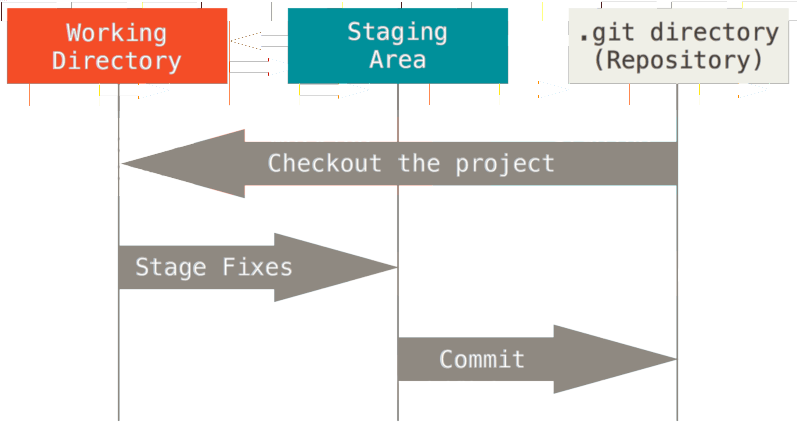
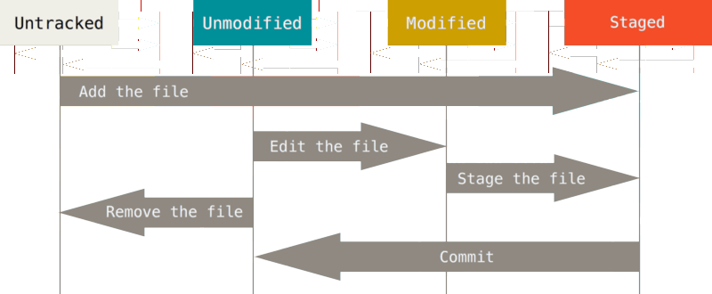

[toc]

**info on our [gitlab server](https://gitlab.nikkyrron.com)**

The docker container registry stores docker images that are tagged according to a project name. Currently all images are tagged to the docker project with the following format:

gitlab.nikkyrron.com:4567/cicd/docker/*<name>:<tag>*

Example:

gitlab.nikkyrron.com:4567/cicd/docker/**ubuntu:bionic**

## Background

The three main sections of a Git project: 

- **working directory** - this is what you see when you cd into your git project folder. it contains all the files that make up your project, along with a **.git** folder which is referred to as the **git directory**

- **git directory** - the **.git** directory. This is where git stores everything that represents your git repository as it is being tracked. When files are committed, they are copied to the **.git/objects** directory, and metadata about the files and the commits is in there also. Also in the **.git** directory are the hooks, etc.
**NOTE** This does in fact mean that, for any file that has been committed, there is a duplicate of that file in here for what you see in the working directory.

- **staging area** - this is a file in the **.git** directory called *index*. When you stage files for commit with `git add <files>`, the file in its modified state in the working directory is copied into the **.git/objects** directory. Then the checksum for the modified version of that file is placed in the index file. 

The basic Git workflow goes something like this:

1. You modify files in your working directory.
2. You stage the files, which copies the modified version into the **.git/objects** directory, and stores the checksum of that file in the .index staging file.
3. You do a commit, which does 2 things:
  - creates a snapshot that contains the newly modified files in their entirety, along with a pointer to the files that were not modified in this commit. 
  - create a commit object, which is just a pointer to that snapshot. The commit object also contains info (metadata) about the commit; committer, date etc.

## Basics on usage

### Configure git client to use https

For this to work git must have the cert from the git server. Download the cert ( a .crt file) and put it in a folder such as */home/ron/gitcerts/<certname>*

Then do `git config --global http.sslCAInfo /home/ron/gitcerts/gitlab.crt`.

At this point git clone will work with https.

### Create a new repo

To initialize git in an existing project directory do `git init`. This creates the **.git** folder which is your repository skeleton. The actual repo sits in here.  

To start tracking the files in your project do:
    git add .  # or file/wildcard/directory etc
    git commit -m 'initial commit'

### Clone an existing repo

To pull down a remote repo do `git clone <URL>`.

When you clone a repo, it will be completely up to date with the origin where you cloned it from.

Going forward you simply modify, stage, and commit any changes.

Tracked files can be in one of 3 states:  *unmodified, modified,* or *staged*.
- **unmodified** - they are in the working tree in the same state (checksum) as the .git/object directory.
- **modified** - they are in a different (modified) state in the working tree than in the .git/object directory.
- **staged** - they are in the .git/object directory in their modified status, and the checksum of that modified file is in the **.git/index** staging file. These files are ready to be committed.

### git ignore

Consult the Pro Git book which has a nice explanation of the syntax for the `.gitignore` file.

### Remove files

Use `git rm` to remove files. From there you commit, then the file is gone from the repo and from your working directory. If you do `git rm --cached` it will NOT be removed from the working directory. 

### Move files

To rename a file use `git mv`. Git will rm the old filename and add the new one.

### Viewing history log

Use `git log` to see past commit history. Some variations include:
- **git log -s** - short log view
- **git log -p** - more detailed view that shows the actual diff changes
- **git log -p -2** - show details, but only show 2 log records. The last 2 commits in other words.

### Amending a commit

Use `git commit --amend` if you made a commit but want to either modify the commit message or add more files. If you run the amend and you have not made any additional changes to the files committed previously it will only bring up the commit editor for the last commit so you can modify it.

If you make a commit, then you realize you wanted to add more changes to that commit, or you want more changes to be on that last commit, you can make the additional changes, then do `git add` followed by `git commit --amend` and the additional changes will be added to the last commit.

### Unstaging files

To remove a file from the staging area use `git reset HEAD <filename>`. Afterwards, the file will remain modified in the working directory, but not be staged for commit.

### Undoing modifications to files in working directory

Use `git checkout -- <filename>` to undo changes to a file in the working directory. GIT will simply revert the file to its state during the last commit. In other words it will pull it from the .git directory (snapshot).

!!! This is irreversible. So be sure you can live without those changes before doing this.

### Working with remotes

A remote is simply a version of your project that is hosted on another computer. 

### Show remotes

Use `git remote -v` to display URLs for all remotes.

### Adding remotes

To add a remote for a repo, use `git remote add <shortname> <URL>`. Then you can use `git fetch <shortname>` to fetch the remote files.

### Fetching and pulling from remotes

As mentioned above, use `git fetch <shortname>` to pull down all data from a remote that you dont already have. 
When you clone a repo, a remote named **origin** will automatically be added to the list of remotes.

Note that `git fetch` does not merge the remote version of any file into your current work. You have to do that manually. The `git pull` command fetches and merges automatically, and is usually the more comfortable workflow. When you run `git pull` and the remote version of a file you have locally is different, a merge commit will be generated and the editor will pop up for you to enter a commit message.

If after running `git pull` the remote version of a file will have changes that conflict with changes you made (and committed), a merge conflict will occur which has to be dealt with before the remote can be merged.

### Pushing to remotes

To push your committed changes to a remote use `git push <remote name> <branch name>`. So to push your local master branch to the origin server, use `git push origin master`.

### Inspecting a remote

To see more info about a remote use `git remote show <remote name>`. 

### Removing and renaming remotes

To change a remote's shortname, use `git remote rename <current shortname> <new shortname>`. This also changes it on the remote server. In other words if you do `git remote rename rf ron`, the reference to *rf/master* will now be *ron/master*.

To remove a remote use `git remote rm <shortname>`.

### Tagging

Tagging is used to mark important commits in the history. It is typically used to tag a release point like **v1.0** or **v1.1** etc.

### Listing tags

Use `git tag` to list all tags in the repo. They will be listed alphabetically.
You can also search for tags with a pattern, like `git tag -l "v1.8*"`. 

### Creating tags

There are 2 main types of tags, **lightweight** and **annotated**.

A lightweight tag is just a pointer to a specific commit. It is like a branch that never changes.

An annotated tag has much more information, and is stored in GIT as a full object. It is checksummed, has the tagger's name, email, date, a tagging message, and can be signed with GPG.

It is recommended to create annotated tags unless the tag is temporary or not important enough to have all this info.

### Annotated tags

To create an annotated tag, just do `git tag -a <tagname> -m "tagging message"`, for example `git tag -a v1.3 -m "version 1.3"`. This applies to the last commit. To tag a specific commit add some of the commit hash to the end.

### Lightweight tags

A lightweight tag is basically just a commit's checksum stored in a file, no other info is kept. 
To create a lightweight tag, just do not specify the *-a, -s,* or *-m* options. `git tag v1.3`.
As mentioned above, this tags the latest commit. To tag a specific commit, add the hash to the end.

### Sharing tags

By default `git push` does not push your tags upstream. To push a tag upstream do `git push <remote name> <tagname>`. Or to push all your tags at once do `git push <remote name> --tags`. 

### Git aliases

Just like aliases in bash, you can create shortcuts with git commands.
`git config --global alias.co checkout` will create an alias that allows you to type **co** instead of **checkout**.

Even better you could create a better alias for unstaging a file:

`git config --global alias.unstage 'reset HEAD --'`. Then, instead of typing `git reset HEAD -- <file>` you can do `git unstage file` to accomplish the same thing.

## Branching

Key points:
- branches are just pointers to commits in the history that you can move around. By default when you create a branch it is pointing to the latest HEAD commit of the branch you are branching off of:

