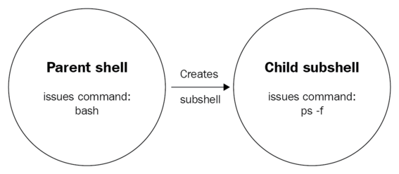

This post is derived from the book **Learn Linux Shell Scripting - Fundamentals of Bash 4.4**

The scripts are on github at [https://github.com/PacktPublishing/Learn-Linux-Shell-Scripting-Fundamentals-of-Bash-4.4.git](https://github.com/PacktPublishing/Learn-Linux-Shell-Scripting-Fundamentals-of-Bash-4.4.git)
and are cloned into ~/bashcourse on the bashclass VM

[toc]

## Section 1: Variables and User Input

### Variables

#### Commands Used

- **read** - a shell built-in which when used with -p will echo a string and then get user input and assign it to a named variable
- **test** - can validate expressions, numeric operators, and check for the existence of files or directories as well as their properties
- **if** - a shell keyword which will evaluate a subsequent expression and if true will execute a then statement following

#### Assignment of value

Variables can be used in different ways:

- as constants by assigning them a value at the start of the script and using that value throughout unchanged
- assigned by a user's input, which will be varied with different users.
- assigned a value by conditional testing within the script logic itself

#### Naming

Variables should be named in lowercase with underscores as separators
animal_type="gecko"

### User Input

Typically input to the script from a user is represented as  `${1}` , `${2}` etc in order they are supplied from command line.


To assign them to a variable in the script use `var=${1}`

#### Parameters vs arguments

Parameters are defined **IN** a script, while arguments are supplied **TO** a script.

Parameters are static and bound to the script version, while arguments are supplied at runtime.

#### Non-interactive with Positional Arguments

Arguments supplied at run time with no prompting:

```

	#!/bin/bash

	# Initialize the variables from passed arguments.
	character_name=${1}
	location=${2}
	food=${3}

	# Compose the story.
	echo "Recently, ${character_name} was seen in ${location} eating ${food}!"
```

#### Interactive using the read command

Interactively gather input from user by prompting with the read command

```

	#!/bin/bash

	# Prompt the user for information.
	read -p "Name a fictional character: " character_name
	read -p "Name an actual location: " location
	read -p "What's your favorite food? " food

	# Compose the story.
	echo "Recently, ${character_name} was seen in ${location} eating ${food}!
```

#### Combining them with if-then and test

 This will involve using the test command within an if-then loop to check if prompting is needed for a missing variable.
 If <test> then read .
 test -z is used to check if a variable is empty. If the variable is empty an exit code 0 is returned which will trigger the then clause

```

	#!/bin/bash

	# Usage: ./interactive-ultimate.sh [fictional-character-name] [actual-
	# location] [favorite-food]
	#####################################

	# Grab arguments.
	character_name=$1
	location=$2
	food=$3

	# Prompt the user for information, if it was not passed as arguments.
	if test -z ${character_name}; then read -p "Name a fictional character: " character_name; fi
	if test -z ${location}; then read -p "Name an actual location: " location; fi
	if test -z ${food}; then read -p "What's your favorite food? " food; fi

	# Compose the story.
	echo "Recently, ${character_name} was seen in ${location} eating ${food}!"
  ```
  ## Section 2: Error Checking and Handling

  **Commands Used:**
- **mktemp** - create a temporary file with a random name, useful to store temporary data on disk. Add -d for a temporary directory
- **true** - do nothing, successfully
- **false** - do nothing, unsuccessfully

**Objectives**
- explain the exit status
- do functional checks with the test command
- use shorthand notation for the test command

### Error Checking

#### Exit Status

The exit status, commonly also referred to as exit codes or return codes, is the way Bash communicates the successful or unsuccessful termination of a process to its parent. In Bash, all processes are forked from the shell that calls them. The following diagram illustrates this:


Bash forks into another shell with same env and runs the `ps -f` command as a process in the forked shell. When the ps -f process is complete the fork is terminated and an exit status is returned
to the parent shell.

An exit code of 0 is considered a success, while all other codes should be treated as not a success.
The exit code is stored in the variable `$?`

```

	#!/bin/bash

	# Run a command that should always work and assign the exit code to a var:
	mktemp
	mktemp_rc=$?

	# Run a command that should always fail and assign the exit code to a var:
	mkdir /home/
	mkdir_rc=$?

	echo "mktemp returned ${mktemp_rc}, while mkdir returned ${mkdir_rc}!"
```

The exit codes will be echoed as 0 for the first and 1 for the second.

#### Functional Checks

A functional check uses test to verify something and returns a boolean, it is added to the script:

```

	#!/bin/bash

	# Create a directory.
	mkdir /tmp/temp_dir
	mkdir_rc=$?

	# Use test to check if the directory was created and assign the exit code to a var.
	test -d /tmp/temp_dir
	test_rc=$?

	# Check out the return codes:
	echo "mkdir resulted in ${mkdir_rc}, test resulted in ${test_rc}."
```
!!! If the directory had been created before, the mkdir command would haver exited 1 while the test would exit 0
Think about whether an exit code or a test result is what you need for the script.

#### Test Shorthand

These are the things test can do:

- Check whether a file exists
- Check whether a directory exists
- Check whether a variable is not empty
- Check whether two variables have the same values
- Check whether `FILE1` is older than `FILE2`
- Check whether `INTEGER1` is greater than `INTEGER2`

The shorthand for the test command is the `[[ ]]` structure.

!!! `test -d /tmp/`in shorthand is `[[ -d /tmp/ ]]`

```

#!/bin/bash

# Test if the /tmp/ directory exists using the full command:
test -d /tmp/
test_rc=$?

# Test if the /tmp/ directory exists using the simple shorthand:
[ -d /tmp/ ]
simple_rc=$?

# Test if the /tmp/ directory exists using the extended shorthand:
[[ -d /tmp/ ]]
extended_rc=$?

# Print the results.
echo "The return codes are: ${test_rc}, ${simple_rc}, ${extended_rc}."
```

You can also use a variable in the test expression and bash will expand it

```

#!/bin/bash

# Description: Write faster tests with the shorthand, now even better
# with a CONSTANT!
# Usage: ./test-shorthand-variable.sh
#####################################

DIRECTORY=/tmp/

# Test if the /tmp/ directory exists using the full command:
test -d ${DIRECTORY}
test_rc=$?

# Test if the /tmp/ directory exists using the simple shorthand:
[ -d ${DIRECTORY} ]
simple_rc=$?

# Test if the /tmp/ directory exists using the extended shorthand:
 -d **${DIRECTORY}**
extended_rc=$?

# Print the results.
echo "The return codes are: ${test_rc}, ${simple_rc}, ${extended_rc}."
```

#### Bash Debugging

Run a script with `bash -x <script>` and bash will print commands and their arguments as they are executed. It shows the variables expanded also.

`$ bash -x test-shorthand-variable.sh`
+ DIRECTORY=/tmp/
+ test -d /tmp/
+ test_rc=0
+ '[' -d /tmp/ ']'
+ simple_rc=0
+  -d /tmp/
+ extended_rc=0
+ echo 'The return codes are: 0, 0, 0.'
The return codes are: 0, 0, 0.

### Error Handling

In addition to checking for errors, there is the issue of how to handle them when they occur

#### if-then-exit

The if-then-exit statement evaluates and on failiure it exits the script with an exit code 1 (or whatever code you choose):

```
#!/bin/bash

FILE=/tmp/random_file.txt

# Check if the file exists.
if  [[ ! -f ${FILE}  ]]; then       #! inverts the test to mean if NOT exists
  echo "File does not exist, stopping the script!"
  exit 1	      	#if the test result warrants, then exit code 1 happens
fi

# Print the file content.			# otherwise drop out of the loop and continue the script
cat ${FILE}
```
```
$ bash -x if-then-exit.sh
+ FILE=/tmp/random_file.txt
+  ! -f /tmp/random_file.txt
+ echo 'File does not exist, stopping the script!'
File does not exist, stopping the script!
+ exit 1
```

Some more examples of the extended shorthand syntax are as follows:

- `if [[-f /tmp/file ]]; then do`  do-something is executed if the file /tmp/file does exist
- `if [[ ! -f /tmp/file ]]; then do` -> do-something is executed if the file /tmp/file does not exist
- `if [[ -n ${variable}  ]]; then do` -> do-something is executed if the variable ${variable} is not empty
- `if [[ -z ${variable} ]]; then do` -> do-something is executed if the variable ${variable} is empty

! You can also use the ! to negate or invert a zero ( -z ) or nonzero ( -n ) flag but it is clumsy

- `if [[ ! -n ${variable} ]]; then do` -> do-something is executed if the variable ${variable} is empty
	- instead of using the ! to invert this nonzero flag use the -z zero flag
- `if [[ ! -z ${variable} ]]; then do` -> do-something is executed if the variable ${variable} is not empty
	- use -n instead of the ! against this flag

#### if-then-else

  The `if-then-else` statement evaluates and on failiure it executes an alternative command:

  `IF condition, THEN do; ELSE do;`


  ```

  #!/bin/bash

  file_name=$1

  # Check if the file exists.
  if  -f ${file_name} ; then
    cat ${file_name} # Print the file content.
  else
    echo "File does not exist, stopping the script!"
    exit 1
  fi
```

  You can also use multiple `if-then-else` statements to better guarantee the ultimate goal of the script.

  In the following example, the first `if-then-else` block will correct if it fails, while the second `if-then-else` block
  will ensure that either the first did not fail, or that the failure was really corrected and that the script ultimately
  succeeded and that the exit code 0 is valid

  ```

  #!/bin/bash


  # Description: Make sure the file given as an argument is empty.
  # Usage: ./empty-file.sh <file-name>
  #####################################

  # Grab the first argument.
  file_name=$1

  # If the file exists, overwrite it with the always empty file
  # /dev/null; otherwise, touch it.
  if  -f ${file_name} ; then
    cp /dev/null ${file_name}		#the first if-then-else will first fail then the else statement will fix the failure
  else
    touch ${file_name}
  fi

  # Check if either the cp or touch worked correctly.
  if  $? -ne 0 ; then
    echo "Something went wrong, please check ${file_name}!"		#the second if-then-else will ensure the fix worked, otherwise exit the script with an error
    exit 1
  else
    echo "Success, file ${file_name} is now empty."
  fi
```

#### Shorthand Syntax

**Commands Used**
- **true** - do nothing, successfully
- **false** - do nothing, unsuccessfully

The error handling shown in the `if-then-else` statements above is wordy. There is a solution using the logical operators `&&` **(AND)** and `||` **(OR)**
along with the `true` and `false` commands

```
#!/bin/bash

# Check out how an exit status of 0 affects the logical operators:
true && echo "We get here because the first part is true!"
true || echo "We never see this because the first part is true :("

# Check out how an exit status of 1 affects the logical operators:
false && echo "Since we only continue after && with an exit status of 0, this is never printed."
false || echo "Because we only continue after || with a return code that is not 0, we see this!"
```

The `&&` operator can only be crossed if the exit code is 0  (success)
The `||` operator can only be crossed if the exit code is NOT 0 (failure)

The next script uses the `||` operator to exit with error code 123 on a false condition

```

#!/bin/bash

# This command will surely fail because we don't have the permissions needed:
cat /etc/shadow || exit 123
```

! Optimally, you should use an echo then an exit to inform the user on the failure.

#### Error Prevention

While it is one thing to handle errors, it is even better to prevent them from happening.


The following script will:

1. use the `$#`, a positional representing the number of arguments passed, to ensure the correct amount (3 in this case) was passed.
2. use a series of if-then statements with the `||` operator to exit on failure

```

#!/bin/bash

# We need exactly three arguments, check how many have been passed to
# the script.
if  **$#** -ne 3 ; then
  echo "Incorrect usage!"
  echo "Usage: $0 <directory_name> <file_name> <file_content>"
  exit 1
fi
# Arguments are correct, lets continue.

# Save the arguments into variables.
directory_name=$1
file_name=$2
file_content=$3

# Create the absolute path for the file.
absolute_file_path=${directory_name}/${file_name}

# Check if the directory exists; otherwise, try to create it.
if  ! -d ${directory_name} ; then
  mkdir ${directory_name} || { echo "Cannot create directory, exiting script!"; exit 1; }
fi

# Try to create the file, if it does not exist.
if  ! -f ${absolute_file_path} ; then
  touch ${absolute_file_path} || { echo "Cannot create file, exiting script!"; exit 1; }
fi

# File has been created, echo the content to it.
echo ${file_content} > ${absolute_file_path}
```

#### Managing Absolute and Relative Paths

Since bash forks to execute a script, the fork inherits the same current working directory.
This script will use a relative pathname  to create a new directory called dpkg, relative to the current working directory. It will also use shorthand error handling via the `||` operator.

```

#!/bin/bash

# Create the directory in which we'll store the file.
if  ! -d dpkg ; then
  mkdir dpkg || { echo "Cannot create the directory, stopping script."; exit 1; }
fi

# Copy the log file to our new directory.
cp /var/log/dpkg.log dpkg || { echo "Cannot copy dpkg.log to the new directory."; exit 1; }
```

The next script will also use relative pathnames to create the dpkg directory, but it will always create it relative to the script location.

Therefore the script can be called from anywhere

```

#!/bin/bash

# Change directory to the script location.
cd $(dirname $0)

# Create the directory in which we'll store the file.
if  ! -d dpkg ; then
  mkdir dpkg || { echo "Cannot create the directory, stopping script."; exit 1; }
fi

# Copy the log file to our new directory.
cp /var/log/dpkg.log dpkg || { echo "Cannot copy dpkg.log to the new directory."; exit 1; }
```

How does `cd $(dirname $0)` work?
The `dirname` command is used to strip the filename from the end of an absolute path/filename. In the code above dirname is being applied to $0 which
represents the script itself. Therefore the result will be the directory of the script. So with command substitution the variable will expand to that directory and
the statement will cd to that directory.

#### Dealing with y/n

By using the `||` operator we can check for the various ways a user can respond to a yes/no question.
First the script will read in a reply and assign it to a var reply_variable, then the variable will be tested against all acceptable values.

```

#!/bin/bash


# Usage: ./yes-no.sh
#####################################

read -p "Do you like this question? " reply_variable

# See if the user responded positively.
if  ${reply_variable} = 'Y' || ${reply_variable} = 'yes' || ${reply_variable} = 'YES' || ${reply_variable} = 'Yes' ; then
  echo "Great, I worked really hard on it!"
  exit 0
fi

# Maybe the user responded negatively?
if  ${reply_variable} = 'N' || ${reply_variable} = 'no' || ${reply_variable} = 'NO' || ${reply_variable} = 'No' ; then
  echo "You did not? But I worked so hard on it!"
  exit 0
fi

# If we get here, the user did not give a proper response.
echo "Please use yes/no!"
exit 1
```

The problem with this is that the user may have their cap locks on and THINK they are responding correctly.
The possibilities include YES, yes, or yES  etc.

To avoid this, use **parameter expansion** and bash will expand the variable to either all lowercase or uppercase. So then, their answer is assigned by the read command to the variable, then the variable value is forced to all lower/upper case so we can test it irrelevant to user's caps lock.
To use parameter expansion, follow the varname with either `,,` or `^^`
Then we can set the `if-then-||` to allow either response.

```

#!/bin/bash

read -p "Do you like this question? " reply_variable

# See if the user responded positively.
if  ${**reply_variable,,**} = 'yes' ; then   <---- check for y or yes in any case, and allow it by forcing it to lowercase
  echo "Great, I worked really hard on it!"
  exit 0
fi

# Maybe the user responded negatively?
if  ${**reply_variable^^**} = 'NO' ; then		<----- check for n or no in any case and allow it by forcing it to uppercase
  echo "You did not? But I worked so hard on it!"
  exit 0
fi

# If we get here, the user did not give a proper response.
echo "Please use yes/no!"
exit 1
```

## Section 3: Regular  Expressions

#### "Greediness"

When searching for a string like grep 'in' it will match not only the word in but any words containing the letters in such as  painful

Use a space in a regex string to only find a whole word.
grep '  in  '  will find only the word in whereas grep 'in' will find  inside, into, etc.

#### Character Matching

The dot . represents one character position, while a * represents all positions ending at either another operator or the end of the text being searched.

grep 'i.to' will match into while grep  'i*to' will match into and also infinito

#### Line Anchors

The  caret ^ means the beginning of a line, while the $ means the end of a line. grep 'end$ will only the letters end if they are at the end of a line.
grep '^end' would only find the letters end if it occurred at the beginning of a line.

#### Escaping

The backslash \ is used to escape special characters like . or $  since these characters have special meaning in a regex they must be preceded by a \ and turned literal.

grep $500 will try to expand a bash variable, while grep \$500 will look for a string $500 such as in an expense report.

#### Quoting

Quotes will prevent variable expansion as well as isolate a term.

grep $500 will expand to the value of a var
grep '$500' not expand the variable. However since $ is a special character denoting the end of a line, it would be a bad choice.
grep '\$500' will stop expansion and escape the $

#### Character Classes

Use brackets such as **[a-z]** to find any lowercase letter
Use **[0-9]** to find any number

There is also a double bracket notation such as this:    **[[:alnum:]]** which means alphanumeric or  **[a-z A-Z 0-9]**

**[[:alnum:]]**   Matches lowercase and uppercase letters or digits   **[a-z A-Z 0-9]**

**[[:alpha:]]**	Matches lowercase and uppercase letters	**[a-z A-Z]**

**[[:digit:]]**	Matches digits	**[0-9]**

**[[:lower:]]**	Matches lowercase letters	**[a-z]**

**[[:upper:]]**	Matches uppercase letters	**[A-Z]**

**[[:blank:]]**	Matches spaces and tabs	**[ \t]**

Globbing

Globbing refers to using wildcards such as  rm *.txt

In regex, the * means one of more occurrences of the character preceding it, so it would be  .*

grep .* *  will find any and all characters in every file

NOTE:  Globbing is always related to files, while using regex is used inside the files.

You can use the bracket notation for globbing:
```
$ ls p[a-z]ng
ping
pong
```

#### Advanced grep  ( egrep )

The egrep command is actually not a separate command, but is a wrapper to execute grep -E to use extended regular expressions.

Using egrep makes available additional constructs as follows:

**?**		Matches a repeat of the previous character zero or more times

**+**		Matches a repeat of the previous character one or more times

**{n}**		Matches a repeat of the previous character exactly n times

**{n,m}**	Matches a repeat of the previous character between n and m times

**{,n}**		Matches a repeat of the previous character n or fewer times

**{n,}**		Matches a repeat of the previous character n or more times

**(xx|yy)**	Alternation character, allows us to find **xx** OR **yy** in the search pattern (great for patterns with more than one character, otherwise, **[xy]** notation would suffice)

## Section 4: sed stream editor


sed edits streams coming in to `STDOUT` or files in place with the -i option

#### Stream editing

Stream editing does not modify the original file only the output to `STDOUT`

you can either pipe into it or run it directly against the file name
- `cat [input-file] | sed [options]`
- `sed [options] [input-file]`

`$ cat search.txt`
How much wood would a woodchuck chuck		<---- contents of a text file for an example
if a woodchuck could chuck wood?

`$ cat search.txt | sed 's/wood/stone/'`
How much stone would a woodchuck chuck
if a stonechuck could chuck wood?

The default is to match only on the first instance on each line, and to match both whole words and parts of a word

 To match all instances use a /g

`$ cat search.txt | sed 's/wood/stone/g'`
How much stone would a stonechuck chuck
if a stonechuck could chuck stone?

To only edit specific lines place the line number on the beginning of the expression

`$ cat search.txt | sed '1s/wood/stone/g'`
How much stone would a stonechuck chuck
or
`$ cat search.txt | sed '2s/wood/stone/g'`
if a stonechuck could chuck stone?

To sepcify multiple lines use comma delimits

`$ cat search.txt | sed '1,2s/wood/stone/g'`
How much stone would a stonechuck chuck
if a stonechuck could chuck stone?

#### In-place editing

The previous examples only modify what goes to STDOUT they do not change the origin file.
For that use the -i ( --in-place ) option. Just add the switch and it will modify the file itself

`sed -i 's/wood/stone/g' search.txt`

You can also have sed create a backup of the file before modifying it

`sed -i'.bak' 's/wood/stone/g' search.txt`
! There is no space between -i and '.bak' - this is intentional because sed expects the script string  ( 's/wood/stone/g' )  to come immediately after the options

#### Line manipulation

sed can also work on lines

**Delete lines**

To delete certain lines by number pipe into sed and use <n>d

`$ cat search.txt | sed '1d'`
if a stonechuck could chuck stone?

To delete lines containing a certain word use '/<word>/d'

`$ cat search.txt |sed '/if/d'`
How much stone would a stonechuck chuck

! To make the word case-insensitive, add a regex construct to it like this  -   '/[Hh]ow'  to find either How or how. Or to delete the line use -  '/[Hh]ow/d'

Also you can use '/.ow' to find How or how, and '/.ow/d to delete How or how

**Delete certain words in lines**

To do this simply use the standard word substition  `'s/wood/stone/g'`  like before but use an empty string for the replacement:

`sed 's/wood//g search.txt`
How much would a chuck chuck
if a chuck could chuck?

NOTE:  In reality, sed will **NOT** delete the whitespace where the word was, so you will end up with this:

`How much  would a chuck chuck`	there is whitespace  between much and would

`if a chuck could chuck ?`  there is whitespace between chuck and ?

In the areas where wood was the standalone word  ( not woodchuck ) it leaves the whitespace.

To fix this you need to do two operations using the **-e** option:

- delete wood and the whitespace after it -  `'s/wood //g/`  to replace wood and the space after with nothing. This will remove the instances where wood is standalone word
- delete wood where it is part of a word , where there is no whitespace after it  -  `'s/wood//g`

Those could be used independently too. But in that example to get rid of **ALL** instances of wood we would need both of them.

By using **-e** sed can run multiple operations in one command, to produce the ultimate filtering that we want to be streamed to **STDOUT**

Place the **-e** option before each operation:

`sed -e 's/wood //g' -e 's/wood//g search.txt`

#### Print lines

sed can print lines using the **/p** option. However, by default sed prints all lines that it searches whether they match or not. So for lines that match it will print them twice, once for the match and once for the print itself.

`sed '/How/p' search.txt`
How much stone would a stonechuck chuck
How much stone would a stonechuck chuck
if a stonechuck could chuck stone?

To suppress this behavior use **-n** for quiet. This way sed will only print the lines that match

`sed -n '/How/p' search.txt`
How much stone would a stonechuck chuck

## Section 5: Conditional Testing and Scripting Loops

**Commands Used:**
* elif
* help
* while
* sleep
* for
* basename
* break
* continue

#### Topics Covered

* advanced if-then-else
* the binary operator =~  -  used in a test when the right side is an extended regular expression
* while loop
* for loop
* the loop control

#### Advanced if-then-else

A recap on the `if-then-else` loop:

```
#!/bin/bash

file_name=$1

# Check if the file exists.
if  -f ${file_name} ; then
  cat ${file_name} # Print the file content.
else
  echo "File does not exist, stopping the script!"
  exit 1
fi
```

#### Using regular expressions in tests

Regular expressions are mostly supporting constructs used with other scripting tools.
They can be used within the test blocks `[[....]]` as well.

```
#!/bin/bash

INPUT_NUMBER=$1		# assign the first positional argument to var

# Check the number of arguments received.
if  $# -ne 1 ; then
 echo "Incorrect usage, wrong number of arguments."
 echo "Usage: $0 <number>"
 exit 1
fi

# Check to see if the input is a number.
if  ! ${INPUT_NUMBER} =~ **[[:digit: ]]; then 		# a regex nested in a test. The binary operator =~ **is used when the right side of a test is a regex
 echo "Incorrect usage, wrong type of argument."
 echo "Usage: $0 <number>"
 exit 1
fi

# Multiple the input number with itself and return this to the user.
echo $((${INPUT_NUMBER} * ${INPUT_NUMBER}))
```

#### Fix script to not allow alphanumeric argument

! The test for the argument being a digit is not complete.  If the argument passed was a3, the test would pass and the script would return exit code 0.

This is because the regex  `[[:digit:]]` simply looks for a digit within the var, not exclusively.

To fix this, use line anchors in the regex to isolate the digit on either side. Change the regex test as follows:

`if  ! ${INPUT_NUMBER} =~ **^[[:digit:$ ]]**; then`

#### Fix script to allow more than just 0-9

The regex  `^[[:digit:]]$`  will only allow one digit. To allow an argument of 10 or above append the one or more  **( + )**  symbol to `[[:digit:]]`

`if  ! ${INPUT_NUMBER} =~ **^[[:digit:+$]]**; then`

### Final script

```
#!/bin/bash

INPUT_NUMBER=$1

# Check the number of arguments received.
if  $# -ne 1 ; then
 echo "Incorrect usage, wrong number of arguments."
 echo "Usage: $0 <number>"
 exit 1
fi

# Check to see if the input is a number.
if  ! ${INPUT_NUMBER} =~ **^[[:digit:+$ ]]**; then		# the final regex, allows only digits by using line anchors on either side and allows more than one digit
 echo "Incorrect usage, wrong type of argument."			by using the +  ( one or more ) regex symbol.
 echo "Usage: $0 <number>"
 exit 1
fi

# Multiple the input number with itself and return this to the user.
echo $((${INPUT_NUMBER} * ${INPUT_NUMBER}))
```

### The elif condition

The elif command allows you to string together else statements like this:

```
if condition1; then
do
elif condition2; then
do
.....
else
do
```

There is one caveat:  Just as with an `if-then-else` statement, only one statement will ever be executed with a single loop.
If there needs to be more than one statement executed by the script, then
multiple `if-then-else` statements will have to be used.

```

#!/bin/bash

# Since we're dealing with paths, set current working directory to script location.
cd $(dirname $0)

# Input validation.
if  $# -ne 1 ; then
  echo "Incorrect usage!"
  echo "Usage: $0 <file or directory path>"
  exit 1
fi

input_path=$1

if  -f ${input_path} ; then
  echo "File found, showing content:"
  cat ${input_path} || { echo "Cannot print file, exiting script!"; exit 1; }
elif  -d ${input_path} ; then
  echo "Directory found, listing:"
  ls -l ${input_path} || { echo "Cannot list directory, exiting script!"; exit 1; }
else
  echo "Path is neither a file nor a directory, exiting script."
  exit 1
fi
```

The first if block verifies only one argument is passed

The next if block checks if the argument is a file, and if so it cats it out OR it errors out - it has the logical OR operator || to alternatively handle an unexpected failure
The elif block checks if the argument is a directory, and if so does an ls on it OR it errors out - it also has the logical OR operator || to alternatively handle an unexpected failure

If all statements fail, the else block errors out the script.

! As expected, too many `if-then` or `if-elif` statements become cumbersome, and the solution is the case command.

### Nesting

An alternative to the OR method is to nest an `if-then-else` statement within the then or else of an outer `if-then-else` statement.

It allows for more control over feedback to the user if a command fails. Using the OR allows to supply a message like above but it relies on the output from the command itself,
such as Permission denied errors trying to cat a file or ls a directory without enough permissions.

```

#!/bin/bash

# Since we're dealing with paths, set current working directory.
cd $(dirname $0)

# Input validation.
if  $# -ne 1 ; then
  echo "Incorrect usage!"
  echo "Usage: $0 <file or directory path>"
  exit 1
fi

input_path=$1

# First, check if we can read the file.
if  -r ${input_path} ; then
  # We can read the file, now we determine what type it is.
  if  -f ${input_path} ; then
	echo "File found, showing content:"
	cat ${input_path}
  elif  -d ${input_path} ; then
	echo "Directory found, listing:"
	ls -l ${input_path}
  else
	echo "Path is neither a file nor a directory, exiting script."
	exit 1
  fi
else
  # We cannot read the file, print an error.
  echo "Cannot read the file/directory, exiting script."
  exit 1
fi
```

The flow is as follows:
```
if condition, then
	if condition, then
	execute
	elif condition, then
	execute
	else
	exit
	fi
else
exit
fi
```

This gives the script 2 scenarios where we could identify a failure with the argument:
* is it readable  - first test
* if readable is it either a file or directory - second test

The outer if statement will exit if not readable, and the inner if statement will exit if readable but not a file or directory.
Therefore, more control over feedback to user.

**For help on shell builtins and keywords**

First use `type -a` to determine if it is either of the two

```
$ type -a [[
[[ is a shell keyword

$ type -a if
if is a shell keyword

$ type -a echo
echo is a shell builtin

$ type -a type
type is a shell builtin
```

Then use the help command to get help on them
- help [[
- help if
- help echo
- help type

### The while loop

`WHILE true; DO; DONE`

The while loop will do  an action many times, while the condition is still true. Rather than be an unending loop, the action taken by do will mutate the condition
until it is no longer true

An unending while true loop looks like this:

```
#!/bin/bash

# Infinite while loop.
while true; do
  echo "Hello!"
  sleep 1 # Wait for 1 second.
done
```

Obviously it will run forever.

! The sleep command is one way to time a loop since it increments with each loop. If the while condition tracks that increment, the script will run **n** times according to `sleep n`.

Here is how to use the sleep command to increment a counter that is tracked by the while statement

```
#!/bin/bash

# Define the counter outside of the loop so we don't reset it for
# every run in the loop.
counter=0

# This loop runs 10 times.
while  ${counter} -lt 10 ; do
  counter=$((counter+1)) # Increment the counter by 1.
  echo "Hello! This is loop number ${counter}."
  sleep 1
done

# After the while-loop finishes, print a goodbye message.
echo "All done, thanks for tuning in!"
```

When the counter reaches 10 the while condition is mutated to false and the loop exits, executing the remainder of the script and exiting.

**About the double parentheses**

The double parentheses used in the do statement:
`counter=$((counter+1))` # Increment the counter by 1.

The double paren is used to perform arithmetic, and, as in this case is often used for assignments.

### The until loop

`DO; UNTIL condition is true; DONE`

The until loop does the same thing as a while loop, it does something then it hits a hard stop and exits.

It does the same thing but is written inverse to the while loop:  the while loop exits when the condition becomes false, whereas the until loop exits when the condition becomes true.

```

#!/bin/bash

# Define the counter outside of the loop so we don't reset it for
# every run in the loop.
counter=0

# This loop runs 10 times.
until  ${counter} -gt 9 ; do
  counter=$((counter+1)) # Increment the counter by 1.
  echo "Hello! This is loop number ${counter}."
  sleep 1
done

# After the while-loop finishes, print a goodbye message.
echo "All done, thanks for tuning in!"
```

There is no hard rule on when to use one of the other. When in doubt just use while, it will hardly ever be wrong as long as the condition is structured correctly.

In some cases it may be easier to state the condition with an until loop, such as  if the loop exits based on something like the date.

### Creating an interactive while loop

Normally a for loop is favored over a while loop.

However, a while loop, the while true loop in particular,  is excellent for dealing with user input.

By using the while true construct and nesting an if-then-else block within it, you can query a user repeatedly until you get the answer you are looking for.

The while true loop will run the if-then-else block tirelessly until the block gets the desired result.

```
#!/bin/bash

# Infinite loop, only exits on correct answer.
while true; do
  read -p "I have keys but no locks. I have a space but no room. You can enter, but can’t go outside. What am I? " answer
  if  ${answer} =~ [Kk]eyboard ; then # Use regular expression so 'a keyboard' or 'Keyboard' is also a valid answer.
	echo "Correct, congratulations!"
	exit 0 # Exit the script.
  else
	# Print an error message and go back into the loop.
	echo "Incorrect, please try again."
  fi
done
```

! Remember, the =~ is in the test statement because the expression to the right is a regex

### The for loop

The for loop is interchangeable with while, but has better shorthand syntax, often requiring much less code than an equivalent while loop.

The for loop has 2 different syntaxes, a C style and the regular bash syntax.

`FOR value IN list-of-values; DO thing-with-value; DONE`

A for loop iterates over a list of things, and each loop uses a different item in that list, in a sequential order.

```
#!/bin/bash

# Create a 'list'.
words="house dog telephone dog"

# Iterate over the list and process the values.
for word in ${words}; do
  echo "The word is: ${word}"
done

$ bash for-simple.sh
The word is: house
The word is: dog
The word is: telephone
The word is: dog
```

The loop uses a variable word and for every iteration of the loop it reassigns the value to the next item in the list.

The C-style syntax for the for loop works like this:

`FOR ((counter=0; counter<=10; counter++)); DO something DONE`

```
#!/bin/bash

# This loop runs 10 times.
for ((counter=1; counter<=10; counter++)); do
  echo "Hello! This is loop number ${counter}."
  sleep 1
done

# After the for-loop finishes, print a goodbye message.
echo "All done, thanks for tuning in!"
```

```
$ bash for-counter.sh
Hello! This is loop number 1.
Hello! This is loop number 2.
Hello! This is loop number 3.
Hello! This is loop number 4.
Hello! This is loop number 5.
Hello! This is loop number 6.
Hello! This is loop number 7.
Hello! This is loop number 8.
Hello! This is loop number 9.
Hello! This is loop number 10.
All done, thanks for tuning in!
```

The variable is counter. The construct  ((counter=1; counter<=10; counter++))  says the following:

- initial value of counter is 1
- do while counter is less than or equal to 10,
- increment the counter at the end of each run of the loop.

The bash-style syntax for using a counter like this is:

`for counter in {1..10}; do`

```
#!/bin/bash

# This loop runs 10 times.
for counter in {1..10}; do
  echo "Hello! This is loop number ${counter}."
  sleep 1
done

# After the for-loop finishes, print a goodbye message.
echo "All done, thanks for tuning in!"
```

```
$ bash for-number-list.sh
Hello! This is loop number 1.
Hello! This is loop number 2.
Hello! This is loop number 3.
Hello! This is loop number 4.
Hello! This is loop number 5.
Hello! This is loop number 6.
Hello! This is loop number 7.
Hello! This is loop number 8.
Hello! This is loop number 9.
Hello! This is loop number 10.
All done, thanks for tuning in!
```

The while range is established by brace expansion, as the  **{1..10}**  will expand to **1 2 3 4 5 6 7 8 9 10**  -  delimited by whitespace

! It appeared to me that 1-10 would work as well, but it does not expand. So brace expansion is explicitly done using **..**

Brace expansion works with both numbers and characters, such as **{a..z}**.

With characters it actually uses the ASCII hex codes, which is why **{A..z}** will place some special characters between the last uppercase Z and the first uppercase a

```
$ echo {A..z}
A B C D E F G H I J K L M N O P Q R S T U V W X Y Z [  ] ^ _ ` a b c d e f g h i j k l m n o p q r s t u v w x y z
```

You can also change the default increment of 1 by staing it in the braces:

`{<starting value>..<ending value>..<increment>}`

```
$ echo {1..100..10}
1 11 21 31 41 51 61 71 81 91
$ echo {0..100..10}
0 10 20 30 40 50 60 70 80 90 100
```

#### Globbing and the for loop

To find 'error' in log files you can do a single command:
`grep -i 'error' *.log`

To perform many actions on many files, a globbing action along with a for loop is better.

The examples below will gradually build to a use case for this:

Here is the for loop equivalent of `ls /var/log/*.log`

Populate the variable with the results of **ls**, then echo each one

```
#!/bin/bash

# Create a list of log files.
for file in $(ls /var/log/*.log); do
  echo ${file}
done
```

Add a grep 'error' action for each iteration to grep every result

```
#!/bin/bash

# Create a list of log files.
for file in $(ls /var/log/*.log); do
  echo "File: ${file}"
  grep -i 'error' ${file}
done
```

Use an **if-then-else** statement in the loop to perform further actions on specific files:

- Add the **--quiet** to grep to squelch echoing the results
- nest an **if-then-else** into the for loop to test for grep exit code 0 (an error was found)
- echo out the filename
- then copy it to another folder

At this point we are globbing a list of files, then discriminately performing multiple actions on qualifying files.

```
#!/bin/bash

# Create a directory to store log files with errors.
ERROR_DIRECTORY='/tmp/error_logfiles/'
mkdir -p ${ERROR_DIRECTORY}

# Create a list of log files.
for file in $(ls /var/log/*.log); do
 grep --quiet -i 'error' ${file}

 # Check the return code for grep; if it is 0, file contains errors.
 if  $? -eq 0 ; then
 echo "${file} contains error(s), copying it to archive."
 cp ${file} ${ERROR_DIRECTORY} # Archive the file to another directory.
 fi

done
```
```
$ bash for-globbing.sh
/var/log/bootstrap.log contains error(s), copying it to archive.
/var/log/dpkg.log contains error(s), copying it to archive.
/var/log/kern.log contains error(s), copying it to archive.
```

Use sed to strip out all lines in each file that do not contain "error"

```
#!/bin/bash

#####################################
# Description: Combining globbing patterns in a for loop.
# Usage: ./for-globbing.sh
#####################################

# Create a directory to store log files with errors.
ERROR_DIRECTORY='/tmp/error_logfiles/'
mkdir -p ${ERROR_DIRECTORY}

# Create a list of log files.
for file in $(ls /var/log/*.log); do
  grep --quiet -i 'error' ${file}

  # Check the return code for grep; if it is 0, file contains errors.
  if  $? -eq 0 ; then
	echo "${file} contains error(s), copying it to archive ${ERROR_DIRECTORY}."
	cp ${file} ${ERROR_DIRECTORY} # Archive the file to another directory.

	# Create the new file location variable with the directory and basename of the file.
	file_new_location="${ERROR_DIRECTORY}$(basename ${file})"		#This line creates a variable with path/filenames for sed to use below to access them.
	# In-place edit, only print lines matching 'error' or 'Error'.
	sed --quiet --in-place '/[Ee]rror/p' ${file_new_location} 	#only print the lines that match '/[Ee]rror/p' .  Use --in-place to change the file itself.
  fi																Effectively, sed will stream the contents out and only replace the lines that match

done
```

### Loop Control

There are 2 keywords we need to use the full power of loops:  `break` and `continue`

#### Break

Breaking out of a loop allows to exit the loop and continue the script.

A previous example used an _infinite_ **while true** loop to ask a riddle repeatedly, then exit 0 from the loop
and the script itself on correct answer:

```
#!/bin/bash

# Infinite loop, only exits on correct answer.
while true; do
  read -p "I have keys but no locks. I have a space but no room. You can enter, but can’t go outside. What am I? " answer
  if  ${answer} =~ [Kk]eyboard ; then # Use regular expression so 'a keyboard' or 'Keyboard' is also a valid answer.
	echo "Correct, congratulations!"
exit 0
  else
	# Print an error message and go back into the loop.
	echo "Incorrect, please try again."
  fi
done
```

In the next script the exit 0 is replaced with break. Now, when the if test becomes true, break will throw execution out of the loop but stay to run more commands later in the script.

```
#!/bin/bash

# Infinite loop, only exits on correct answer.
while true; do
  read -p "I have keys but no locks. I have a space but no room. You can enter, but can’t go outside. What am I? " answer
  if  ${answer} =~ [Kk]eyboard ; then # Use regular expression so 'a keyboard' or 'Keyboard' is also a valid answer.
	echo "Correct, congratulations!"
break # Exit the while loop.		# in previous example this line was exit 0, and the script exited immediately. With break we can exit just the loop and continue the script,
  else													thereby using a while loop and beyond in a script
	# Print an error message and go back into the loop.
	echo "Incorrect, please try again."
  fi
done

# This will run after the break in the while loop.
echo "Now we can continue after the while loop is done, awesome!"
```

#### Use break in a for loop

This script works like this:
- use for to iterate through numbers 1..10
- use a nested if-then to test each iteration against a value in an already assigned variable
- upon the test returning true, break out of the loop and run whatever is after the done statement, outside the loop.

```
#!/bin/bash

# Generate a random number from 1-10.
random_number=$(( ( RANDOM % 10 )  + 1 ))

# Iterate over all possible random numbers.
for number in {1..10}; do

  if  ${number} -eq ${random_number} ; then
	echo "Random number found: ${number}."
	break # As soon as we have found the number, stop.
  fi

  # If we get here the number did not match.
  echo "Number does not match: ${number}."
done
echo "Number has been found, all done."
```

#### Continue

Using continue allows to stop the current iteration of the loop, and continue to the next iteration.

How this script works:
- for will iterate thru numbers 1..20  with interval of 2  ( 1,3,5,7,9,11,13,15,17,19 )  effectively.
- if will use the test on each iteration
- if the test is false, the if-then is finished and the loop continues beyond it
- if the test is true, continue will stop the current iteration and wrap back up to the for statement to start the next iteration.

The next script uses a test  - `[[ $((${number}%5)) -eq 0 ]]`  which applies a **modulo**

A modulo is the remainder of a division.

The test does the following:
- apply the module **5** the current number.
- test if the modulo -eq 0, meaning it divides by 5 with no remainder. Effectively this test would be true for 5 and 15, given the range of the for statement
- the continue is triggered and those numbers are skipped, deemed unlucky, and will not be echoed to STDOUT under the loop

```
#!/bin/bash

# Look at numbers 1-20, in steps of 2.
for number in {1..20..2}; do
  if  $((${number}%5)) -eq 0 ; then
	continue # Unlucky number, skip this!
  fi

  # Show the user which number we've processed.
  echo "Looking at number: ${number}."

done
```

**FUN FACT**:  Doing the above on command line would look like this:
```
$ for number in {1..20..2};
> do if [[ $((${number}%5)) -eq 0 ]];
> then continue
> fi
> echo "Looking at number: ${number}."
> done
Looking at number: 1.
Looking at number: 3.
Looking at number: 7.
Looking at number: 9.
Looking at number: 11.
Looking at number: 13.
Looking at number: 17.
Looking at number: 19.
```

### Loop Control and Nesting

How to use break with an argument which tells break which loop to break out of.

```
#!/bin/bash

#####################################
# Description: Breaking out of nested loops.
# Usage: ./break-x.sh
#####################################
while true; do
  echo "This is the outer loop."
  sleep 1

  for iteration in {1..3}; do
	echo "This is inner loop ${iteration}."
if [[ ${iteration} -eq 2 ]]; then
	  break 1    # break 1 meaning break out of THIS loop
	fi
	sleep 1
  done
done
echo "This is the end of the script, thanks for playing!"
```
    $ bash break-x.sh
    This is the outer loop.
    This is inner loop 1.
    This is inner loop 2.
    This is the end of the script, thanks for playing!

In the above script `break 1` means break out of **THIS** loop. the same as just break. If it were break 2, it would break us out of the next outer loop.  If this loop were nested 5 loops deep, we could do a break 4 and break out of the a distant outer loop, so on and so on.

## Section 6: Pipes and Redirection in scripts

A discussion of redirection in Bash. First the basics then some advanced uses.

- file descriptors
- output redirection
- input redirection
- advanced redirection
- pipes
- here documents (heredocs)
- here strings

### File descriptors

Redirection is possible because since everything on linux is a file, so are the keyboard (input) and the terminal (output).
<pre>
$ cd /dev/fd/
$ ls -l
total 0
lrwx------ 1 reader reader 64 Nov  5 18:54 <b>0</b> -> /dev/pts/0
lrwx------ 1 reader reader 64 Nov  5 18:54 <b>1</b> -> /dev/pts/0
lrwx------ 1 reader reader 64 Nov  5 18:54 <b>2</b> -> /dev/pts/0
lrwx------ 1 reader reader 64 Nov  5 18:54 255 -> /dev/pts/0
</pre>

!!! The _255_ indicates that file descriptors are also used when linux opens a file.

The **fd** folder under /dev stands for _file descriptor_. They are used internally to bind _input_ from the keyboard to _output_ on the terminal.
The files _fd0_, _fd1_, and _fd2_ are 3 file descriptors that all point to _/dev/pts/0_.

!!! pts stands for _pseudo terminal slave_, the definition given to SSH connections.

Looking at /dev/fd from 3 different locations:
<pre>
# SSH connection 1
reader@ubuntu:~/scripts/chapter_12$ ls -l /dev/fd/
total 0
lrwx------ 1 reader reader 64 Nov  5 19:06 0 -> /dev/pts/<b>0</b>
lrwx------ 1 reader reader 64 Nov  5 19:06 1 -> /dev/pts/<b>0</b>
lrwx------ 1 reader reader 64 Nov  5 19:06 2 -> /dev/pts/<b>0</b>

# SSH connection 2
reader@ubuntu:/dev/fd$ ls -l
total 0
lrwx------ 1 reader reader 64 Nov  5 18:54 0 -> /dev/pts/<b>1</b>
lrwx------ 1 reader reader 64 Nov  5 18:54 1 -> /dev/pts/<b>1</b>
lrwx------ 1 reader reader 64 Nov  5 18:54 2 -> /dev/pts/<b>1</b>

# Virtual machine terminal
reader@ubuntu:/dev/fd$ ls -l
total 0
lrwx------ 1 reader reader 64 Nov  5 19:08 0 -> /dev/<b>tty</b>/1
lrwx------ 1 reader reader 64 Nov  5 19:08 1 -> /dev/<b>tty</b>/1
lrwx------ 1 reader reader 64 Nov  5 19:08 2 -> /dev/<b>tty</b>/1
</pre>

Each has its own _/dev_ mount which isolates traffic for each one from the other ones.

The 3 default streams are:
- **stdin** - bound to _/dev/fd/0_
- **stdout** - bound to _/dev/fd/1_
- **stderr** - bound to _/dev/fd/2_

Output is split into _normal_ and _error_ output.
Since both of these are linked to the terminal, they will be seen no matter what.
However, with redirection, the difference between stdout and stderr is important.

Text entered in a terminal goes to **stdin** ( _/dev/fd/0_ ) which a command can read.
The command acts on the input and writes the output from the command to **stdout** or **stderr**, which will again be read by the terminal.
- a terminal _writes_ to **stdin** and _reads_ from **stdout** or **stderr**
- a command _reads_ from **stdin** and _writes_ to **stdout** or **stderr**

!!! Other than the internal _fd/{0,1,2}_ used by linux, there are reserved descriptors _fd/{3-9}_ always available for programmer use

### Output redirection

#### Redirecting STDOUT

Most output from commands will be to _stdout_ on **/dev/fd/1**. This output can be redireced using **>**

`command > output-file`

Unlike pipes, a redirect will always be to a file. If the file doesn't exist it is created, otherwise it is overwritten ( **>>** is used to **append**)
Not all files are equal in linux, and further on we will use some non-standard files for advanced uses.

Everything that can be printed to a terminal can be written to a file.

The `cat` command sends its output to _stdout_ which is bound to **/dev/fd/1**, which is bound to the terminal.
If we cat a file to another file, we have simply copied a file.

In the redirection example `command > output-file`  the **>** is really shorthand for **1>** which refers to file descriptor **/dev/fd/1**.
Likewise, when dealing with **stderr**, on **/dev/fd/2** we will use **2>** instead of **1>** or **>** .

##### --example--
```
#!/bin/bash

# Description: Redirect user input to file.
# Usage: ./redirect-to-file.sh
#####################################

# Capture the users' input.
read -p "Type anything you like: " user_input

# Save the users' input to a file.
echo ${user_input} > redirect-to-file.txt
```
The `read` command will prompt for input, which will be saved to **$user_input** and `echo` will send the contents of the var to **stdout** which will be redirected to the .txt file instead of the usual **/dev/pts/0** which is the terminal.

! By using a relative path for the output file in the example script, it will always go in the directory where the script is run from. Also, by using a single **>** the file is always overwritten. Use **>>** to append to the end of the file instead. **>>** is shorthand for **1>>**

The next script set the working directory to the script's home directory using `cd $(dirname $0)` and appends the echo output to the file.

##### --example--
```
#!/bin/bash

# Description: Redirect user input to file.
# Usage: ./redirect-to-file.sh
#####################################

# Since we're dealing with paths, set current working directory.
cd $(dirname $0)

# Capture the users' input.
read -p "Type anything you like: " user_input

# Save the users' input to a file. > for overwrite, >> for append.
echo ${user_input} >> redirect-to-file.txt
```

#### Redirecting stderr

In order to redirect `STDERR` output you have to use **2>** explicitly. In other words, you cannot just run a command that produces an error and redirect the output using the  (**>**)  or  (**1>**)  because `STDERR` is not represented by **>**, that is for **STDOUT**.

For example:
<pre>
$ <b>cat /root/</b>
<i>cat: /root/: Permission denied</i>         ### stderr to terminal as expected

$ <b>cat /root/ 1> error-file</b>
<i>cat: /root/: Permission denied</i>         ### using the <b>1></b> redirection has no effect on <b>STDERR</b>

$ <b>ls -l</b>
<i>-rw-rw-r-- 1 reader reader    <b>0</b> Nov  5 20:35 error-file</i>     ### therefore the redirect file is <b>empty</b>

$ <b>cat /root/ 2> error-file</b>
$ <b>ls -l</b>
<i>-rw-rw-r-- 1 reader reader   <b>31</b> Nov  5 20:35 error-file</i>     ### by using <b>2></b> the <b>STDERR</b> was redirected and file has content

$ <b>cat error-file</b>
<i>cat: /root/: Permission denied</i>
</pre>
The error goes to terminal as expected, since both STDOUT and STDERR are both linked to **/dev/pts/0**

#### Redirecting BOTH stdout and stderr

In cases where you want to store all output to a file, bash 4 introduced a new redirection command  `&>` used as follows:

##### --example--
<pre>
<b>$ ./stderr</b>
<i>This is sent to stdout.</i>
<i>This is sent to stderr.</i>

<b>$ ./stderr &>/tmp/output</b>
<b>$ cat /tmp/output</b>
<i>This is sent to stderr.
This is sent to stdout.</i>
</pre>
#### Special output redirection

Errors can also be redirected to a special device.

##### /dev/null

Anything that goes to `/dev/null` is discarded. One example where this is useful in scripts is to avoid cluttering the terminal with error messages that are not necessary for the user to see. Although there will be no output, the command will still report an exit status.

Here is an example where this is useful:
##### --example--
```
#!/bin/bash

# Description: Find a file.
# Usage: ./find.sh <file-name>
#####################################

# Check for the current number of arguments.
if [[ $# -ne 1 ]]; then
  echo "Wrong number of arguments!"
  echo "Usage: $0 <file-name>"
  exit 1
fi

# Name of the file to search for.
file_name=$1

# Redirect all errors to /dev/null, so they don't clutter the terminal.
find / -name "${file_name}" 2> /dev/null
```

This script is simply a wrapper around the `find` command. It will avoid the many permissions errors when find is used against a high level directory like **/**. The output will simply be the location of the file as found by the `find` command itself.

!!! There may be cases where this is useful for a command that does not have a `--quiet` flag. Or the `--quiet` flag may suppress stdout, when you only want to discard stderr.

##### /dev/zero

Redirecting to `/dev/zero` will produce the same result as `/dev/null`. However, `/dev/zero` has a special purpose: it can read null bytes.

Out of all 256 bytes, the null byte is the first: it is hex `00`.

This can be used to allocate a set amount of empty space to a disk or a virtual disk file for example:

<pre>
$ <b>head -c 1024 /dev/zero > allocated-file</b>
reader@ubuntu:/tmp$ ls -l
-rw-rw-r-- 1 reader reader 1024 Nov  6 20:09 allocated-file
$ <b>cat allocated-file</b>
reader@ubuntu:/tmp$
</pre>

The `head -c 1024 /dev/zero` command reads in 1024 bytes from `/dev/null` and redirects it to _allocated-file_.
Using `cat allocated-file` produces no output (it is full of null bytes). However the file is exactly 1024 bytes in size. So the disk has a size now.

There is another option available for doing this in a script:  `fallocate`. It does the same thing but without redirection.
<pre>
$ <b>fallocate --length 1024 fallocated-file</b>
$ ls -l
-rw-rw-r-- 1 reader reader 1024 Nov  6 20:09 allocated-file
-rw-rw-r-- 1 reader reader 1024 Nov  6 20:13 fallocated-file
$ cat fallocated-file
$
</pre>

### Input redirection

Since the file descriptor for stdin is `/dev/fd/0`, the redirection symbol for input is `<0`.

Here is an example of input redirection using the `read` command:

##### --example--
```
$ echo "Something else" > answer-file
$ read -p "Type something: " new_answer < answer-file
$ echo ${new_answer}
Something else
```

First, the string _Something else_ was echoed into `answer-file`, then the read command assigned `$new_answer` by redirecting input to come from that file. The `read` command will read from a file until a newline is found, which is how `echo` always ends a string.

##### /dev/random and /dev/urandom

There are 2 special devices:  `/dev/random` and `/dev/urandom` which are pseudo-random number generators. These devices work by gathering _entropy_ from sources like device drivers, mouse movements and other things which are mostly random.

There is a slight difference between the 2 devices. The `/dev/random` device will stop producing output if there is not enough entropy in the system, whereas `/dev/urandom` will keep going. For scripts `/dev/urandom` is probably the better choice as it will not hang up and cause long delays.

The output from `/dev/urandom` can be seen with a `head -1 /dev/urandom` command.

##### Using /dev/urandom to generate passwords

By using input redirection together with the `tr` command, we can use `/dev/urandom` to generate secure passwords.
The `tr` (translate) command takes input and changes or deletes characters then writes to stdout.

##### --example--

```
#!/bin/bash

# Description: Generate a password.
# Usage: ./password-generator.sh <length>
#####################################

# Check for the current number of arguments.
if [[ $# -ne 1 ]]; then
  echo "Wrong number of arguments!"
  echo "Usage: $0 <length>"
  exit 1
fi

# Verify the length argument.
if [[ ! $1 =~ ^[[:digit:]]+$ ]]; then
  echo "Please enter a length (number)."
  exit 1
fi

password_length=$1

# tr grabs readable characters from input, deletes the rest.
# Input for tr comes from /dev/urandom, via input redirection.
# echo makes sure a newline is printed.
tr -dc 'a-zA-Z0-9' < /dev/urandom | head -c ${password_length}
echo
```

After the desired length is input from the user, `tr` receives input redirection from `/dev/urandom`, strips all but the set filter `'a-zA-Z0-9'`
then pipes it into `head` which cuts the number of characters down to `$password_length`. The `echo` at the end produces a newline so the terminal will return to its leftmost position after printing the generated password.

### Advanced redirection

It is also possible to use both input and output together in a script, although not used often since most commands already accept user input as an argument and supply a flag for outputting to a file.

##### --example--
<pre>
$ <b>cat stderr.c</b>
#include <stdio.h>
int main()
{
  // Print messages to stdout and stderr.
  fprintf(stdout, "This is sent to stdout.\n");
  fprintf(stderr, "This is sent to stderr.\n");
  return 0;
}

$ <b>grep 'stderr' < stderr.c</b>
  // Print messages to stdout and stderr.
  fprintf(stderr, "This is sent to stderr.\n");

$ <b>grep 'stderr' < stderr.c > /tmp/grep-file</b>

$ <b>cat /tmp/grep-file</b>
// Print messages to stdout and stderr.
fprintf(stderr, "This is sent to stderr.\n");
</pre>

The first command greps out the term **stderr** from the file `stderr.c`

The next command uses both input and output redirection by grepping out the term and then redirecting grep's output to a file named
`/tmp/grep-file`.

You can actually put the input redirection ahead of the `grep` command like this:
```
$ < stderr.c grep 'stdout' > /tmp/grep-file-stdout
```

But this is mostly moot since rather than using both redirections it is earier to just do:
`grep 'stdout' stderr.c > /tmp/grep-file-stdout`

Redirecting a redirection

For theoretical purposes here is another example:
```
$ cat /etc/shadow > shadow 2>&1
$ cat shadow
cat: /etc/shadow: Permission denied
```

In the above script, the following things are happening:
- the `cat` command is redirecting any stdout `>` to the `shadow` file.
- by using `2>&1` all stderr `2>` is redirecting to stdout `&1`.
- effectively, the stderr redirection is being redirected to the `shadow` file.
- since the `cat` is being executed by an unprivileged user, stderr is generated
- stderr has been redirected to the `shadow` file, therefore a `cat` of the shadow file reveals the error.
!!! This is mostly advanced information, which would become useful when working with custom file descriptors other than the standard `&0-3`.

#### Command substitution

Just like it sounds, setting a variable to the result of a bash command execution. Like `cd $(dirname $0)`. `$0` is the script's fully qualified _filename_ and the `dirname` command will strip the filename off, leaving the script's directory. With that resolved the `cd` command knows exactly where to go.

Here is another example script:
##### --example--
```
#!/bin/bash

# Description: Use command substitution with a variable.
# Usage: ./simple-password-generator.sh
#####################################

# Write a random string to a variable using command substitution.
random_password=$(tr -dc 'a-zA-Z0-9' < /dev/urandom | head -c 20)

echo "Your random password is: ${random_password}"
```
The output:
<pre>
$ bash simple-password-generator.sh
Your random password is: T3noJ3Udf8a2eQbqPiad

$ bash simple-password-generator.sh
Your random password is: wu3zpsrusT5zyvbTxJSn
</pre>

Here is a one line example of this:  `$ echo "Your random password is: $(tr -dc 'a-zA-Z0-9' < /dev/urandom | head -c 20)"`

The output is the same:

Your random password is: REzCOa11pA2846fvxsa

While that one line would work in a script, it is less readable and we cannot reuse the variable so better to set the variable first.

#### Process substitution

This is closely related to command substitution. The syntax is `<(command)`

It works very similarly, however instead of outputting the result to a string it writes it to a file.

Some commands such as `diff` need input in the form of files. Process substitution allows this:
```
$ diff <(ls /tmp/) <(ls /home/)
1,11c1
< directory-file
< grep-file
< grep-file-stdout
< passwd
< shadow
---
> reader
```
Diff compares two _files_, so using `<(ls /tmp/)` presents the output as a file to `diff`.

### Pipes

Pipes are very often used for anything more complex than a single command. They work by connecting the `stdout` of one command to the `stdin` of another command.

`command-with-output | command-using-input`

In the following example, using a pipe replaces the need for redirection and extra work:

The hard way

```
$ echo 'Fly into the distance' > file
$ grep 'distance' < file
Fly into the distance
```

The easy way using a pipe

```
$ echo 'Fly into the distance' | grep 'distance'
Fly into the distance
```
Pretty self explanatory.

#### How pipes work with redirections

The following example illustrates a point about pipes and redirections together:
```
$ cat /etc/shadow | grep 'denied'
cat: /etc/shadow: Permission denied    # this is stderr from cat (unprivileged user), NOT output from grep

$ cat /etc/shadow | grep 'denied' > /tmp/empty-file
cat: /etc/shadow: Permission denied             #this is again stderr from cat

$ cat /etc/shadow | grep 'denied' 2> /tmp/error-file
cat: /etc/shadow: Permission denied                      #again stderr from cat.

$ cat /tmp/empty-file
$ cat /tmp/error-file      # both files are empty
```

The `cat` fails on all attempts because of unprivileged user. The third attempt, to redirect stderr to a file does **NOT** redirect the stderr message _cat: /etc/shadow: Permission denied_ because the `grep 'denied' 2> /tmp/error-file` will only redirect the stderr from the `grep` command itself, not from the `cat` command. And since nothing made it to `grep` there is no stdout or stderr to write out.

The standard pipe `|` only pipes _stdout_ . To pipe both `stdout` **and** `stderr` use  `|&`.

Example:
```
$ cat /etc/shadow |& grep 'denied' > /tmp/error-file
$ cat /tmp/error-file
cat: /etc/shadow: Permission denied
```
By using `|&`, **all** output was piped to `grep` and as such `grep` picked up the `stderr` and wrote it to the file.
!!! The `|&` _pipes_ both outputs in the same way as `&>` _redirects_ both outputs

If we used `|&` and `&>` together, such as  `cat /etc/shadow |& grep 'denied' &> /tmp/file` we would be sure to capture **any** output from both `cat` and `grep`.

#### Practical examples of pipes

##### Password generator using chained pipes

Here is another version of the password generator script, this time we will chain pipes:

```
#!/bin/bash

# Description: Generate a password, using only pipes.
# Usage: ./piped-passwords.sh
#####################################

password=$(head /dev/urandom | tr -dc 'a-zA-Z0-9' | head -c20)

echo "Your random password is: ${password}"
```
By default `head` grabs the first 10 lines of a file. Since `/dev/urandom` is random in where newlines show up, the total length of the file is not known, so grabbing 10 lines will ensure we have enough to work with for the final password.

Next, we pipe it into `tr` to trim out anything not alphanumeric. Then we pipe that into `head -c20` which will produce the first 10 _characters_.
And this is the final product.

##### Setting passwords in a script

This simple script takes no input, creates a user name defined in the script and sets a given password to that user.

```
#!/bin/bash

# Description: Set a password using chpasswd.
# Usage: ./password-setter.sh
#####################################

NEW_USER_NAME=bob

# Verify this script is run with root privileges.
if [[ $(id -u) -ne 0 ]]; then
 echo "Please run as root or with sudo!"
 exit 1
fi

# We only need exit status, send all output to /dev/null.
id ${NEW_USER_NAME} &> /dev/null

# Check if we need to create the user.
if [[ $? -ne 0 ]]; then
 # User does not exist, create the user.
 useradd -m ${NEW_USER_NAME}
fi

# Set the password for the user.
echo "${NEW_USER_NAME}:password" | chpasswd
```

- `if [[ $(id -u) -ne 0 ]]`  -  if current user `id` is not equal to **0** then we are not root
- `id ${NEW_USER_NAME} &> /dev/null` run the `id` command against the user "bob".
- `if [[ $? -ne 0 ]]`  if the exit status is not **0** then the user was not found, so create user.
- `echo "${NEW_USER_NAME}:password" | chpasswd`  the `chpasswd` command accepts the string as input and sets the password.

##### The tee command

The `tee` command will read from `stdin` and write out to both `stdout` and a file. For example, it allows you to run an interactive command where you need to see the output on terminal, but also log all the activity to a file.

For example:

`sudo apt upgrade -y | tee /tmp/upgrade.log`

you will see the usual activity of `apt upgrade` and it will also be written out to `/tmp/upgrade.log`

To see both `stdout` and `stderr` for the `apt upgrade` command, use the `|&` :

`sudo apt upgrade -y |& tee /tmp/upgrade.log`

 ! By default `tee` overwrites a file, use `tee -a` to append the file.

### Here documents

Here documents, or heredocs, are used to supply input to certain commands. Most notably in a multiline fashion.

```
cat << EOF
input
more input
the last input
EOF
```

Used in a terminal it would look like this:

```
$ cat << EOF
> input
> more input
> the last input
> EOF
input
more input
the last input
```

By using the input redirection syntax `<<` bash accepts a heredoc. The `EOF` sets the _delimiting identifier_ which will be used to signal the end of the multiline input. `EOF` is short for _end of file_. The `EOF` must be by itself on the last line to properly end the input.

The example using `cat` is not very practical since breaking up the input served no real purpose.
A more useful example is below, using the `wall` command to broadcast a message:

```
$ wall << EOF
> Hi guys, we're rebooting soon, please save your work!
> It would be a shame if you lost valuable time...
> EOF

Broadcast message from reader@ubuntu (pts/0) (Sat Nov 10 16:21:15 2018):

Hi guys, we're rebooting soon, please save your work!
It would be a shame if you lost valuable time...
```

#### Heredocs and variables

By default variables are resolved in heredocs:
```
$ cat << EOF
> Hi, this is $USER!
> EOF
Hi, this is reader!
```

To pass a variable with no value (to be resolved later) quote the delimiting identifier:  `'EOF'`

```
$ cat << 'EOF'
> Hi, this is $USER!
> EOF
Hi, this is $USER!
```

#### Using heredocs for script input

Heredocs can be used to supply input to interactive scripts such as database installer scripts.

This script has an infinite `while true` loop requiring input from the user:

```
#!/bin/bash

# Description: A simple riddle in a while loop.
# Usage: ./while-interative.sh
#####################################

# Infinite loop, only exits on correct answer.
while true; do
  read -p "I have keys but no locks. I have a space but no room. You can enter, but can’t go outside. What am I? " answer
  if [[ ${answer} =~ [Kk]eyboard ]]; then # Use regular expression so 'a keyboard' or 'Keyboard' is also a valid answer.
    echo "Correct, congratulations!"
    break # Exit the while loop.
  else
    # Print an error message and go back into the loop.
    echo "Incorrect, please try again."
  fi
done

# This will run after the break in the while loop.
echo "Now we can continue after the while loop is done, awesome!"
```
The script will loop until the correct answer 'Keyboard' or 'keyboard' is given ( `[Kk]eyboard ]` ).

Using a heredoc we can run this script and supply multiple inputs to it:

```
$ bash while-interactive.sh << EOF
a mouse
the sun
keyboard
EOF

Incorrect, please try again.
Incorrect, please try again.
Correct, congratulations!
Now we can continue after the while loop is done, awesome!
```

!!! You can use heredocs in nested functions and loops. To be able to use indentation, you need to use `<<-` instead of `>>`. Then the heredoc will ignore all tabs, allowing you to indent for readability.

#### Here strings

Similar to a here document, a `here string` supplies input to a command, but only a single string instead of using the `EOF` to supply a multiline document. It uses the `<<<` syntax.

Here is an example of supplying a string to the `bc` bash calculator command:
```
$ bc <<< 2^8
256
```
This is functionally the same as piping the string in with an `echo`, but shorter.

## Section 7: Functions

- functions explained
- augmenting functions with parameters
- function libraries

##### commands used

- top - display Linux processes
- free - Display amount of free and used memory in the system
- declare - Set variable values and attributes. will be used with -r to set varaible to read-only
- case - Execute commands based on pattern matching. it is like if-then-elif with many elif's
- rev - reverse lines characterwise
- return - Return from a shell function. used in functions to return to calling script with a code

### Functions explained

Simply put, a function is a set of commands grouped together to perform some _function_ .

Declaring and calling a function:

```
#!/bin/bash

# Description: Prints "Hello world!" using a function.
# Usage: ./hello-world-function.sh
#####################################

# Define the function before we call it.
hello_world() {
  echo "Hello world!"
}

# Call the function we defined earlier:
hello_world
```

$ bash hello-world-function.sh
Hello world!

The syntax for declaring a function is:

function_name() {
commands
}

!!! The notation `function_name()` is a shorter version of  `function function_name`. The `()` is simply a shorter way and follows more closely with other programming languages.

Here is an example with more complexity to better illustrate why abstracting numerous commands away with a function is a good idea:

```
#!/bin/bash

# Description: A more complex function that shows why functions exist.
# Usage: ./complex-function.sh
#####################################

# Used to print some current data on the system.
print_system_status() {
  date # Print the current datetime.
  echo "CPU in use: $(top -bn1 | grep Cpu | awk '{print $2}')"
  echo "Memory in use: $(free -h | grep Mem | awk '{print $3}')"
  echo "Disk space available on /: $(df -k / | grep / | awk '{print $4}')"
  echo # Extra newline for readability.
}

# Print the system status a few times.
for ((i=0; i<5; i++)); do
  print_system_status
  sleep 5
done
```

The function runs several complex commands involving chained pipes. Finally, the function can be called from a C-style `for` loop, giving us a recurring system status for a set duration.

Functions offer
- easy to reuse code
- sharing of code ( via libraries for example)
- abstracting confusing commands to a simple function call

#### Variable scopes

All variables have a scope. By default variables are _global_ to the script. Variables defined in a function, however, are _local_ in scope to the function.

This script demonstrates that variables declared outside the function are in fact _global_.

```

#!/bin/bash
# Description: Show different variable scopes.
# Usage: ./functions-and-variables.sh <input>
#####################################

# Check if the user supplied at least one argument.
if [[ $# -eq 0 ]]; then
  echo "Missing an argument!"
  echo "Usage: $0 <input>"
  exit 1
fi

# Assign the input to a variable.
input_variable=$1
# Create a CONSTANT, which never changes.
CONSTANT_VARIABLE="constant"

# Define the function.
hello_variable() {
  echo "This is the input variable: ${input_variable}"
  echo "This is the constant: ${CONSTANT_VARIABLE}"
}

# Call the function.
hello_variable
```

Now run the script:
```
$ bash functions-and-variables.sh teststring
This is the input variable: teststring
This is the constant: constant
```

As expected, the variables defined are global and thus the function returned the values defined earlier.

In order to set a variable to _local_ scope inside a function, use the `local` shell built-in.
Example:
```
# Define the function.
hello_variable() {
  local FUNCTION_VARIABLE="function variable text!"
  echo "This is the input variable: ${input_variable}"
  echo "This is the constant: ${CONSTANT_VARIABLE}"
  echo "This is the function variable: ${FUNCTION_VARIABLE}"
}
```

Furthermore, if you use an already defined _global_ variable in a function, you can actually reassign the value of the variable while in the function. Outside of the function, further down the script the variable will have its original value.

Example:
```
#!/bin/bash

# Description: Show different variable scopes.
# Usage: ./functions-and-variables.sh <input>
#####################################

# Check if the user supplied at least one argument.
if [[ $# -eq 0 ]]; then
  echo "Missing an argument!"
  echo "Usage: $0 <input>"
  exit 1
fi

# Assign the input to a variable.
input_variable=$1
# Create a CONSTANT, which never changes.
CONSTANT_VARIABLE="constant"

# Define the function.
hello_variable() {
  local CONSTANT_VARIABLE="maybe not so constant?"
  echo "This is the input variable: ${input_variable}"
  echo "This is the constant: ${CONSTANT_VARIABLE}"
}

# Call the function.
hello_variable

# Try to call the function variable outside the function.
echo "Function variable outside function: ${CONSTANT_VARIABLE}"
```
Running this script produces the following output:
```
$ bash functions-and-variables.sh last-input
This is the input variable: last-input
This is the constant: maybe not so constant?
Function variable outside function: constant
```
!!! Although not commonly used, the `declare` shell built-in can be used to set a variable as read-only: `declare -r CONSTANT=value`. By doing this, a variable cannot be reassigned inside a function or anywhere else.

#### Practical examples using functions

Before introducing functions with parameters, here are some uses for functions that do not need parameters.

##### Error handling

The next script uses the `||` _OR_ operator to handle commands that exit with an other than 0 status. Instead of a contruct like `command || { echo "Something went wrong."; exit 1; }` we can place the alternative commands in a function and call the function after the `||`.

```
#!/bin/bash

# Description: Functions to handle errors.
# Usage: ./error-functions.sh
#####################################

# Define a function that handles minor errors.
handle_minor_error() {
  echo "A minor error has occured, please check the output."
}

# Define a function that handles fatal errors.
handle_fatal_error() {
  echo "A critical error has occured, stopping script."
  exit 1
}

# Minor failures.
ls -l /tmp/ || handle_minor_error
ls -l /root/ || handle_minor_error

# Fatal failures.
cat /etc/shadow || handle_fatal_error
cat /etc/passwd || handle_fatal_error
```
**--How it works--**
The script will execute both commands under _#Minor failures_ and call the `handle_minor_error` function which will echo out and the script will continue.
Then the script will execute under _#Fatal failures_ and call the `handle_fatal_error` function which will echo out and `exit 1` the script.

The output, as expected, will look like this:
```
$ bash -x error-functions.sh
+ ls -l /tmp/
total 8
drwx------ 3 root root 4096 Nov 11 11:07 systemd-private-869037dc...
drwx------ 3 root root 4096 Nov 11 11:07 systemd-private-869037dc...
+ ls -l /root/
ls: cannot open directory '/root/': Permission denied
+ handle_minor_error
+ echo 'A minor error has occured, please check the output.'
A minor error has occured, please check the output.
+ cat /etc/shadow
cat: /etc/shadow: Permission denied
+ handle_fatal_error
+ echo 'A critical error has occured, stopping script.'
A critical error has occured, stopping script.
+ exit 1
+
```

### Using functions with parameters

Just like scripts, functions can accept arguments.

This example script will print text to `stdout` in a few different colors. It has a function which has 2 parameters `string` and `color`:

```
#!/bin/bash

# Description: Some printed text, now with colors!
# Usage: ./colorful.sh
#####################################

print_colored() {
  # Check if the function was called with the correct arguments.
  if [[ $# -ne 2 ]]; then
    echo "print_colored needs two arguments, exiting."
    exit 1
  fi

  # Grab both arguments. Use 'local' keyword to set variables locally scoped to function
  local string=$1
  local color=$2

  # Use a case-statement to determine the color code.
  case ${color} in
  red)
    local color_code="\e[31m";;
  blue)
    local color_code="\e[34m";;
  green)
    local color_code="\e[32m";;
  *)
    local color_code="\e[39m";; # Wrong color, use default.
  esac

  # Perform the echo, and reset color to default with [39m.
  echo -e ${color_code}${string}"\e[39m"
}

# Print the text in different colors.
print_colored "Hello world!" "red"
print_colored "Hello world!" "blue"
print_colored "Hello world!" "green"
print_colored "Hello world!" "magenta"
```

In the line `local color_code="\e[31m";;` - when `\e[31m` is passed to the terminal, it sets the color for everything _after_ that statement. So then `echo -e ${color_code}${string}"\e[39m"` will first change the color to `${color_code}` then echo `${string}` in that color. The subsequent `"\e[39m"` will reset the terminal back to default colors.

#### Returning values

A function can take input, do something with it, and return a result back to the caller.

In this next script the function will use `rev` to take input, then return the reverse of that input.

```
#!/bin/bash

# Description: Reverse the input for the user.
# Usage: ./reverser.sh <input-to-be-reversed>
#####################################

# Check if the user supplied one argument.

if [[ $# -ne 1 ]]; then
  echo "Incorrect number of arguments!"
  echo "Usage: $0 <input-to-be-reversed>"
  exit 1
fi

# Capture the user input in a variable.

user_input="_${1}_" # the underscores will show in the result returned to terminal by the function call

# Define the reverser function.

reverser() {
  # Check if input is correctly passed.
  if [[ $# -ne 1 ]]; then
    echo "Supply one argument to reverser()!" && exit 1
  fi

  rev <<< ${1}   # Pass the function's first argument to rev using a here string (rev doesn't take variables)
}

# Capture the function output via command substitution.
reversed_input=$(reverser ${user_input})

# Show the reversed input to the user.
echo "Your reversed input is: ${reversed_input}"
```

The output from the script:
```
$ bash reverser.sh rain
Your reversed input is: _niar_
```

It is important to understand the distinction between the 2 arguments used in this script:
- the argument passed to the script `${1}` which expands to `rain`
- the argument passed to the function `_${1}_` which expands to `_rain_`

Within the function, the first argument is referenced as `${1}` but it is **NOT** the same value as the first argument passed to the script.

Functions have their own arguments, so while both the first argument of the script and the function are both represented as `${1}` they are not the same thing. This is why although the functions argument is also called `${1}` the output is `_rain_` because that is the actual value of `${1}` in the function, whereas to the \*script\* the value is `rain`.

The function call and echo lines could have been combined - `echo "Your reversed input is: $(reverser ${user_input})"`.
It is perhaps more readable splitting them up and giving the function call its own line.

#### Function libraries

Rather than retyping the same functions into numerous scripts, you can create a function library to share functions among any scripts.

A function library is a dedicated shell script where numerous functions are defined. Another script can then `source` that dedicated script after the header, and have available all scripts defined in the library. The library script should be placed in a predictable location on the system., For a multi-user system it can be placed in /opt which is read-only to users. Or on a single user system it can, for convenience, be placed in your home folder.
! Any commands written in a library script outside of a function **will be executed** when the library is sourced.

Here is the new library with 4 functions, which do things we have done previously in scripts:

```
#!/bin/bash

# Description: Bash function library.
# Usage: source ~/bash-function-library.sh
#####################################

# Check if the number of arguments supplied is exactly correct.
check_arguments() {
  # We need at least one argument.
  if [[ $# -lt 1 ]]; then
    echo "Less than 1 argument received, exiting."
    exit 1
  fi

  # Deal with arguments
  expected_arguments=$1
  shift 1 # Removes the first argument.

  if [[ ${expected_arguments} -ne $# ]]; then
    return 1 # Return exit status 1.
  fi
}

# Checks if the argument is an integer.
check_integer() {
  # Input validation.
  if [[ $# -ne 1 ]]; then
    echo "Need exactly one argument, exiting."
    exit 1 # No validation done, exit script.
  fi

  # Check if the input is an integer.
  if [[ $1 =~ ^[[:digit:]]+$ ]]; then
    return 0 # Is an integer.
  else
    return 1 # Is not an integer.
  fi
}

# Checks if the user answered yes or no.
check_yes_no() {
  # Input validation.
  if [[ $# -ne 1 ]]; then
    echo "Need exactly one argument, exiting."
    exit 1 # No validation done, exit script.
  fi

  # Return 0 for yes, 1 for no, exit 2 for neither.
  if [[ ${1,,} = 'y' || ${1,,} = 'yes' ]]; then
    return 0
  elif [[ ${1,,} = 'n' || ${1,,} = 'no' ]]; then
    return 1
  else
    echo "Neither yes or no, exiting."
    exit 2
  fi
}

# Set the current working directory to the script location.
set_cwd() {
  cd $(dirname $0)
}
```
Summary of the 4 functions in this library:

1. `check_arguments()`:
  1. `if [[ $# -lt 1 ]]` ensure we got at least one argument, exit the script if not
  2. `expected_arguments=$1` store the designated number of arguments passed in as `$1` from calling script.
  3. `shift 1` shift all arguments left 1 position, eliminating the first one
  4. `[[ ${expected_arguments} -ne $# ]]` test the designated arguments count against total arguments `$#`, if the test is false, return exit code 1. If the test is true, return exit code 0.

2. `check_integer()`:
  1. `[[ $# -ne 1 ]]` ensure we got exactly 1 argument, if false exit 1 the script
  2. `[[ $1 =~ ^[[:digit:]]+$ ]]` test the argument is a digit using regex, return 0 if true, else 1

3. `check_yes_no()`:
  1. `[[ $# -ne 1 ]]` ensure we got exactly 1 argument, if false exit 1 the script
  2. `[[ ${1,,} = 'y' || ${1,,} = 'yes' ]]` if $1 is _y_ or _yes_ return 0
  3. `[[ ${1,,} = 'n' || ${1,,} = 'no' ]]` if $1 is _n_ or _no_ return 1
  4. if both tests are false, exit 2 the script

4. `set_cwd()` (set current working directory):
  1. apply `dirname` to the script name `$0` stripping out the filename and giving us the script directory, then `cd` to script directory

##### A script that calls the check_arguments() function:

```
#!/bin/bash

#####################################
# Author: Sebastiaan Tammer
# Version: v1.2.0
# Date: 2018-11-17
# Description: Validates the check_arguments library function
# Usage: ./argument-checker.sh <argument1> <argument2>
#####################################

source ./bash-function-library_v1-3-0.sh

# Check user input.
# Use double quotes around $@ to prevent word splitting. Use \ to split the command to 2 lines for readability
check_arguments 2 "$@" || \
{ echo "Incorrect usage! Usage: $0 <argument1> <argument2>"; exit 1; }

# Arguments are correct, print them.
echo "Your arguments are: $1 and $2"
```
**--How it works--**
- `check_arguments 2 "$@" || { echo "Incorrect usage! Usage: $0 <argument1> <argument2>"; exit 1; }`
  - call function and pass 2 as desired argument count, then pass `"$@"` which prints all arguments - **OR**
  - echo the incorrect usage message and `exit 1` the script
- if the function returned exit 0,  `echo "Your arguments are: $1 and $2"`

**REMEMBER**: only a `false` or `exit` other than **0** will cross a `||`. Therefore if the function test fails, thus returning an exit 1, the `||` is crossed and the `echo "Incorrect usage...."` line will execute. Otherwise the function returns exit 0 and the script continues.
!!! On `check_arguments 2 "$@"` - the double quotes around `$@` are to prevent _word splitting_. Bash interprets whitespace as a separator, so if a string like `"1 2"` which is intended as a **single** argument were passed to the function it would be interpreted as 2 arguments `1` and `2`. The "$@" will ensure that bash does not _split the words_ and incorrectly give the function 2 arguments.

##### A script that calls the set_cwd() function:

This script will use the function to correctly set the working directory so that the _output redirection_ to file will be saved in a known place.
```
#!/bin/bash

# Description: Redirect user input to file.
# Usage: ./library-redirect-to-file.sh
#####################################

# Load our Bash function library.
source ~/bash-function-library.sh

# Since we're dealing with paths, set current working directory.
set_cwd

# Capture the users' input.
read -p "Type anything you like: " user_input

# Save the users' input to a file. > for overwrite, >> for append.
echo ${user_input} >> redirect-to-file.txt
```
Even though the funcion library sits in a different directory from the script calling it, the `set_cwd` function sets the directory relative to the calling script. Functions take on the environment of the script that calls them.

The next script will call both the `check_arguments` and `check_integer` functions.

```
#!/bin/bash

# Description: Generate a password.
# Usage: ./library-password-generator.sh <length>
#####################################

# Load our Bash function library.
source ~/bash-function-library.sh

# Check for the correct number of arguments.
check_arguments 1 "$@" || \
{ echo "Incorrect usage! Usage: $0 <length>"; exit 1; }

# Verify the length argument.
check_integer $1 || { echo "Argument must be an integer!"; exit 1; }

# tr grabs readable characters from input, deletes the rest.
# Input for tr comes from /dev/urandom, via input redirection.
# echo makes sure a newline is printed.
tr -dc 'a-zA-Z0-9' < /dev/urandom | head -c $1
echo
```
**--How it works--**
- source the script library
- call `check_arguments` setting required # of arguments to 1, and passing with `"$@"` to avoid word splitting
- if the `check_arguments` function returns 1, the echo runs stating Incorrect usage and exits the script
- call `check_integer` passing the first argument which sets the # of arguments and must be an integer
- if the `check_integer` function returns 1, the echo runs stating Argument must be integer
- if both checks returned successful return code 0, use `tr` to strip all but alphanumerics from the output of `/dev/urandom` then pipe the result thru `head` which will retain the number of characters passed to the script as the desired length of password.

! This confused me at first. For `tr -dc 'a-zA-Z0-9' < /dev/urandom | head -c $1` the order of operations will be `dev/urandom` producing output, then going thru `tr` then `head` lastly. The pipe is executed **last** in the order

The last script will call the `check_yes_no` function to evaluate input.

```
#!/bin/bash

# Description: Doing yes-no questions from our library.
# Usage: ./library-yes-no.sh
#####################################

# Load our Bash function library.
source ~/bash-function-library.sh

read -p "Do you like this question? " reply_variable

check_yes_no ${reply_variable} && \
echo "Great, I worked really hard on it!" || \
echo "You did not? But I worked so hard on it!"
```
**--How it works--**
- source the function library
- use `read` to echo a string and assign the input to `reply_variable`
- call `check_yes_no` and pass the input variable `reply_variable`
- the function will test for 4 possible outcomes
  - the input is exactly one argument. if not the function will exit the script with exit code **1**
  - the input is "yes" - a `return 0` is returned and execution continues to the `&&` block
  - the input is "no" - a `return 1` is returned. the `&&` will not execute, the script continues to the `||` block

  - the input is neither "yes" or "no" - the function will exit the script with exit code **2**

The script is short because it only has to stipulate what to do with a valid input. The function itself is written to exit the script if the input is incorrect. The logic that drives the calling block relies on the fact that crossing either `&&` or `||` is a boolean decision based on either pass or fail ( exit 0 is pass and exit other than 0 is fail).
!!! If the script crosses the `&&` and echoes the "Great ...." line, echo always returns an exit 0, which is a boolean true, and thus the `||` will not execute. It is a combination of the boolean operators and how exit statuses affect those operators that allows a short calling block for this script.

##### Summary

1. Functions are chains of commands that are defined once and then called by scripts. They are reusable and can be shared to scripts via a "library" which is a dedicated script with all the functions defined in it and nothing else.
2. Variable scopes: globally scoped variable are script-wide. Locally scoped variable are only available in the function that declares them. Use the `local` keyword when declaring variables within a functino. A function can change the value of a global variable, but that change will only be valid within the function.
  - If a variable is declared in the script with `declare -r` its value cannot be changed in a function or anywhere else
3. Functions have their own independent set of parameters. The `$1` within a function is **not** the same as the `$1` within the calling script. `$1` within a function refers to the first argument passed to the function itself.
4. functions can deliver output thru `stdout` and this output can be captured by placing the function call with a command substition.

## Section 8: Scheduling and Logging

The basics of scheduling the execution of scripts and logging the results of scripts. Both `at` and `cron` can be used to schedule commands and scripts. Results can be logged using the local mail functionality of linux and redirection.

- scheduling with `at` and `cron`
- logging script results

##### commands used
- at - executes commands at a specified time.
- wall - write a message to all users
- atq -  lists the user's pending jobs. if run by root, list all user's jobs
- atrm - deletes jobs, identified by their job number.
- sendmail - an electronic mail transport agent
- crontab - maintain crontab files for individual users (Vixie Cron)
- alias - Define or display aliases.

### Scheduling commands

#### Using the at command

The `at` command is used mostly for ad-hoc scheduling.

Example:

<pre>
$ <b>at 11:51</b>
warning: commands will be executed using /bin/sh
at> <b>wall "Hello readers!"</b>
at> <EOT>
job 6 at Sat Nov 24 11:51:00 2018
</pre>

After entering the commands, press `Ctrl-D` to save it. The `EOT` is printed to stdout by `at` after `Ctrl-D` is pressed.

You can also have `at` get the commands from a file with the `-f` flag:
`at 12:30 -f commands.txt`

You can specify the time either absolutely, as above, or relatively like so:

`at now + 5 min`

You could also specify more complex times such as **4 pm three days from now** but `cron` is better suited for this. Use `at` for on-demand command execution.

The time syntax for `at` will accept _minutes_ _hours_ _days_ or _weeks_.

##### The at queue

The `atq` command will display pending jobs. You could then use `atrm` to delete pending jobs:
<pre>
$ <b>atq</b>
12    Sun Nov 25 10:35:00 2018 a reader
13    Sun Nov 25 10:40:00 2018 a reader
14    Sun Nov 25 10:34:00 2018 a reader
$ <b>atrm 13</b>
$ <b>atq</b>
12    Sun Nov 25 10:35:00 2018 a reader
14    Sun Nov 25 10:34:00 2018 a reader
</pre>

!!! Instead of using `atq` or `atrm` you can use `at -l` to list the queue or `at-r`|`at -d` to remove jobs.

##### at output

With sendmail installed, `at` will send local email when a job is executed. The email will contain the stdout from the command executed with `at`.

Rather then getting numerous emails from `at` a job output can be redirected to a file. This is explained later on.

##### Using cron

A much more powerful scheduling apparatus on linux is `cron`. The `cron` scheduler has 2 components:
- the cron daemon `crond`, the background process that runs the scheduled jobs
- the `crontab` file, where the jobs are defined

##### crontab

Every user can have their own `crontab`. There is also a system-wide `crontab`.

The syntax for the crontab is `<timestamp> command`. The timestamp is defined as follows:
- minute of the hour
- hour of the day
- day of the month
- month
- day of the week

For every position in the timestamp there will be either a <b>*</b> as a wildcard, or a number.

For example:
-  `15 16 * * *` means every day at **16:15**
- `* 20 * * *` every minute when the hour is 20 every day, every month, every day of the week. effectively this will run 60 times every day
- `59 23 31 12 *` on Dec 31st at **23:59** regardless of the day of the week

Some advanced syntax:
- **8-16** a range between 8-16 minutes, hours etc
- <b>*/5</b> an interval of every 5 _units_ most often used for minutes.
- **10,15** a comma-separated list of individual values such as on the _10th_ and the _15th_ hour ( 10am and 3pm )

The steps to create a crontab are:
- `crontab -e` to edit the _crontab_ file
- the entry looks like:  `* * * * * <command>`
- close the editor and the _crontab_ file will be updated with your new scheduled job

To list all jobs scheduled in your crontab use `crontab -l`

To delete a scheduled job from your crontab use `crontab -e` to edit the crontab file and either remove the line, or comment it out.

You can also delete the entire crontab with `crontab -r`, not a very safe practice as it does not confirm, it just deletes the entire crontab file.

All crontabs are stored in `/var/spool/cron/crontabs/` for every user. The individual crontabs are simply files named after the user who created them. They are put there by the `crontab -e` command when a user creates a crontab. the `root` user can view any file in there.

There is also a shorthand way of setting certain jobs:
- `@hourly <command>`
- `@daily <command>`
- `@weekly <command>`
- `@monthly <command>`

The shorthand syntax is used instead of the 5 placeholders `* * * * *`.

### Logging script results

When commands are run on a schedule you probably will not see their output to screen, so we need to log the results for later viewing, to periodically ensure the script is working as intended.

There are 2 objectives in this section:
1. use 3 env variables in the crontab to ensure success of cron jobs
2. use redirection to create logfiles of job executions

#### Crontab environment variables

In the crontab we can define environment variables to be used by the commands and scripts that are scheduled in the crontab. There are predominantly 3 environment variables used:
- PATH
- SHELL
- MAILTO

##### PATH

Normally when logging in either directly on terminal or SSH, you use an _interactive login_ shell. When commands are run via `at` or `cron`, it is through a _non-interactive non-login_ shell.

There are a number of files which set your profile in Bash. Four of them are:

- `/etc/profile` - system-wide for all users
- `/etc/bash.bashrc` - system-wide for all users
- `~/.profile` - personal for each user
- `~/.bashrc` - personal for each user

An `interactive login` shell parses all these files, whereas a `non-interactive non-login` shell does not.

By echoing 3 env variables, `$PATH` `$PS1` and `$0` from a normal login, from `at` and from `cron` using an interactive and a non-interactive shell we will see different results between them.

The `$PATH` variable in a cron job can be set in the crontab. This way the cron job can find the commands it needs to run with no issues.

Just put a `PATH=...` statement at the top of the crontab and everything executed by the crontab will use this `PATH`.

##### SHELL

By default a cron job will run using the `/bin/sh` and not `bin/bash`.
To fix this just insert `SHELL=/bin/bash` at the top of the crontab to use the bash shell for all jobs.

##### MAILTO

As expected, the `MAILTO` env variable tells sendmail what address to send email to. If placed at the top of a crontab, cron will mail the results of every job to that address.

A better use may be to set it to `MAILTO=""`  and then **no** emails will spam your inbox.
Instead of using email to track your cron jobs use redirection to create logfiles.

#### Logging with redirection

There are 2 concepts in this section:
1. a crontab can be created using a file containing the actual scheduling
2. redirection constructs with pipes and stdout/stderr, including chaining them together, can be used in the crontab just as in a script. The same with passing arguments.

##### Create a crontab from a file

First off, this will replace the **entire crontab** so you will be using a file to manage your entire crontab from now on. This has benefits including being able to version control this file or back it up.

To manage your crontab from file:
- create the file and include the env variables, any comments, and the jobs themselves
- run `crontab <filename>` and your crontab will be populated with the file contents.

The `crontab <filename` command will use syntax error checking to prevent faulty scheduling as well. It will not update the crontab if there are syntax errors in the file.

##### Logging with Redirection

For the example, create the crontab from a file, then check the logfile after it runs:
<pre>
$ <b>nano reverser-crontab</b>
SHELL=/bin/bash
PATH=/usr/local/sbin:/usr/local/bin:/usr/sbin:/usr/bin:/sbin:/bin:/snap/bin
MAILTO=""
# m h dom mon dow command
* * * * * /home/reader/scripts/chapter_13/reverser.sh 'crontab' &>> /tmp/reverser.log
</pre>

The command will run the `reverser.sh` script with argument `crontab` and redirect **all** output ( both stdout and stderr ) `&>>` to file `/tmp/reverser.log`

Check the logfile:
<pre>
$ <b>cat /tmp/reverser.log</b>
Your reversed input is: batnorc
</pre>

It is a good idea to **not** include logging in the script itself, and to instead either redirect when running it on the command line ad-hoc (preferably using `tee`), or have the crontab redirect as above. Having a script execute its own logging when it runs would create log files needing to be accessible by multiple users and clutter up the file with everyone's results mixed in.

!!! Consider placing some sort of echo message in your scripts to indicate the script was successful. Many commands produce no output if they are successful. Otherwise, you will not know if a command either ran successfully or not at all.

##### Summary

- `at`  is mostly used for ad-hoc commands although it does have a queue system
- `cron` is much more powerful and can be managed in version control by using the `crontab <filename>` method
- a crontab has its own env variables and can redirect and pass arguments just like on command line
- it is easy to use a redirect to log all runs from a crontab to a specified logfile

## Section 9: Parsing bash script arguments with getopts

This section will focus on the different ways of passing arguments to a script, particulary flags. First recapping on positional arguments, then continuing with arguments passed as flags. Next, how to use flags in your own scripts using the `getopts` shell builtin.

##### commands used

- getopts - used by shell procedures to parse positional parameters as options
- shift -  Shift positional parameters. Rename the positional parameters $N+1,$N+2 ... to $1,$2 ...  If N is not given, it is assumed to be 1.

### Positional parameters vs. flags

As a reminder, positional parameters are used to pass argumentsj to scripts:

`bash script.sh argument1 argument2 ...`

Then, in the script, the values are stored in the order they are specified ( their position on the command line) starting with `$1` then `$2` and so on. Remember, `$0` represents the script's name. This approach can be error prone, and your script must check for the input from the user and deal with invalid input, such as too few or too many arguments, or if some arguments are optional. Many combinations may be possible.

There are ways to ensure the user knows what input is expected:
- echo a `Usage: ..` field in the header
- returning error messages followed by reiterating the usage field.

There is another method available: **options** more commonly known as **flags** such as `-p` `-A` etc.

#### Using flags on the command line

Most commands use a combination of positional arguments and flags. The `cd` command uses a single positional argument: the directory to change to. ( `cd` has 2 flags: `-L` and `-P` which are rarely used).

To decide which to use, as a rule of thumb, flags are often used for **modifiers** while positional arguments are used for **targets**. A **target** is simply the thing you want to manipulate, while a flag or **modifier** is used to modify the behavior of the command.

For example, in the command `ls -la /home/ron`:
- `-la` is the flag (modifier), or flags actually, _l_ and _a_ combined.
- `/home/ron` is the positional argument (target)

Some flags even require their own positional argument. An example of this is the `find` command:

`find /boot/ -type d`

The `type` flag has _d_ as its positional argument.

### The getopts shell builtin

The `getopts` command is used in the beginning of the script to get the options supplied in the form of flags.

! Do not confuse `getopts` with `getopt`, which is not a shell builtin. It is a separate command. `getopts` was created as a replacement for `getopt`. `getopt` allows for the parsing of long options such as --help instead of -h. For most cases `getopts` is preferable.

A list of common short flags that do the same to most commands:
- `-h` print the help/usage for a command
- `-v` make the command verbose
- `-q` make the command quiet
- `-f <file>` passes a file to the command
- `-r` perform the operation recursively
- `-d` run the command in debug mode

#### The getopts syntax

**--outside explanation from web--**

Here is an explanation from https://www.mkssoftware.com/docs/man1/getopts.1.asp to better explain the syntax:

The basic syntax of `getopts` is  `getopts optstring name [arg]`


The `optstring` is all the option letters that the script should recognize. `afs` is an example optstring if the script should recognize the `-a` `-f` and `-s` flags.

The `name` is the name of a shell variable. Each time `getopts` is invoked the next flag in the `optstring` list will be placed into `name`.

The `[arg]` is an optional list of arguments which, if specified, will be parsed _instead_ of arguments from command line.

There are 3 other variables used by `getopts`:
- **OPTARG** - `getopts` will use this variable when **option arguments** are expected. A value will be assigned to this variable based on the following outcomes:
  - an expected argument is found: the argument will be placed in `OPTARG`
  - IF `getopts` is running in **_silent error mode_** and either an **expected argument is not found** or an **unexpected argument is found**: the option involved will be placed in `OPTARG`

**NOTE:** Also when in silent mode, for unfound expected arguments or unexpected arguments, `optname` will be affected: for missing but expected arguments, a `:` is placed in `optname`; for unexpected arguments, a `?` is placed in `optname`. This enables the `case` command to properly trap and inform the user.

- **OPTIND** - Each option in `optstring` is assigned an index by `getopts`, starting with **1**. For every iteration, `getopts` will place the value of the option to be processed in the variable `OPTIND`.

- **OPTERR** - if the value of `OPTERR` is **0**, `getopts` will be in **silent error mode** even if there is no colon at the front of `optstring`. The default value for `OPTERR` is **1**.

**--end of explanation--**

Here is an example script that, when passed the `-v` flag, will print a **verbose**
message telling us it found the flag. Any other flag it will print an error to stdout. If no flag is passed it prints nothing.

```
cat single-flag.sh
#!/bin/bash

# Description: Shows the basic getopts syntax.
# Usage: ./single-flag.sh [flags]
#####################################

# Parse the flags in a while loop.
# After the last flag, getopts returns false which ends the loop.
optstring=":v"
while getopts ${optstring} options; do
  case ${options} in
    v)
      echo "-v was found!"
      ;;
 ?)
      echo "Invalid option: -${OPTARG}."
      exit 1
      ;;
  esac
done
```

Output:
<pre>
$ <b>bash single-flag.sh</b>
_< no output >_

$ <b>bash single-flag.sh -p</b>
Invalid option: -p. # Wrong flag, print an error.

$ <b>bash single-flag.sh -v</b>
-v was found! # Correct flag, print the message.
</pre>

Execution will look like this:
<pre>
$ <b>bash single-flag.sh</b>
_<no flag so no output>_

$ <b>bash single-flag.sh -p</b>
Invalid option: -p.

$ <b>bash single-flag.sh -v</b>
-v was found!
</pre>

**--How it works--**

For the variable `${optstring}`:
- the variable `${optstring}` has been assigned `:v`. So this is the optstring.
- the colon in the variable value `:v` sets `getopts` in **silent error reporting** mode.
- **silent error reporting** means the script will handle option errors on its own.

For the line `while getopts ${optstring} options; do`
- the value of `${optstring}` tells `getopts` which options are expected.
- `${options}` will contain the flag currently being evaluated by the loop. With each iteration of the loop, `gitopts` will assign the next flag to `${options}`
- the subsequent `case` statement will evaluate the value currently in `${options}`
- the `while` loop will iterate through every option in `${options}`. When the options are exhausted the loop will return an exit status other than 0, causing the loop to exit, and the remainder of the script will execute.

The `?` in the `case` statement is what `getopts` will place in a wildcard representing an unexpected option, obviously not handled in the other `case` options such as `v)`. If it is executed an error message is echoed and the script will exit 1.

!!! It may seem redundant to have the variable `optstring` to contain all expected arguments, and also have a `case` statement with all expected arguments as well. However, as will be illustrated later, the `optstring` can also be used to specify things beyond just the letter.


#### Multiple flags

Obviously `getopts` can handle multiple flags.

The next example script will handle 3 different flags and the `case` statement will execute according to the flag passed from command line:

```
#!/bin/bash

# Description: Getopts with multiple flags.
# Usage: ./hey.sh [flags]
#####################################

# Abstract the help as a function, so it does not clutter our script.
print_help() {
  echo "Usage: $0 [flags]"
  echo "Flags:"
  echo "-h for help."
  echo "-b for male greeting."
  echo "-g for female greeting."
}

# Parse the flags.
optstring=":bgh"
while getopts ${optstring} options; do
  case ${options} in
    b)
gender="boy"
      ;;
    g)
gender="girl"
      ;;
    h)
print_help
      exit 0 # Stop script, but consider it a success.
      ;;
    ?)
      echo "Invalid option: -${OPTARG}."
      exit 1
      ;;
  esac
done

# If $gender is n (nonzero), print specific greeting.
# Otherwise, print a neutral greeting.
if [[ -n ${gender} ]]; then
  echo "Hey ${gender}!"
else
  echo "Hey there!"
fi
```
The execution looks like this:
<pre>
$ <b>bash hey.sh -h</b>
Usage: hey.sh [flags]
Flags:
-h for help.
-b for male greeting.
-g for female greeting.

$ <b>bash hey.sh</b>
Hey there!

$ <b>bash hey.sh -b</b>
Hey boy!

$ <b>bash hey.sh -g</b>
Hey girl!
</pre>


**--How it works--**

- the `optstring` for this script is **:bgh**.
- the `case` statement handles assigning a value to `${gender}` if either **b** or **g** is passed.
- if **h** is passed, the function `print_help` is executed and the script is exited with code **0**
- if an unexpected argument was passed, echo an error which includes the invalid argument ( the value of `${OPTARG}` )
- after the loop iterates thru all options and is exited, a message will echo using the value of `${gender}` that was assigned by the `case` statement
- if no argument was received the `else` block will echo an alternative message.

This script does not, however, have the login to deal with unpredictable users.
If a user passes either too many flags or the same flag multiple times this is how it would execute:
<pre>
$ <b>bash hey.sh -h -b</b>
Usage: hey.sh [flags]
Flags:
-h for help.
-b for male greeting.
-g for female greeting.

$ <b>bash hey.sh -b -h</b>
Usage: hey.sh [flags]
Flags:
-h for help.
-b for male greeting.
-g for female greeting.

$ <b>bash hey.sh -b -h -g</b>
Usage: hey.sh [flags]
Flags:
-h for help.
-b for male greeting.
-g for female greeting.
</pre>

In all scenarios, the script executed based on the `-h` flag. This is because the loop will iterate through all values in the `optstring` by default, unless it hits the `-h` flag, in which case it will run the `print_help` function and then exit the script.

The script will accept one of four possible arguments. However, it only expects **one** of the four possible arguments. But there is no logic to check for this condition.

It looks like one solution for this would to use a single flag with arguments instead.

#### Flags with arguments

In an `optstring` the colon has another use beyond setting **silent error mode**. When placed after a flag letter, it means an **option argument** is expected. And `getopts` will store the argument passed for that option in the variable`OPTARG`.

In the following script, which is a repeat of the single flag example earlier using `-v`, we will set the value of `optstring` to `:v:`, then use `OPTARG` to echo that argument back to the user:

 ```
#!/bin/bash

# Description: Shows the basic getopts syntax.
# Usage: ./single-flag.sh [flags]
#####################################

# Parse the flags in a while loop.
# After the last flag, getopts returns false which ends the loop.
optstring=":v:"
while getopts ${optstring} options; do
  case ${options} in
    v)
      echo "-v was found!"
echo "-v option argument is: ${OPTARG}."
      ;;
    ?)
      echo "Invalid option: -${OPTARG}."
      exit 1
      ;;
  esac
done
```

As explained at the beginning of this section, `OPTARG` will either contain a passed argument for an option, or an unrecognized option passed to the script.

The script execution looks like this:

<pre>
$ <b>bash single-flag.sh</b>
_<no output>_

$ <b>bash single-flag.sh -v Hello</b>
-v was found!
-v option argument is: Hello.

$ <b>bash single-flag.sh -vHello</b>
-v was found!
-v option argument is: Hello.
</pre>

The script works fine as long as the user supplies an option and option argument. The option and argument do not even require a space between them, because getopts knows an argument is expected to follow.

!!! As noted earlier in this section, the need for `optstring` may seem redundant, but without it, we could not tell `getopts` to expect an **option argument**.

The script will not deal well with a user in certian situations:

<pre>
<b>$ bash single-flag.sh -v</b>
Invalid option: -v.
$ <b>bash single-flag.sh -v ''</b>
-v was found!
-v option argument is:
</pre>

The script caught the option with an empty `''` argument, but on the first execution it did not because there was **no** argument.

The next script will inform the user that an argument is required by adding a `:)` block to the case statement:

```
#!/bin/bash

# Description: Shows the basic getopts syntax.
# Usage: ./single-flag.sh [flags]
#####################################

# Parse the flags in a while loop.
# After the last flag, getopts returns false which ends the loop.
optstring=":v:"
while getopts ${optstring} options; do
  case ${options} in
    v)
      echo "-v was found!"
      echo "-v option argument is: ${OPTARG}."
      ;;
    :)
      echo "-${OPTARG} requires an argument."
      exit 1
      ;;
    ?)
      echo "Invalid option: -${OPTARG}."
      exit 1
      ;;
  esac
done
```

Recall from explanation of `getopts`:
- for an unexpected option argument, a `?` is placed in `options` and the option itself is placed in `$OPTARG`. So the case block acts accordingly.
- for a missing but expected option argument, a `:` is placed in options and the option itself is placed in `OPTARG`. Again the case block acts accordingly.

#### Combining flags with positional arguments

Things to consider when using both options and positional arguments:
- By default, Bash recognizes options as positional parameters.
- The options and option arguments should come before the positional arguments.

Here is a wrapper script that will do the following things:
- list a file (default behavior)
- delete a file with the `-d` option
- empty a file with the `-e` option
- rename a file with the `-m` option (will include another filename as an argument)
- call the help function with the `-h` option

```
#!/bin/bash

# Description: A tool which allows us to manipulate files.
# Usage: ./file-tool.sh [flags] <file-name>
#####################################

print_help() {
  echo "Usage: $0 [flags] <file-name>"
  echo "Flags:"
  echo "No flags for file listing."
  echo "-d to delete the file."
  echo "-e to empty the file."
  echo "-m <new-file-name> to rename the file."
  echo "-h for help."
}

command="ls -l" # Default command, can be overridden.

optstring=":dem:h" # The m option contains an option argument.
while getopts ${optstring} options; do
  case ${options} in
    d)
      command="rm -f";;
    e)
      command="cp /dev/null";;
    m)
new_filename=${OPTARG}; command="mv";;
    h)
      print_help; exit 0;;
    :)
      echo "-${OPTARG} requires an argument."; exit 1;;
    ?)
      echo "Invalid option: -${OPTARG}." exit 1;;
  esac
done

# Remove the parsed flags from the arguments array with shift.
shift $(( ${OPTIND} - 1 )) # -1 so the file-name is not shifted away.

filename=$1

# Make sure the user supplied a writable file to manipulate.
if [[ $# -ne 1 || ! -w ${filename} ]]; then
  echo "Supply a writable file to manipulate! Exiting script."
  exit 1
fi

# Everything should be fine, execute the operation.
if [[ -n ${new_filename} ]]; then # Only set for -m.
  ${command} ${filename} $(dirname ${filename})/${new_filename}
else # Everything besides -m.
  ${command} ${filename}
fi
```

**--How it works--**

The `getopts` is fairly self explanatory. For the `-m` option, the `case` block will take the argument given for _new filename_ ( placed in `$OPTARG` by **getopts** and assign it to `new_filename` for use further down the script when the `mv` command does the work.

There is some room for confusion concerning the `shift` block.

The goal of the shift block is to effectively shift the user supplied _filename_ to `$1`. Since the _filename_ will have been the last argument on the command line, we just need to shift away all parameters except the last one.

The `shift $(( ${OPTIND} - 1 ))` block will expand to either `shift 1` or `shift 2` by subtracting **1** from the value of `OPTIND` which will be the last parameter place; `$2` or `$3` depending on which option was used for this script (the `-m` option requires and extra argument for _new_filename_). So `shift` will effectively shift away all places minus 1, leaving the last parameter as `$1`, and the next assigned to `$filename`

The next block in the script will assign `$1` to `$filename` and it will be processed accordingly.

The script still has a vulnerability: If a user wants to to rename a file with the `-m` option, the script will expect a _new filename_ as the option argument for `-m` followed by the _filename_ to be renamed. If the user does not supply one or the other of these the script will assume it has the option argument for `-m`, then the `shift` command will ultimately erase it. Next, the script will error saying "Supply a writable file to manipulate! Exiting script." It will not be clear to the user what actually happened.

! Ultimately, it is better to not mix `getopts` with positional arguments. In the example above, use a `-f` option with the option argument being the _filename_ being renamed. Then, for the `-m` option, the command line syntax would be:  `./file-tool.sh -m <new-filename> -f <filename>`. Thus, the `case` statement could properly deal with issues for any option or option argument.

## Section 10: Bash parameter substitution and expansion

A discussion of parameter expansion, which allows for many manipulations of variables.

First a discussion of:

- the default values of variables
- input checking
- variable length

Next, a discussion of how to manipulate variables, including:

- replacing and removing patterns from text
- modifying the case of variables
- using substrings

##### commands used
- export - Set export attribute for shell variables.
- dirname -  strip last component from file name, leaving the directory of the file

### Parameter expansion

The term **parameter expansion** applies to more than just parameters/arguments supplied to a script. It also applies to variables.

The terms **parameter expansion** and **parameter substitution** tend to be used interchangably on the internet. However, in the official documentation, the word **substitution** is only used with **command substitution** and **process substitution**. Command substitution is the `$(....)` syntax, and process substitution is the `<(....)` syntax.

The confusion stems from the fact that **parameter substitution**, which is the replacing of the variable name with its value at runtime, is only a small subset of the larger **parameter expansion** in Bash. The best course of action is to stick with the official designation:  **parameter expansion**.

#### Parameter substitutions - recap

An example of parameter substitution using the `export` command:

 <pre>
$ <b>export word=Script</b>

$ <b>echo ${word}</b>
Script

$ <b>echo "You're reading: Learn Linux Shell ${word}ing"</b>
You're reading: Learn Linux Shell Scripting

$ <b>echo "You're reading: Learn Linux Shell $wording"</b>
You're reading: Learn Linux Shell
</pre>

Setting variables with `export` makes them available to other subshells forked from them.
The example also illustrates why you should enclose your variable name in braces, because it clearly identifies what portion is the variable name itself.

The above example was an example of **parameter substitution**. The rest of this section will be **parameter expansion** and will be referred to as such.

#### Default values

Variables can be set with default values instead of throwing an error when the user does not supply needed information.

The next example uses the `interactive.sh` script from section 1 **Variables and User Input**, but adds default values for the parameters:

```
#!/bin/bash

# Description: Interactive script with default variables.
# Usage: ./interactive-arguments.sh <name> <location> <food>
#####################################

# Initialize the variables from passed arguments.
character_name=${1:-Ron}
location=${2:-Austin}
food=${3:-hamburgers}

# Compose the story.
echo "Recently, ${character_name} was seen in ${location} eating ${food}!"
```

The format for using default values is defined in `man bash` as follows:

!!! `${parameter:-word}` Use default values. If parameter is unset or null, the expansion of word is substituted. Otherwise, the value of parameter is substituted.

In that definition, the word _parameter_ should be read as **variable**, although when user-supplied it is actually an argument to a parameter. When using this syntax, if the variable is either _unset_ or _null_, the value after the dash will be inserted instead.

Here is the execution of the script:
<pre>
$ <b>bash default-interactive-arguments.sh</b>
Recently, Ron was seen in Austin eating hamburgers!

$ <b>bash default-interactive-arguments.sh '' Houston ''</b>
Recently, Ron was seen in Houston eating hamburgers!
</pre>

In the first execution, no values were givenm, so the script expanded the defaults into all 3 parameters.
Next, an _empty_ (null) was used, followed by a value, followed by another _empty_. So the script expanded the defaults into the _empty_ parameters and substituted the supplied value for the second parameter _location_.

If the colon is removed from the default value statement, as follows:

character_name=**${1-Ron}** instead of character_name=**${1:-Ron}** then an _empty_ value will **not** be substituted with the default value:

```
....
character_name=${1-Ron}
location=${2-Austin}
food=${3-hamburgers}
....
```

The execution will be:
<pre>
$ <b>bash /tmp/default-interactive-arguments.sh '' Houston</b>
Recently,  was seen in Houston eating hamburgers!
</pre>

The substitution is not inserted for the _empty_ value. It **would**, however, still be inserted for an _unset_ value.

For most cases, you should leave the colon and have the both _empty_ **and** _unset_ be substituted.

#### Input checking

You can also use parameter expansion to display an error if a variable is null or empty.

Up to now, we did this using `if-then` logic, which is an excellent and flexible solution, but it is also verbose. Especially if all you are interested in is the user supplying the parameters.

The next script is a new version of the previous example which used parameter expansion to use substitute defaults. This new version does not supply default values, but will instead alert the user if positional arguments are missing.

The syntax is defined in `man bash` as follows:

!!! **${parameter:?word}**  Display Error if Null or Unset. If parameter is null or unset, the expansion of word (or a message to that effect if word is not present) is written to `STDERR`, and the shell, if not interactive, exits. Otherwise the value of parameter is substituted.

Here is the new script:
```

#!/bin/bash

# Description: Script with parameter expansion input checking.
# Usage: ./check-arguments.sh <name> <location> <food>
#####################################

# Initialize the variables from passed arguments.
character_name=${1:?Name not supplied!}
location=${2:?Location not supplied!}
food=${3:?Food not supplied!}

# Compose the story.
echo "Recently, ${character_name} was seen in ${location} eating ${food}!"
```

Note the colon. In the same way as previous example, the colon forces the parameter expansion to substitute both empty and unset values.

When the script is executed it looks like this:
<pre>
$ <b>bash check-arguments.sh</b>
check-arguments.sh: line 12: 1: Name not supplied!

$ <b>bash check-arguments.sh Nikky</b>
check-arguments.sh: line 13: 2: Location not supplied!

$ <b>bash check-arguments.sh Nikky Austin</b>
check-arguments.sh: line 14: 3: Food not supplied!

$ <b>bash check-arguments.sh Nikky Austin spaghetti</b>
Recently, Nikky was seen in Austin eating spaghetti!

$ <b>bash check-arguments.sh Nikky Austin ''</b>
check-arguments.sh: line 14: 3: Food not supplied!
</pre>

This solution is concise with regard to writing the script, but is not very pretty to the user, showing the script name and line numbers. It may be better to use the `if-then` method instead.

#### Parameter length

It is also possible to use parameter expansion to substitute the _length in characters_ of a parameter's value.

The syntax for this from `man bash`:
!!! **${#parameter}**  Parameter length. The length in characters of the value of a parameter is substituted. If parameter is <b>*</b> or **@**, the value substituted is the number of positional parameters.

So with this syntax, instead of printing `${parameter}` which substitutes the value at runtime, we use `${#parameter}`, which expands to the number of characters in the value.

Here is an example showing how it works. It will also demonstrate that whitespace is considered a character in a value:

<pre>
$ <b>variable="hello"</b>

$ <b>echo ${#variable}</b>
5

$ <b>variable="hello there"</b>

$ <b>echo ${#variable}</b>
11
</pre>

The familiar `$#` used to denote the number of arguments passed to a script is actually **parameter expansion** at work. Recall the `man bash` definition for parameter length. Part of it said:

"If parameter is <b>*</b> or **@**, the value substituted is the number of positional parameters."

So then `${#*}` is equal to `$#`.

The next script will use both `${#*}` for total arguments and `${#word}` for character length, each in a `[[ <test> ]]` construct:

```
#!/bin/bash

# Description: Verify argument length.
# Usage: ./acronyms.sh <three-letter-acronym>
#####################################

# Use full syntax for passed arguments check.
if [[ ${#*} -ne 1 ]]; then
  echo "Incorrect number of arguments!"
  echo "Usage: $0 <three-letter-acronym>"
exit 1
fi

acronym=$1 # No need to default anything because of the check above.

# Check acronym length using parameter expansion.
if [[ ${#acronym} -ne 3 ]]; then
  echo "Acronym should be exactly three letters!"
exit 2
fi

# All checks passed, we should be good.
echo "Your chosen three letter acronym is: ${acronym}. Nice!"
```

Both tests use parameter expansion to check for invalid input from the user. Also, each test will produce a different exit code if bad input is found. The different error codes are helpful for troubleshooting in a complex script.

Here is the execution of the script:
<pre>
$ <b>bash acronyms.sh</b>
Incorrect number of arguments!
Usage: acronyms.sh <three-letter-acronym>

$ <b>bash acronyms.sh SQL</b>
Your chosen three letter acronym is: SQL. Nice!

$ <b>bash acronyms.sh SQL DBA</b>
Incorrect number of arguments!
Usage: acronyms.sh <three-letter-acronym>

$ <b>bash acronyms.sh TARDIS</b>
Acronym should be exactly three letters
</pre>

The script can detect **no** arguments, **too many** arguments or arguments of **incorrect length**.
These constructs make it easier to handle the various invalid arguments users may supply.

### Variable manipulation

Parameter expansion deals with more than just default values, input checking, and parameter length. It can also allow us to manipulate variables before using them.

The term _variable manipulation_ is not from the bash page. Variable manipulation is really just another form of parameter expansion.

First we start with **pattern substitution** which is a lot like using `sed` from the section **Regular expressions**.

#### Pattern substitution

Pattern substitution is just that, a way to substitute a pattern with something else.

This can be done with `sed`:

<pre>
$ <b>echo "Hi"</b>
Hi

$ <b>echo "Hi" | sed 's/Hi/Bye/'</b>
Bye
</pre>

When the pattern **Hi** is piped to `sed` it is substituted with **Bye** via the `'s/Hi/Bye/'`  arguments to `sed`. The `s/` tells `sed` to _search and replace_.

So to do the same thing with a variable, there are two options:
- pipe it through `sed`
- use another method of parameter expansion

From `man bash`:

!!! `${parameter/pattern/string}` Pattern substitution. The pattern is expanded to produce a pattern just as in pathname expansion. Parameter is expanded and the longest match of pattern against its value is replaced with string. If pattern begins with **/**, all matches of pattern are replaced with string.

For the variable `${sentence}`, we could replace the first instance of _pattern_ with `${sentence/pattern/string}` or replace **all** instances of _pattern_ with `${sentence//pattern/string}` (notice the extra forward slash)

Both possibilities are demonstrated below:

<pre>
$ <b>sentence="How much wood would a woodchuck chuck if a woodchuck could chuck wood?"</b>

$ <b>echo ${sentence}</b>
How much wood would a woodchuck chuck if a woodchuck could chuck wood?

$ <b>echo ${sentence/wood/stone}</b>
How much stone would a woodchuck chuck if a woodchuck could chuck wood?

$ <b>echo ${sentence//wood/stone}</b>
How much stone would a stonechuck chuck if a stonechuck could chuck stone

$ <b>echo ${sentence}</b>
How much wood would a woodchuck chuck if a woodchuck could chuck wood?
</pre>

Note that this does **not** change the value of the variable, it merely mutates the value with a pattern substitution for some purpose. There is no `=` thus there is no assignment happening.

To assign the mutated value of the variable do something like this:

<pre>
$ <b>sentence_mutated=${sentence//wood/stone}</b>

$ <b>echo ${sentence_mutated}</b>
How much stone would a stonechuck chuck if a stonechuck could chuck stone?
</pre>

Or to actually change the variable itself to the value of the pattern substitution:
<pre>
$ <b>sentence=${sentence//wood/stone}</b>

$ <b>echo ${sentence}</b>
How much stone would a stonechuck chuck if a stonechuck could chuck stone?
</pre>

Here is a funny example of using pattern substitution:

```
#!/bin/bash

# Description: Blocks the use of the forbidden word!
# Usage: ./forbidden-word.sh
#####################################

read -p "What is your favorite shell? " answer

echo "Great choice, my favorite shell is also ${answer/zsh/bash}!"
```
<pre>
$ <b>bash forbidden-word.sh</b>

What is your favorite shell? <b>bash</b>
Great choice, my favorite shell is also bash!

$ <b>bash forbidden-word.sh</b>
What is your favorite shell? <b>zsh</b>
Great choice, my favorite shell is also bash!
</pre>

#### Pattern removal

Closely related to pattern substitution, **pattern removal** is basically just pattern substitution, and substituting a pattern with _nothing_.

In fact, pattern substitution can do that just fine, but **pattern removal** has more options that are either difficult or impossible to do with pattern substitution.

Pattern removal has two options:  removing matched pattern **prefixes** or **suffixes**. Also, like pattern substitution, you can either stop after the first matched pattern, or continue until the last by using an <b>*</b>.

The syntax as defined by `man bash`:

!!! `${parameter#word} ${parameter##word}`  Remove matching prefix pattern.
`${parameter%word}${parameter%%word}` Remove matching suffix pattern.

The best example of how this works did not come from this book, I found it at
https://unix.stackexchange.com/questions/412952/is-there-a-parameter-substitution-expansion-alternative-for-cut-f1-2-3-d

For the prefix pattern removal:
<pre>
$ <b>var=a:b:c:d:e:f:g:h:i</b>

$ <b>echo "${var#a}"</b>
:b:c:d:e:f:g:h:i

$ <b>echo "${var#a:b:}"</b>
c:d:e:f:g:h:i

$ <b>echo "${var#*:*:}"</b>
c:d:e:f:g:h:i

$ <b>echo "${var##*:}"</b>    # Two hashes make it greedy
i
</pre>

Using one `#` will only remove **one** match for the following pattern, and the asterisk is a wildcard representing any characters leading up to it.

Using two `##` will make the removal process _greedy_ and will remove **all** matches from the prefix. Using a wildcard will represent any characters either before or after it depending on where the wildcard is placed.

For the suffix pattern removal:
<pre>
$ <b>var=a:b:c:d:e:f:g:h:i</b>

$ <b>echo "${var%i}"</b>
a:b:c:d:e:f:g:h:

$ <b>echo "${var%:h:i}"</b>
a:b:c:d:e:f:g

$ <b>echo "${var%:*:*}"</b>
a:b:c:d:e:f:g

$ <b>echo "${var%%:*}"    # Two %s make it greedy</b>
a
</pre>

Pay close attention to the 3d example `echo "${var%:*:*}"`  Since there is only one `%` it only removes **one** pattern matching `:*:*` starting from the end, which would be `:h:i`  very tricky. Comparing it to the next and last example you see where the wildcard works, so the pattern is then **every** occurence of `:*` and since the string is a repeated occurence of _:*_ it removes all but the first character.

!!! The only way to really understand the pattern removal process is to experiment and see the results. The wording of the `man bash` description uses the term _shortest match_ and _longest match_. This caused me a great deal of confusion at first.

 The next script is designed to check for the existence of a given filename in a backup directory, thus verifying the file was properly backed up.

 While not a practical or easy way to do the task, it properly illustrates using the similar but not equal functionality of pattern removal and the `dirname` command to accomplish a task:

```
#!/bin/bash

# Description: Check if daily backup has succeeded.
# Usage: ./check-backup.sh <file>
#####################################

# Format the date: yyyymmdd.
DATE_FORMAT=$(date +%Y%m%d)

# Use basename to remove directory, expansion to remove extension.
file=$(basename ${1%%.*}) # Double %% so .tar.gz works too.

if [[ ${file} == "backup-${DATE_FORMAT}" ]]; then
  echo "Backup with todays date found, all good."
  exit 0 # Successful.
else
  echo "No backup with todays date found, please double check!"
  exit 1 # Unsuccessful.
fi
```
The script uses a combination of both **pattern removal** and the **basename** command against a fully qualified filename specified on the command line. The final result will be the backup-_filename_ as the backup program would have saved it.

The script also uses a `==` operator in a test to check _string equality_.

Here is the execution of the script from command line:

<pre>
$ <b>touch /tmp/backup-20181215.tar.gz</b>

$ <b>touch /tmp/backup-20181216.tar.gz</b>

$ <b>bash -x check-backup.sh /tmp/backup-20181216.tar.gz</b>
++ date +%Y%m%d
+ DATE_FORMAT=20181216
++ basename /tmp/backup-20181216
+ file=backup-20181216
+ [[ backup-20181216 == backup-20181216 ]]
+ echo 'Backup with todays date found, all good.'
Backup with todays date found, all good.
+ exit 0

$ <b>bash check-backup.sh /tmp/backup-20181215.tar.gz</b>
No backup with todays date found, please double check!
</pre>

#### Case modification

Another type of parameter expansion is **case modification**, in this example referring to upper and lowercase letters.

In a previous script we used the `,,` and `^^` contructs to convert an entire string to lowercase or uppercase respectively, within a test for string equality:

<pre>
<SNIPPED>
read -p "Do you like this question? " reply_variable

# See if the user responded positively.
if [[ <b>${reply_variable,,}</b> = 'y' || <b>${reply_variable,,}</b> = 'yes' ]]; then
  echo "Great, I worked really hard on it!"
  exit 0
fi

# Maybe the user responded negatively?
if [[ <b>${reply_variable^^}</b> = 'N' || <b>${reply_variable^^}</b> = 'NO' ]]; then
  echo "You did not? But I worked so hard on it!"
  exit 0
fi
</pre>

The parameter expansion used in those tests was not done using a pattern. By not specifying a pattern it is implied that the pattern is a wildcard, and thus every character in the string matches.

The syntax for case modification using a pattern is defined in `man bash` as:
!!! ${parameter^pattern} ${parameter^^pattern} ${parameter,pattern} ${parameter,,pattern}Case modification. This expansion modifies the case of alphabetic characters in parameter. The pattern is expanded to produce a pattern just as in pathname expansion. Each character in the expanded value of parameter is tested against pattern, and, if it matches the pattern, its case is converted. The pattern should not attempt to match more than one character.

Here are some examples of using patterns to modify characters according to a specified pattern:

<pre>
$ <b>animal=salamander</b>

$ <b>echo ${animal^a}</b>
salamander

$ <b>echo ${animal^^a}</b>
sAlAmAnder

$ <b>echo ${animal^^ae}</b>
salamander

$ <b>echo ${animal^^[ae]}</b>
sAlAmAndEr
</pre>

This works pretty much as expected after learning the pattern removal from earlier examples.

There is another capability using the `~` which means to **reverse case**. One `~` will match one occurence, while two `~~` is greedy and matches all occurrences:
<pre>
$ <b>name=Patricia</b>

$ <b>echo ${name}</b>
Patricia

$ <b>echo ${name~}</b>
patricia

$ <b>echo ${name~~}</b>
pATRICIA

$ <b>echo ${name~~a}</b>
PAtriciA
</pre>

#### Substring expansion

The concept of a substring is simple: if it is part of a string and in the correct order, it is a substring. For the string **Today is a great day** the following are all substrings:

- Today is
- a great day
- day is a gre
- Today is a great da
- o

Even a single space is a substring as bash treats whitespace as a character.

The `man bash` definition for substring expansion:
!!!  ${parameter:offset} ${parameter:offset:length}Substring Expansion. Expands to up to length characters of the value of parameter starting at the character specified by offset.

So you specify where to start the substring, and the length in characters it should have. Note that the first character will be considered 0 **not** 1. If the length is omitted, you get everything after the offset.

<pre>
$ <b>sentence="Today is a great day"</b>

$ <b>echo ${sentence}</b>
Today is a great day

$ <b>echo ${sentence:0:5}</b>
Today

$ <b>echo ${sentence:1:6}</b>
oday i

$ <b>echo ${sentence:1:7}</b>
oday is

$ <b>echo ${sentence:11}</b>
great day
</pre>

Works as expected, and indeed spaces count as characters. The last example shows omitting the length specification, and so you simply get the offset and everything after it.

Here is an earlier script revised to use substring expansion. It also uses **case modification** to force the single letters ( using **^** ) of the acronym to uppercase, and then the entire string ( using **^^**) parameter to uppercase for the output.

Obviously the snipped portion would be assigning `$1`to `$acronym`:
```
#!/bin/bash

# Description: Verify argument length, with a chant!
# Usage: ./acronym-chant.sh <three-letter-acronym>
#####################################
<SNIPPED>

# Split the string into three letters using substring expansion.
first_letter=${acronym:0:1}
second_letter=${acronym:1:1}
third_letter=${acronym:2:1}

# Print our chant.
echo "Give me the ${first_letter^}!"
echo "Give me the ${second_letter^}!"
echo "Give me the ${third_letter^}!"

echo "What does that make? ${acronym^^}!"
```
The assignment of the letters to variables is done for readability, as a simple `${acronym:0:1}` would also output the first letter, or `${acronym:1:1}` the second letter, and so on.

## Section 11: Tips and tricks

#### Arrays
