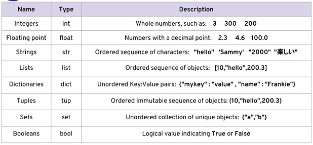
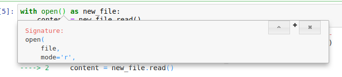
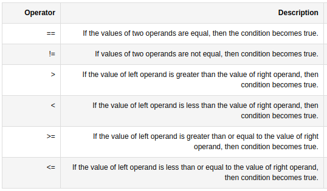

The excerpt from the Udemy course.

[toc]

# Section 1 Course Overview

- Using python 3, since 2 is going out of support in 2020, and 99% of all issues have been worked out
- downloaded and installed anaconda to take advantage of Jupyter Notebook, which allows you to see your code being interpreted line-by-line, which is good for learning purposes.
- course instructor is installing Sublime, but I am using Atom.

The git repo for the course includes all notebooks for Jupyter. The repo is imported into Bitbucket and can be cloned with: </br>   `git clone http://atlassian:7990/scm/hl/complete-python-3-bootcamp.git`

# Section 2 Using Anaconda Navigator

To start the course, open bash terminal and type anaconda-navigator. Then select Jupyter Notebook, which will open in a browser window.

Using Jupyter Notebook allows you to use what is called a cell based system, where you write out code and see the results of the code under the cell you type it into. The idea is that this is quicker than jumping back and forth between the editor and the terminal when testing new code.

Also, if you click the dropdown that says **Code** you can select **Markdown** you can enter straight markdown in a cell.

Click on Help, Keyboard Shortcuts to see all available hotkeys.

The files created in Jupyter Notebook are _.ipynb_ files. You cannot associate them with the app where they open in Jupyter, you have to open them from within Jupyter.

! If you do something like `int = 4` which is ruining a built-in, you can restart the kernel from the menu.

# Section 3 Object and Data Structure Basics

## Intro to Python Data Types

These are the basic building blocks for contructing larger pieces of code



The first column is the long name and the 2d column is the short name'

The difference between a List and a Tuple is that objects in a tuple cannot be changed. Notice the tuple is in Parentheses while a list is in brackets.

## Python Numbers

Two main number types we will work with:
- integers
- floating point

Arithemtic operator examples:
- multiply - 2*3
- divide - 8/4
- add - 2+3
- subtract - 4-3
- modulo - 7%3
- exponent - 2**3
- order of operations - to change default order use paren (2 + 10) * (10 + 3) = 12*13

## Variable Assignments

Pretty much same as bash. Avoid using words with special meaning like _list_ and _str_.

Python uses **Dynamic Typing** meaning you can reassign variables to different data types.

Example:

    my_dogs=2
    my_dogs=["Maxie","Midnite"]


The type is changed from an integer to a list.
The plus is faster coding, the minus is error prone.

You can check with **type()**

You can also assign variable _a_ with a reference to itself:

    a = 5
    5
    a = a + a
    10

Check variable type:

    a = 5
    type(a)
    int

    a=30.1
    type(a)
    float

## Intro to Strings

Strings are sequences of characters using either single or double quotes.
- 'hello'
- "Hello"
- " I don't do that" . This one has a single quote, but wrapped in double quotes it is escaped.

Strings are _ordered sequences_ and this means we can use indexing and slicing to grab sub-sections of the string. Indexing notation uses [] (looks like array syntax):

If the value is **hello** then the indexing works like this:

    character:   h e l l o
    index:       0 1 2 3 4

You can also use reverse index, where **-1** equals the last character, like to find the last character if you dont know the number of characters:

    character:  h   e   l   l   o
    rev index:  0  -4  -3  -2  -1

Some escape characters within a string:

Newline `\n`

    print('hello \nworld')
    hello
    world

Tab `\t`

    print('hello \tworld')
    hello  world

The `len() function`

    len('hello')
    5

    len('I am')
    4


### Summary

Indexes

    character:   h e l l o
    index:       0 1 2 3 4

    character:  h   e   l   l   o
    rev index:  0  -4  -3  -2  -1

Escaping

    print('hello \nworld')
    hello
    world

    print('hello \tworld')
    hello  world

`len()`

    len('hello')
    5

    len('I am')
    4


## Indexing and Slicing with Strings

! **REMEMBER:**  -  the first index is **0**

### Indexing

Indexing addresses a character in a string as an index like an array:

`mystring = "Hello World"`

- mystring[0]  - this index points to **H**ello World
- mystring[3] - this index points to Hel**l**o World


Reverse indexing uses negative numbers starting from the end of the string:

- mystring[-2] - this _reverse_ index points to Hello Wor**l**d
- mystring[-3] - this _reverse_ index points to Hello Wo**r**ld

!!! Reverse indexing can be useful to address the last character without knowing the total character count, or, of course the last _nth_ character from the end as well.

### Slicing

Slicing is grabbing a subsection, by specifying indexes as delimiters. The _starting at_ index is included in the result, but the _stop index_ is **not**.

The syntax looks like this:
    [start:stop:step]
- start is a numerical index for the slice start
- stop is the index to go up to but not include
- step is the jump between the two

Example:

`mystring = 'abcdefghijk'`
- mystring[2:] =  **'cdefghijk'**
- mystring[:3] = **'abc'**
- mystring[3:6] = **'def'**
- mystring[1:3] = **'bc'**

Step size is the third parameter in the range:

`mystring = 'abcdefghijk'`
- mystring[::2] = **'acegik'**  (all indexes in a _step of 2_)
- mystring[::3] = **'adgj'**  (all indexes in a _step of 3_)
- mystring[2:7:2] = **'ceg'** (starting at 2 with a _stop index_ of 7, in a step of 2)

You can actually _reverse_ a string by using a negative step size:
- mystring[::-1] = 'kjihgfedcba'

## String Properties and Methods

### The immutability of strings

While you can reassign a variable value in total, you **cannot** reassign part of a variable ( mutation).

For example, say you wanted to change the value of **"Sam"** to **"Pam"**.
The following attempt to change `"Sam"` to `"Pam"` using an index will **not** work:

    name = "Sam"
    name[0] = 'P' # this will produce an error

You **could** indirectly mutate it by using string concatenation. This involves assigning a second variable with an index (or slice) of the first, and then concatenating them together:

    name = "Sam"
    last_letters = name[1:]
    'am'
    'P' + last_letters
    'Pam'

    x = 'Hello World'
    x + " it is beautiful outside!"   # note the space before 'it'
    'Hello World it is beautiful outside!'

**NOTE**: You can **NOT** concatenate a number with a string:

    '2' + '3'  # you can concatenate 2 strings
    '23'

    '2' + 3
    TypeError: can only concatenate str (not "int") to str

### Applying methods to strings

There are a set of methods that can be applied to a string in Python.

    x = 'Hello World'
    x.upper()  # using the upper method. It is actually a function str.upper
    'HELLO WORLD'
    x.lower()   # using the lower method. It is the str.lower function
    'hello world'

This does NOT reassign the value of x. It is like a parameter substitution in bash.

    x = x.upper()  # This will reassign x

    x.split()  # This does word splitting to produce a list. It splits with either whitespace or a character passed in to the split function.
    ['Hello', 'World']  # split on whitespace

    x = 'Hi this is a string'
    x.split('i')  # pass in the 'i' character to split
    ['H', ' th', 's ', 's a str', 'ng']


**NOTE:** It splits on 'i', removing the 'i's. Notice it leaves whitespace intact.


## Print Formatting with Strings

Injecting a variable into a string is known as **string interpolation**.

For example:

    my_name = "Ron"
    print("Hello " + my_name)
    Hello Ron

Two methods for doing this are:

- **.format()** method
- **f-strings** - (formatted string literals)

### String Formatting with the .format() method

A good way to format objects into your strings for print statements is with the string .format() method. For example:

    print('The quick {} fox jumped over {} lazy dog'.format('brown','the'))
    The quick brown fox jumped over the lazy dog


A big advantage of the `.format()` method is that strings can be inserted by index position:

    print('The {0} {1} {2}'.format('fox','brown','quick'))
    The fox brown quick

Since **The quick brown fox** makes more sense we can control the order of insertion as follows:

    print('The {2} {1} {0}'.format('fox','brown','quick'))  # using the index positions
    The quick brown fox

You can use or reuse in any way you want:

    print('The {0} {0} {0}'.format('fox','brown','quick'))  # it is flexible
    The fox fox fox


You can also assign keywords to the indexes for a more concise reference in the string itself:

    print('The {q} {b} {f}'.format(f='fox',b='brown',q='quick'))  # assigning keywords to the indexes
    The quick brown fox


And this is also flexible as to use and reuse:

    print('The {f} {f} {f}'.format(f='fox',b='brown',q='quick'))  # also flexible
    The fox fox fox

### Float formatting with the .format method

Float formatting looks like this:

`"{value:width.precision f}"`


Example:

Start with a float assigned to _result_

    result = 100/777
    0.1287001287001287

Reference it with .format()

    print("The result was {}".format(result))
    The result was 0.1287001287001287
    or
    print("The result was {r}".format(r=result)) #  You can use indexing here too of course
    The result was 0.1287001287001287


Now using **{value:width.precision f}**. The value can be left blank if not using keyword:

    print("The result was {r:1.3f}".format(r=result))  # setting the width.precision to 1.3 and using keyword r
    The result was 0.129

!!! The float is rounded at the last position. **0.1287...** becomes **0.129**

### String Formatting with f-strings

A newer and faster way to insert values into strings is with **f-strings**, which are formatted string literals. These are new to python as of version 3.6.

Using **f-strings** does not require the **.format** portion outside the string:

    name = "Ron"
    print(f'Hello, my name is {name}')  # The f signals that there will be a variable value inserted in the string


It also works with multiple variables:

    name = "Ron"
    age = 53
    print(f'{name} is {age} years old.')
    Ron is 53 years old

## Lists

Lists are defined as _ordered sequences_ (like strings) that can contain a variety of object types.

The syntax uses brackets to contain the list itself and commas to separate the objects:

`[1,2,3,4,5]`

Lists support indexing and slicing (again, like strings).

### Indexing a list

     my_list = [1,2,'three',4,5.46]
     my_list[1]
    2

### Slicing a list

     my_list[1:4]
    [2, 'three', 4]

An f-string interpolation using a list object index:

     print(f'This is interpolation using an index from a list. One two {my_list[2]}')
    This is interpolation using an index from a list. One two three

### Concatenating lists

Lists can be concatenated like strings also:

     my_list = [1,2,'three',4,5.46]
     my_list2 = [6,7,8]
     my_list + my_list2
    [1, 2, 'three', 4, 5.46, 6, 7, 8]

### Mutating lists

Unlike strings, lists **can** be mutated.

Mutating the value at index 2:

     my_list
    [1, 2, 'three', 4, 5.46]
     my_list[2] = 'four'
     my_list
    [1, 2, 'four', 4, 5.46]

Mutating the same value using the **upper()** method:

     my_list[2] = my_list[2].upper()
     my_list
    [1, 2, 'FOUR', 4, 5.46]

The above mutation interpolated into a string:

     my_list = [1,2,'three',4,5.46]
     print(f'One, two, {my_list[2].upper()}!')
    One, two, THREE!

### Appending a list

The **append()** method can be used to append a new object to a list.
**NOTE**: The change is _in place_, meaning permanent:

     my_list
    [1, 2, 'three', 4, 5.46]
     my_list.append('six')
     my_list
    [1, 2, 'three', 4, 5.46, 'six']

Mutating an index of a list and appending that to the list:

     my_list = [1,2,'three',4,5.46]
     my_list.append(my_list[2].upper())
     my_list
    [1, 2, 'three', 4, 5.46, 'THREE']

### Removing from a list using pop()

By default the **pop()** method will remove the last item from a list:

     my_list = [1,2,'three',4,5.46]
     my_list.pop()
    5.46    #  it reports back the removed item
     my_list
    [1, 2, 'three', 4]

**NOTE**: this effectively means that the default argument for **pop** is **pop(-1)**, since the **-1** index is the last item in a list

You can pass in the index you want popped from the list:

     my_list = [1,2,'three',4,5.46]
     my_list.pop(2)
    'three'
     my_list
    [1, 2, 4, 5.46]

You can assign the return  of the **pop()** method to a variable:

     my_list = [1, 2, 'three', 4, 5.46]
     popped_item = my_list.pop(2)
     popped_item
    'three'
     my_list
    [1, 2, 4, 5.46]

And you can mutate the return of the **pop()** with the .upper() method before it is assigned:

     my_list = [1,2,'three',4,5.46]
     popped_item = (my_list.pop(2).upper())
     popped_item
    'THREE'
     my_list
    [1, 2, 4, 5.46]

### Sorting a list using .sort()

The **.sort()** method will sort the indexes in a list either alphabetically or numerically:

     alpha_list = ['f', 'd', 'b', 'a', 'c', 'e']
     alpha_list.sort()
     alpha_list
    ['a', 'b', 'c', 'd', 'e', 'f']

**NOTE:** This method works _in place_, and does **not** return a value. Therefore, if you do this:

      alpha_list = ['f', 'd', 'b', 'a', 'c', 'e']
      sorted_list = alpha_list.sort()
      sorted_list


There will be _nothing_ assigned to **sorted_list**.

### Reverse sorting a list using .reverse()

     alpha_list = ['a', 'b', 'c', 'd', 'e', 'f']
     alpha_list.reverse()
     alpha_list
    ['f', 'e', 'd', 'c', 'b', 'a']

In summary, lists work a lot like strings, with the notable exception that lists are **not** immutable. You can mutate select indexes in a list.

## Dictionaries

A dictionary is an unordered (no indexes, not sortable) mapping for storing **key:value** pairs. So you use a key name to retrieve the associated **key:value** pair.

Since it is unordered and therefore unsorted, retrieval from a dictionary will be slower, as the query will have to locate it first.

The syntax for creating a dictionary is like this:

**my_dict = {'key1':'value1','key2':'value2'}**
**NOTE**: **'value1'** is in quotes because it is a string

### Create a dictionary

Create an example dictionary:

     prices_lookup = {'apple':2.99,'oranges':1.99,'milk':3.99}
     prices_lookup
    {'apple': 2.99, 'oranges': 1.99, 'milk': 3.99}
</br>

### Lookup keys in a dictionary

Look up a key:

     prices_lookup['apple']
    2.99

</br>

### Nesting

You can nest a list or even another dictionary in a dictionary, by specifying it as the value of a key.

Nesting dictionaries in dictionaries is uncommon, but supported nevertheless.


A nested list in a dictionary. The dictionary has 2 **key:value** pairs, the first one is a list, and the second is a standard pair:

     nested_list = {'list1':[34,'string',45.7],'key2':'string'}
     nested_list
    {'list1': [34, 'string', 45.7], 'key2': 'string'}

</br>

Doing a lookup of a key:

     nested_list['list1']
    [34, 'string', 45.7]

</br>

Doing a lookup of an element within a nested element:

     nested_dictionary
    {'dict1': {'key1': 'value1', 'key2': 'value2'}, 'list1': ['string1', 45, 56.78]}

     nested_dictionary['list1'][1]
    45
</br>

A nested list and dictionary in a dictionary. The dictionary has 2 **key:value** pairs. The first **key:value** pair is a dictionary, and the second is a list:

     nested_dictionary = {'dict1':{'key1':'value1','key2':'value2'},'list1':['string1',45,56.78]}
     nested_dictionary
    {'dict1': {'key1': 'value1', 'key2': 'value2'}, 'list1': ['string1', 45, 56.78]}

     nested_dictionary['dict1']
    {'key1': 'value1', 'key2': 'value2'}

     nested_dictionary['dict1']['key1'] # call a value from a nested dictionary
    'value1'

     nested_dictionary['list1']
    ['string1', 45, 56.78]

     nested_dictionary['list1'][2]  # call an index from a nested list
    56.78

     nested_dictionary['list1'][0].upper() # apply the .upper() method to the call
    'STRING1'

</br>

### Adding key:value pairs to an existing dictionary

To add another entry in a dictionary just specify the new key name in brackets and assign its value:

     nested_dictionary
    {'dict1': {'key1': 'value1', 'key2': 'value2'}, 'list1': ['string1', 45, 56.78]}

     nested_dictionary['list2'] = ['string2',36,56.09]

     nested_dictionary
    {'dict1': {'key1': 'value1', 'key2': 'value2'}, 'list1': ['string1', 45, 56.78], 'list2': ['string2', 36, 56.09]}

</br>

The same method applies to changing an existing keypair:

     dictionary
    {'key1': 'something', 'key2': 37, 'key3': 'or', 'key4': 'another'}
     dictionary['key3'] = 'and'
     dictionary
    {'key1': 'something', 'key2': 37, 'key3': 'and', 'key4': 'another'}

</br>

To change a specific key in a nested list or dictionary you reference it the same way as above when retrieving the value:

     nested_dictionary
    {'dict1': {'key1': 'value1', 'key2': 'value2'}, 'list1': ['string1', 45, 56.78], 'list2': ['string2', 36, 56.09]}

     nested_dictionary['list1'][1] = 'not45'

     nested_dictionary
    {'dict1': {'key1': 'value1', 'key2': 'value2'}, 'list1': ['string1', 'not45', 56.78], 'list2': ['string2', 36, 56.09]}

</br>

Applying methods works the same way when retrieving and mutating the value:

     nested_dictionary
    {'dict1': {'key1': 'value1', 'key2': 'value2'}, 'list1': ['string1', 'not45', 56.78], 'list2': ['string2', 36, 56.09]}

    nested_dictionary['dict1']['key2'].upper()
    'VALUE2'

</br>

And of course to change a value in-place using a method is like this:

     nested_dictionary['dict1']['key2'] = nested_dictionary['dict1']['key2'].upper()

     nested_dictionary
    {'dict1': {'key1': 'value1', 'key2': 'VALUE2'}, 'list1': ['string1', 'not45', 56.78], 'list2': ['string2', 36, 56.09]}

</br>

### Retrieving all keys or values from a dictionary

To retrieve all keys or all values use the **.keys()** or **.values()** methods respectively.

Retrieve all keys or values from a dictionary:

     dictionary
    {'key1': 'something', 'key2': 37, 'key3': 'and', 'key4': 'another'}

     dictionary.keys()
    dict_keys(['key1', 'key2', 'key3', 'key4'])

     dictionary.values()
    dict_values(['something', 37, 'and', 'another'])

</br>


There is also a **.items()** method which returns the whole dictionary much like just typing **dictionary**, however it returns the key:value pairs in _tuples_.

     dictionary
    {'key1': 'something', 'key2': 37, 'key3': 'and', 'key4': 'another'}

     dictionary.items()
    dict_items([('key1', 'something'), ('key2', 37), ('key3', 'and'), ('key4', 'another')])

</br>


## Tuples

A **tuple** is basically an immutable list. Compare the two definitions below:
- **list**: an ordered sequence of objects **[10,"hello",200.3]**
- **tuple**: an ordered _immutable_ sequence of objects **(10,"hello",200.3)**

Tuples are immutable so once an element is inside a tuple, it cannot be reassigned. Tuples are enclosed in parenthesis **(1,2,3)**

     mytuple = (1,'two',3)

     type(mytuple)
    <class 'tuple'>

     len(mytuple)    # check how many elements are in the tuple.
    3

</br>

Tuples are sortable and indexed like lists.

     mytuple = (1,'two',3)

    mytuple[1]
    'two'

    mytuple[-1]
    3

</br>

There are only 2 methods available to tuples:  **.count()** and **.index()**.

Using count to find how many times a certain value appears in a tuple:

     mytuple = (1,2,3,4,4,5,6)
     mytuple.count(4)     # check for value 4
    2

The **.index()** method will return the index of the first occurence of a value:

     mytuple
    (1, 2, 3, 4, 4, 5, 6)

     mytuple.index(3)
    2

     mytuple.index(4)  # the FIRST occurence of value 4 is at index 3
    3
</br>

Nesting works with tuples as well:

     mytuple = (1,2,3,[1,3,5],'lower')

     mytuple
    (1, 2, 3, [1, 3, 5], 'lower')


**NOTE**: While tuples are immutable, a list nested in a tuple is **NOT**

     mytuple = (1,2,3,[1,3,5],'lower')
     mytuple[3][1]
    3
     mytuple[3][1] = 4   #change the value of index 1 of the nested item at index 3
     mytuple
    (1, 2, 3, [1, 4, 5], 'lower')
</br>

## Sets

A **set** is an unordered sequence of _unique_ objects. An object can only appear once in a set.

Sets are enclosed in curly braces **{}** like dictionaries. In fact, they look a lot like a _dictionary of objects_ instead of key:value pairs.

A set can be assigned by using the **set()** method as follows:

    myset = set()  # assign the set to var myset. It is effectively an empty set.
    type(myset)
    <class 'set'>

</br>

You can then add to the set by calling the **.add** method:

     myset.add(3)   # the add() method only takes 1 argument at a time
     myset
    {3}

    myset.add(5)
    myset
    {3, 5}

</br>

It can also be implicitly created by entering the contents directly:

     set2 = {'this',45,6.78,'that'}
     type(set2)
    <class 'set'>

</br>

Obviously Python interprets a sequence in curly braces but not containing key:value pairs must be a set.

As evidence that sets contain _unique_ items only, we can try to add the same value again:

     myset.add(5)
     myset
    {3, 5}

</br>

### Cast a list as a set to de-dupe it

You can _cast_ a list as a set using the **set()** method and it will effectively de-dupe the list.

     mylist = [1,4,4,3,7,2,2,4,9,7]  # this list has duplicates
     mylist
    [1, 4, 4, 3, 7, 2, 2, 4, 9, 7]

     set(mylist)   # cast the list as a set (does not change the list itself)
    {1, 2, 3, 4, 7, 9}

     mylist = set(mylist)  # reassign the list using the cast method. de-dupe it basically.
     mylist
    {1, 2, 3, 4, 7, 9}

</br>

**NOTE**:  While it appears the set is ordered, in reality, sets do not have an order. If the set were larger it would not be ordered.

### Cast a string as a set

You can also cast a string as a set and it will return all unique characters present.

     set('Mississippi')
    {'M', 'p', 'i', 's'}

</br>

## Booleans

As expected, booleans convey a **true** or **false** condition for a given evaluation.

In python it is important that the terms **True** and **False** are capitalized:

     True
    True

     true
    Traceback (most recent call last):      #python expects this to be a variable
      File "<input>", line 1, in <module>
    NameError: name 'true' is not defined

</br>

You can use _comparison operators_ to produce a boolean result:

 1 > 2
False

 1>2
False

 1 > 2
False

 1 == 2
False

 1 == 1
True

</br>

## Perform simple I/O with basic .txt files

The methods shown here will also expand to other file types such as video, audio, email etc.

**NOTE**: To work with those more advanced file types you will need to install libraries.

First create a text file in the script directory (since I am using Pycharm, it is the project directory) **~/PycharmProjects/bootcamp**

    cat textfile.txt

    Hello this is a text file
    this is the second line
    this is the third line

</br>

### Using the open() method to assign a file

To work with the file assign it to _myfile_ using the **open()** method.

Assign to _myfile_:

    myfile = open('textfile.txt')  # be sure to enclose the argument in single quotes

     myfile
    <_io.TextIOWrapper name='textfile.txt' mode='r' encoding='UTF-8'>

**NOTE**: If the file does not exist or is at another location the error will look like this:

     nofile = open('nofile.txt')
    Traceback (most recent call last):
      File "<input>", line 1, in <module>
    FileNotFoundError: [Errno 2] No such file or directory: 'nofile.txt'

</br>

**NOTE**:  The **open()** method is a built-in function to python. As such there are arguments that apply to it. One of them is **mode**.

The default value for mode when using **open()** is **mode='r'** for read. For writing to files, we must specify **open('filename',mode='w')**. This is coming up in this section.

The full list of **mode** arguments:

- **mode='r'** ------- read only
- **mode='w'** ------- write only (overwrites file or creates new file)
- **mode='a'** ------- append only
- **mode='r+'** ------ reading and writing
- **mode='w+'** ------ writing and reading (overwrites existing files or creates a new file)

The settings are explicit. If you use **mode='r'** you cannot write to the file, and, if you use **mode='w'** you cannot read from the file.

### Using the .read() method to return a single string

The **.read()** method will return one big string. Since the file is 3 lines of text there will be escaped **\n** newline characters:

     myfile.read()
    'Hello this is a text file\nthis is the second line\nthis is the third line\n'

</br>

Interestingly, if we run the command again it will return nothing:

     myfile.read()
    ''

</br>

Why? Because the _"cursor"_ is now at the end of the line, from the last read. It needs to be repositioned using the **.seek()** method:

     myfile.seek(0)  # the argument places the cursor at position 0
    0
     myfile.read()
    'Hello this is a text file\nthis is the second line\nthis is the third line\n'

     myfile.seek(10)   # reposition the cursor at position 10
    10
     myfile.read()
    ' is a text file\nthis is the second line\nthis is the third line\n'

</br>

### Using the .readlines() method to return a list

The **.readlines()** method will return the contents of _myfile_ as a list with each line assigned to its own index, like so:

     myfile.seek(0)  # first reset the cursor to beginning of file
    0
     myfile.readlines()
    ['Hello this is a text file\n', 'this is the second line\n', 'this is the third line\n']

</br>

We can assign this output to a variable and thus work with the list using indexes or loop thru the list:

     myfile.seek(0)  # reset so we get the correct output
    0

     myfile_list = myfile.readlines()  # assign the list to myfile_list

     myfile_list[1]  # retrieve index 1 of myfile_list
    'this is the second line\n'

</br>

### File locations

To open a file at any location, just pass in the full path of the file.

For Windows you need to use the double `\\` in the pathname to escape the backslash, because the backslash is an escape character in python. To make it literal, as in a Windows pathname, you must escape it:

`myfile = open("C:\\Users\\UserName\\Folder\\test.txt")`

For MacOS and linux you use forward slashes as usual:

`myfile = open("/Users/YourUserName/Folder/test.txt")`

 ### Best practices for opening files

 When finished working with files in your code, you need to use the **.close()** method to close it, so another construct, or the OS itself has access again.

The manual way of doing this must be explicitly done in the code:

    myfile.close()

</br>

To avoid having to explicitly close the file use the **with** keyword when opening the file:

      with open('textfile.txt') as my_new_file:
          contents = my_new_file.read()

</br>

Everything below the with statement is indented, and when the indented code is finished, you do not need to close the file.

### Writing to files

As mentioned earlier, we need to use a **mode** argument to write to files, because the default for **open()** is **mode='r'**:

First, here are the current contents of _my_new_file.txt_:

    with open('my_new_file.txt',mode='r') as f:   # open in read mode and assign to f
    print(f.read())

    ONE ON FIRST
    TWO ON SECOND
    THREE ON THIRD

</br>

#### Write to an existing file using the append option

Write to the file _my_new_file.txt_ using the **mode='a'** to append to the file:

    with open('my_new_file.txt',mode='a') as f:
        f.write('FOUR ON FOURTH')

</br>

Now, re-examine the contents of the file:

    with open('my_new_file.txt',mode='r') as f:   # open in read mode and assign to f
    print(f.read())

    ONE ON FIRST
    TWO ON SECOND
    THREE ON THIRD
    FOUR ON FOURTH

The file is now appended.

#### Write to a file using the write option

The write option will either overwrite (truncate, then write in other words) or create the file if it does not exist.

    # first let's write to a file we know does not exist

    with open('nonexistent.txt',mode='w') as f:
        f.write('This is a new file')

    with open('nonexistent.txt',mode='r') as f:
        print(f.read())

    This is a new file    # this is the contents of the file after it was created.

    # Now use write on an existing file:

    with open('nonexistent.txt',mode='w') as f:
        f.write('This will replace the text')

        with open('nonexistent.txt',mode='r') as f:
            print(f.read())

    This will replace the text    # unlike append, the file contents are overwritten

</br>

**NOTE**:  In Jupyter, when working with a built-in function such as **.open()** you can get help on an already declared function. Place the cursor right after the first parentheses of the function then hit `<Shift><Tab>`.

</br>

 

# Section 4 Python Comparison Operators

## Comparison Operators in Python



### Examples of using comparison operators

For equality we use the double equal signs **==** as the comparison operator. This is because the  **=** in python is the _assignment_ operator.

    2 == 2
    True

    '1' == 1
    False     # types matter, a string cannot equal an integer

    'Bye' == 'bye'
    False           # case matters also


    2 != 1   # inequality
    True

    2 < 4     # less than
    True

    4 > 2     # greater than
    True

    2 >= 2    # greater than or equal to
    True

    4 <= 6    # less than or equal to
    True

</br>

### Chaining Comparison Operators with Logical Operators

The logical operators are:

- **and**
  - returns true if _both_ conditions are true
- **or**
  - returns true if _at least one_ condition is true
- **not**
  - inverts the result of the condition

#### examples

    1 < 2 and 2 < 3
    True              # true since both conditions are true


    1==1 or 100==1    # true since at least one condition is true
    True


    not 1 == 1        # the condition is true, and not inverts the condition
    False

</br>

**NOTE**: The statements above can also be written with parentheses:

    (1 < 2) and (2 < 3)
    True

    (1 == 1) or (100 == 1)
    True

    not (1 == 1)
    False

    # it is personal preference when coding it

</br>

# Section 5 Python Statements

Python makes use of colons and whitespace to simplify the syntax of statements.

Version 1 (Other Languages)

    if (a>b){
        a = 2;
        b = 4;
    }

</br>

Version 2 (Python)

    if a>b:
        a = 2
        b = 4

</br>

Python gets rid of **()** and **{}** by incorporating two main factors: a colon and whitespace. The statement is ended with a colon, and whitespace is used (indentation) to describe what takes place in case of the statement.

Another major difference is the lack of semicolons in Python. Semicolons are used to denote statement endings in many other languages, but in Python, the end of a line is the same as the end of a statement.

Here is some pseudo-code to indicate the use of whitespace and indentation in Python:

Other Languages

    if (x)
        if(y)
            code-statement;
    else
        another-code-statement;

</br>

Python

    if x:
        if y:
            code-statement
    else:
        another-code-statement

</br>

## If Elif and Else Statements

Syntax:

    if case1:
        perform action1
    elif case2:
        perform action2
    else:
        perform action3

</br>

### Simple If statement

    if True:                    # the condition always ends with a colon
        print('It was true!')

    It was true!

</br>

### Using else

    x = False

    if x:
        print('x was True!')
    else:
        print('I will be printed in any case where x is not true')

    I will be printed in any case where x is not true

</br>

### Using elif

    loc = 'Bank'

    if loc == 'Auto Shop':
        print('Welcome to the Auto Shop!')
    elif loc == 'Bank':
        print('Welcome to the bank!')
    else:
        print('Where are you?')

    Welcome to the bank!

The indentation and the colons drive the whole statement.
</br></br>
## For Loops

For loops are iterators, they iterate thru a sequence of items in an object such as a list, string, tuple, even dictionaries.

Objects that can be iterated thru are considered _iterable_.

On each iteration, statements are performed, perhaps with conditions.

Here's the general format for a for loop in Python:

    for item in object:
        statements to do stuff

</br>

### For loop iterating thru a list

We'll learn how to automate this sort of list in the next lecture

    list1 = [1,2,3,4,5,6,7,8,9,10]

    for num in list1:     # the variable used here (num in this case) can be named anything
        print(num)

    1
    2
    3
    4
    5
    6
    7
    8
    9
    10

</br>

### For loop with an if-else statement

Now an example with a conditional if-else statement in each iteration:

    list1 = [1,2,3,4,5,6,7,8,9,10]

    for num in list1:
        if num % 2 == 0:    # this script checks for even numbers, using a modulo
            print(num)
        else:
            print('Odd number')

            Odd number
            2
            Odd number
            4
            Odd number
            6
            Odd number
            8
            Odd number
            10
</br>

### For loop using the += operator to increment a value

This for loop will use the **+=** operator to increment a variable *list_sum* with each iteration. The increment will be the value of each number in the list, effectively summing all the numbers in the list:

    list1 = [1,2,3,4,5,6,7,8,9,10]

    # Start sum at zero
    list_sum = 0

    for num in list1:
        list_sum += num  # this statement is the same as "list_sum = list_sum + num"

    print(list_sum)

    55

</br>

**NOTE**: To demonstrate the importance of indentation, we will run the above example with a slight change:

    list1 = [1,2,3,4,5,6,7,8,9,10]

    # Start sum at zero
    list_sum = 0

    for num in list1:
        list_sum += num

        print(list_sum)     # by indenting this to the right, it is now part of the iteration itself.

    1
    3               # now we get a running tally of the value of list_sum at every iteration
    6
    10
    15
    21
    28
    36
    45
    55

</br>

### For loop iterating a string

Now an example of iterating over every character in a string:

    for letter in 'This is a string.':
        print(letter)

    T
    h
    i
    s

    i
    s

    a

    s
    t
    r
    i
    n
    g


</br>

### For loop iterating a tuple

An example of iterating over a tuple:

    tup = (1,2,3,4,5)

    for t in tup:
        print(t)

    1
    2
    3
    4
    5

</br>

### For loop iterating a list of nested tuples

This example will iterate over a list with tuples nested inside it. The first run will return the entire tuple on each iteration. Next we will _unpack_ each tuple to iterate thru the individual elements in the tuple:

    list2 = [(2,4),(6,8),(10,12)]

    for tup in list2:
        print(tup)

    (2, 4)
    (6, 8)
    (10, 12)

</br>

### For loop iterating a list of tuples and unpacking the tuples

Now we use the **(a,b)** variable form after **for** to unpack the elements in each tuple. Within **(a,b)**, the variable letter is arbitrary, it is the form itself that mimics the tuple content.

**NOTE**: The **(a,b)** has to be the _exact_ number of elements in the tuple for it to unpack without an error.

The ability to work with tuples is significant because many objects produce iterables in the form of tuples:

    list2 = [(2,4),(6,8),(10,12)]

    for (t1,t2) in list2:   # the (t1,t2) unpacks the individual values from each tuple
        print(t1)

    2
    6
    10


    #  this time we will unpack and print out the value using an f-string

    list2 = [(2,4),(6,8),(10,12)]

    for (t1,t2) in list2:
        print(f'This is the value of t2:  {t2}')

    This is the value of t2:  4
    This is the value of t2:  8
    This is the value of t2:  12

</br>

### For loop interating a dictionary

The default return when iterating thru a dictionary is the **key**.

For example:

    d = {'k1':1,'k2':2,'k3':3}

    for item in d:
        print(item)

    k1        # the keys are returned
    k2
    k3

</br>

There are 3 dictionary methods;  **.keys()**  **.values()**  and **.items()**  which can return the dictionary contents with more specificity.

- **.keys()**   returns the keys from each keypair
- **.values()**   returns the values from each keypair
- **.items()**   returns the entire keypairs, each in a tuple which can be unpacked

What they create are **dictionary view objects**. The contents of these views are not independent of the dictionary itself, they are only _views_.

#### The .items() method

This example will use the **.items** method to produce a view object:

    d = {'k1':1,'k2':2,'k3':3}

    # Create a dictionary view object
    d.items()

    dict_items([('k1', 1), ('k2', 2), ('k3', 3)])   # returns entire keypairs in tuples

</br>

The **.items()** method, as seen above, returns tuples. Therefore, we can unpack them and separate the keys and the values:

    d = {'k1':1,'k2':2,'k3':3}

    # Dictionary unpacking
    for (k,v) in d.items():       # d.items will return ('k1', 1), ('k2', 2), ('k3', 3)
        print(k)
        print(v)

    k1
    1
    k2
    2
    k3
    3

</br>


#### The .keys() method

This example will use the **.keys()** method to produce a view object:

    d = {'k1':1,'k2':2,'k3':3}

    d.keys()

    dict_keys(['k1', 'k2', 'k3'])   # returns the keys from each keypair

</br>

#### The .values() method

This example will use the **.values()** method to produce a view object:

    d = {'k1':1,'k2':2,'k3':3}

    d.values()

    dict_values([1, 2, 3])    # returns the values from each keypair

</br>

### Casting and sorting the views

You can obtain a true list of the view results by using the **list** keyword to cast the results as a  list:

    d = {'k1':1,'k2':2,'k3':3}

    list(d.keys())

    ['k1', 'k2', 'k3']


    list(d.values())

    [1, 2, 3]


    list(d.items())

    [('k1', 1), ('k2', 2), ('k3', 3)]

</br>

You can use the **sorted** keyword to sort the view results:

    # first lets create an unsorted dictionary, as most are:
    d = {'k1':3,'k3':2,'k2':1}

    # here is what the sorted keyword will produce for iteration thru

    sorted(d.items())
    [('k1', 3), ('k2', 1), ('k3', 2)]   #  3 tuples

    # and here is using the for loop to iterate thru the tuples and print the contents, sorted by key.

    # Dictionary unpacking
    for k,v in sorted(d.items()):
        print(k)
        print(v)

    k1
    3
    k2
    1
    k3
    2

</br>

## While loops

Basic structure with an optional else:

    while test:
      code statements
    else:
      final code statements

</br>

### A basic while loop

Here is an example:

    x = 0

    while x < 10:
        print('x is currently: ',x)
        print(' x is still less than 10, adding 1 to x')
        x+=1

        x is currently:  0
         x is still less than 10, adding 1 to x
        x is currently:  1
         x is still less than 10, adding 1 to x
        x is currently:  2
         x is still less than 10, adding 1 to x
        x is currently:  3
         x is still less than 10, adding 1 to x
        x is currently:  4
         x is still less than 10, adding 1 to x
        x is currently:  5
         x is still less than 10, adding 1 to x
        x is currently:  6
         x is still less than 10, adding 1 to x
        x is currently:  7
         x is still less than 10, adding 1 to x
        x is currently:  8
         x is still less than 10, adding 1 to x
        x is currently:  9
         x is still less than 10, adding 1 to x
</br>

### A while loop with an else statement

And another example with an else statement:

    x = 0

    while x < 10:
        print('x is currently: ',x)
        print(' x is still less than 10, adding 1 to x')
        x+=1

    else:
        print('All Done!')  # when condition x < 10 is no longer true this will close out the loop

        x is currently:  0
     x is still less than 10, adding 1 to x
    x is currently:  1
     x is still less than 10, adding 1 to x
    x is currently:  2
     x is still less than 10, adding 1 to x
    x is currently:  3
     x is still less than 10, adding 1 to x
    x is currently:  4
     x is still less than 10, adding 1 to x
    x is currently:  5
     x is still less than 10, adding 1 to x
    x is currently:  6
     x is still less than 10, adding 1 to x
    x is currently:  7
     x is still less than 10, adding 1 to x
    x is currently:  8
     x is still less than 10, adding 1 to x
    x is currently:  9
     x is still less than 10, adding 1 to x
    All Done!

</br>

## The break, continue, and pass statements

- break: Breaks out of the current closest enclosing loop.
- continue: Goes to the top of the closest enclosing loop.
- pass: Does nothing at all.

These statements can be added to a block in a loop for additional functionality.

### Using the break statement

The **break** statement will break out of the closest enclosing loop. In a for loop, this would essentially iterate thru a sequence and stop the loop when a certain element is found.

    mylist = ['Look', 'for', 'a', 'bad', 'word']

    for word in mylist:
    if word == 'bad':
        break
    print(word)

    Look
    for
    a

</br>

The **break** statement would likely be most useful in a while loop to ensure the loop does not become infinite.

    mylist = ['Look', 'for', 'a', 'bad', 'word']
    counter = 0

    while True:
        for word in mylist:
            if word != 'good':
                print(word)
        counter += 1
        if counter == 5:
            break

        Look
        for
        a
        bad
        word
        Look
        for
        a
        bad
        word
        Look
        for
        a
        bad
        word
        Look
        for
        a
        bad
        word
        Look
        for
        a
        bad
        word

</br>

### Using the continue statement

The **continue** statement returns to the top of the current enclosing loop, circumventing any blocks below it. It is a way to add some sort of exception case for an element in the sequence.

    mystring = 'Sammy'

    for letter in mystring:
        if letter == 'a':
            continue
        print(letter)

        S
        m
        m
        y

</br>

### Using the pass statement

The **pass** statement will effectively do nothing in the current iteration. The loop will effectively iterate through all elements in the sequence, do nothing on each iteration, then break out of the closest enclosing loop.

Its purpose might be as a placeholder for code to come later, allowing the loop to exist in code without anything being done in the loop, and yet not produce an error.

    x = [1,2,3]
    for x in x:
        pass
    print('end of script')

    end of script

 </br>

## Useful Operators in Python

There are a few built-in functions and "operators" in Python that don't fit well into any category, but are nevertheless important.

### The range() function

The **range()** function can quickly generate a list of integers. It takes some arguments as well, most commonly a _start_, _stop_ and _step_ value, just like slicing:

range(**start,stop,step**)

</br>

Note that **range()** is a _generator_ and does not produce a list on its own. To get an actual list from using the **range()** function you need to cast it as a list:

    list(range(0,11))

    [0, 1, 2, 3, 4, 5, 6, 7, 8, 9, 10]   # also like slicing, the stop is an up to but not including the stop number

#### Using range() with just the stop argument

    for num in range(10):    # the minimum, just specify the stop ( 0 - 10) effectively
        print(num)

    0
    1
    2
    3
    4
    5
    6
    7
    8
    9

</br>

#### Using range() with start and stop arguments

    for num in range(5,10):  # specify start and stop.
        print(num)

    5
    6
    7
    8
    9

</br>

#### Using range() with start, stop and step arguments

    for num in range(0,10,2):         #  start at 0, stop at 10, steps of 2
    print(f'{num} is an even number')

    0 is an even number
    2 is an even number
    4 is an even number
    6 is an even number
    8 is an even number

</br>

Finally, the **range()** function is a more efficient way to generate a range of integers without saving them to memory.

</br>

### The enumerate() function

The **enumerate()** function will return, for every iteration of an element in a sequence, a tuple consisting of the index count and the element, for every iteration in a loop, most commonly a for loop.

To see the tuples that **enumerate()** actually returns, we cast it as a list:

    string = 'abcde'      # create a string with 5 elements
    list(enumerate(string))     # enumerate the string and cast it using the list() function

    [(0, 'a'), (1, 'b'), (2, 'c'), (3, 'd'), (4, 'e')]    # enumerate returns the index,element for each iteration in tuples

#### Using enumerate in a for loop

When used in a for loop, we can unpack the tuples for each iteration:

    for i,letter in enumerate('abcde'):   # create 2 variables, 1 for the index, 1 for the element
        print(f'At index {i} the letter is {letter}')  # place the unpacked items in a print statement

        At index 0 the letter is a
        At index 1 the letter is b
        At index 2 the letter is c
        At index 3 the letter is d
        At index 4 the letter is e

Using the **enumerate()** function is a quick way to get an index count of each iteration thru a sequence.

### The zip() function

The **zip()** function merges 2 or more lists together and outputs each item in the lists as separate tuples, like so:

    mylist1 = [1,2,3,4,5]
    mylist2 = ['a','b','c','d','e']

    list(zip(mylist1,mylist2))  # use list() to cast and see what zip created

    [(1, 'a'), (2, 'b'), (3, 'c'), (4, 'd'), (5, 'e')]  # each element in every list is merged into a tuple

</br>

#### Using the zip() function in a loop

Of course, the tuples from **zip()** can be unpacked and referenced in code, like so:

    for item1, item2 in zip(mylist1,mylist2):
        print('For this tuple, first item was {} and second item was {}'.format(item1,item2))

    For this tuple, first item was 1 and second item was a
    For this tuple, first item was 2 and second item was b
    For this tuple, first item was 3 and second item was c
    For this tuple, first item was 4 and second item was d
    For this tuple, first item was 5 and second item was e

</br>

**NOTE**: If the lists are uneven in length, **zip()** will merge as many indexes as the shortest list.

### The `in` operator

Commonly seen in a for loop, the **in** operator can be used independent of a loop to check for a value in an iterable object such as a list, string, the key from a dictionary etc., and return a boolean based on the result:

    'x' in ['x','y','z']
    True

    'x' in ['a','b','c']
    False

    5 in [4,5,6]
    True

    'a' in 'relate'
    True

    d = {'k1':'c','k2':'f','k3':'d'}    # in checks keys by default
    'k1' in d
    True

    d = {'k1':'c','k2':'f','k3':'d'}    # check for a value in values
    'd' in d.values()
    True
</br>

### The min() and max() functions

The **min()** and **max()** functions can quickly return the minimum or maximum integer or string values in a list, string, etc:

    mylist = [10,20,30,40,100]  # use with a list
    min(mylist)
    10

    max(mylist)
    100
    mystring = 'abc'    # use with a string

    min(mystring)
    a
    max(mystring)
    c

    d = {'k1':'d','k2':'g'}   # use with a dictionary
    max(d.values())
    'g'

</br>

### The **random** library

The **random** library has many functions in it, of which we will look at 2 for now:

#### Using **shuffle** from the `random` library

The **shuffle()** function will shuffle the contents of a list. Since the **shuffle()** function works "in place" on the list, it does not produce any output itself, it just changes the list.

    from random import shuffle   # import the shuffle function from the random library
    mylist = [10,20,30,40,50]
    shuffle(mylist)
    print(mylist)
    [20, 40, 30, 10, 50]

</br>

#### Using **randint** from the `random` library

The **randint()** function generates a random number from a range given as an argument.

The **randint()** function does produce output so its result can be assigned.

from random import randint   # import the randint function from the random library
randint(0,100)
56

random_number = randint(0,100)    # assign the generated number to a variable
random_number
43

</br>

### The **input** function

The builtin **input()** function is used to gather input from the user, and most likely assign it to a variable.

    answer = input('What is your name? ')   # leave a space so it looks readble to user
    print(f'{answer} is your name.')
    Ron is your name.

</br>

**NOTE**:  The **input()** function will always return a string type. If you want to gather a number from the user and have it be an integer then you need to cast it:

answer = input('How old are you? ')
answer
'53'        # the result is of type 'string'

answer = input('How old are you? ')
int(answer)
53        # now the result is cast as type integer

To permanently change the variable do a reassign:

    answer = int(answer)
    answer
    53

</br>

## List Comprehensions

A **list comprehension** is a built in routine for building a list with one line of code.

For example here is a usual way to build a list by iterating an object with a for loop:

    mystring = 'hello'
    mylist = []
    for letter in mystring:
        mylist.append(letter)

    mylist
    ['h','e','l','l','o']

</br>

### Building a list using list comprehension

By using **list comprehension** you can essentially _flatten_ the entire for loop into one statement within brackets:

    mystring = 'hello'
    mylist = [letter for letter in mystring]  # all of the elements of the for loop are in the brackets
                                              # the variable 'letter' is the same
    mylist
    ['h','e','l','l','o']

So, essentially, this:

    for letter in mystring:
        mylist.append(letter)

becomes this:

    mylist = [letter for letter in mystring]

and the result is the same. A list is generated by a for loop iterating thru an iterable object.

### More complex examples using list comprehension

Here we will use an arithmetic modifier on the members out of the iterable object:

    lst = [x**2 for x in range(0,11)]   # square each number generated by range, then store
    lst
    [0, 1, 4, 9, 16, 25, 36, 49, 64, 81, 100]

</br>

Here is even more complicated arithmetic:

    # Convert Celsius to Fahrenheit
    celsius = [0,10,20.1,34.5]
    fahrenheit = [((9/5)*temp + 32) for temp in celsius ]
    fahrenheit
    [32.0, 50.0, 68.18, 94.1]

</br>

### Including an if statement in a list comprehension

Here we will include an if statement in the list comprehension to filter out even numbers using a modulo
```python
lst = [x for x in range(30) if x % 2 == 0]  # an if statement to filter out even numbers using a modulo
lst
[0, 2, 4, 6, 8, 10, 12, 14, 16, 18, 20, 22, 24, 26, 28]

# the long form of that in a for loop would be:

for x in range(30):
    if x % 2 == 0:
        lst.append(x)
```

### Nested list comprehensions

This list will be built by nesting a list comprehension in another list comprehension:

    lst = [ x**2 for x in [x**2 for x in range(11)]]
    lst
    [0, 1, 16, 81, 256, 625, 1296, 2401, 4096, 6561, 10000]


    # in traditional for loop context:

    lst = []
    for x in range(11):
        x = x**2
        lst.append(x**2)
    lst
    [0, 1, 16, 81, 256, 625, 1296, 2401, 4096, 6561, 10000]

</br>

# Section 6 Methods and Functions

**Methods** are functions built into objects, such as:

- mylist.append()  the **append** method will append items to the _mylist_ list object
- mylist.pop() the **pop** method will remove one item at specified index
- mylist.count() the **count** method will return the total occurences of a specified value

There are many more methods. To get help on methods:

- in Jupyter Notebook type the method then with cursor in the paren type `Shift-Tab`
- at the end of an object place a period and hit `Tab` for all available methods
- on the command line use the help() function - **help(mylist.insert)** for example.

</br>

**Functions** are a way to package a commonly used set of commands so that they can be called from code whenever needed. This means not having to rewrite those commands every time you want to execute them.

Functions can optionally take arguments when called, and they can return the results of the commands they ran with the supplied arguments. These results can be stored in a variable for use in the code that called they function.

The basic form of a function:

    def name_of_function(arg1,arg2):
        '''
        The docstring goes here. It describes the function.
        '''
        # Do stuff here
        # Return desired result

 </br>

## A very basic function

Here is a very simplistic example of defining a function and calling it. This function takes no arguments and does not return anything:

    def say_hello():      # define function
        print('hello')

    say_hello()     # call the function
    hello

</br>

## A function that takes arguments and returns a result

    def add_numbers(num1,num2):     # define function and arguments
        return num1+num2    # do something with arguments and return the result

    result = add_numbers(6,9)   # call the function, supplying arguments, and assign the result to a variable
    print(result)
    15

</br>

## Calling a function in a for loop

Here is a function that sums 2 numbers passed as arguments. The arguments are taken from a list containing tuples. So the function is run with every iteration of the loop thru the list.

    def add_numbers(num1,num2):   #define the function and what arguments it expects
        return num1+num2

    tups = [(4,7),(5,7),(7,3)]

    for x in (tups):
        result = add_numbers(x[0],x[1])
        print(result)
    11
    12
    10

</br>

## An if-else statement in a function

This function will check for a value in a string and return a boolean. It will also demonstrate how to shorten the evaluation to not need the if-else statement at all.

    def dog_check(mystring):
        if 'dog' in mystring.lower():   # force the string to lowercase so it will alwayys match case
            return True
        else:
            return False    # remember to capitalize booleans

    dog_check('Dog ran away')
    True

</br>

The line **if 'dog' in mystring.lower():** is already redundant. Why? Because even without the **if**, we can just write **'dog' in mystring.lower():** and it will be evaluated as a boolean **True** or **False**.

Therefore, since we don't need the **if**, we don't need the rest of the if-else statement.

We can greatly shorten the function and still return the boolean result we need:

    def dog_check(mystring):
        return 'dog' in mystring.lower():   # This line will evaluate and return the result.

</br>

## A function using if-else to mutate a string using indexes

This function is going to convert a string argument into *pig_latin*. The mutation depends on the first letter of the string being a vowel or consonant:

- **apple**  would be converted to **"appleay"** by adding _ay_ to the end
- **fence** would be converted to **"encefay"**

Any word passed will be mutated according to those rules.

    def pig_latin(word):
        if word[0] in 'aeiou':  # use the in keyword to test against a string of all vowels
            word = word + 'ay'
        else:
            word = word[1:]+word[0]+'ay'    # use indexes of string to slice and append the original string
        return word

     pig_latin('orange')
     'orangeay'

     pig_latin('bunny')
     'unnybay'

 </br>

## A function to check if a number is prime

This function uses the math function to evaluate a prime number. It uses the **math.sqrt()** method to evaluate any number up to its square root for prime.

    import math

    def is_prime2(num):
        '''
        Better method of checking for primes.
        '''
        if num % 2 == 0 and num > 2:
            return False
        for i in range(3, int(math.sqrt(num)) + 1, 2):    # the "+ 1" is necessary because range() is up to but NOT including
            if num % i == 0:
                return False
        return True

    is_prime(49)
    False

    is_prime(47)
    True

</br>

## *args and **kwargs in Python

The terms ***args** and ****kwargs** stand for **arguments** and **keyword arguments**.

They are used as wildcards for passing in arguments to functions.

- ***args** - allow for passing in an arbitrary number of arguments. The function will place the arguments in a tuple, and as such an iterable item available to the function.
- ****kwargs** - allow for passing in an arbitrary number of key:value pairs to the function, and the function will place them into a dictionary for use in the function.

The function can iterate and process the items passed in thru these wildcards, and it can return the tuple or dictionary created by them.

## Using the *args parameter in a function

This function will take an arbitrary number of arguments using ***args**, sum them all, then produce a percentage of that sum.

    def myfunc(*args):
        return sum(args)*.05

    myfunc(40,60,20)
    6.0
**NOTE**: Within ***args**, the word _args_ itself is arbitrary, any word will work. It is good convention to use args for best practices and code readability.

</br>

## Using the **kwargs parameter in a function

This function will take an arbitrary number of key:value pairs as arguments and place them in a dictionary, which can be processed in the function as well as returned by the function.

The function uses an if-else to look for a specific key from the generated dictionary. If that specific key was passed as a parameter it will be found, and the contained print statement will execute.

    def myfunc(**kwargs):
        if 'fruit' in kwargs:
            print(f"My favorite fruit is {kwargs['fruit']}")  # using an f-string to call the key we want
        else:
            print("I don't like fruit")

    myfunc(fruit='pineapple')   # the syntax for passing the keypairs, can be multiple comma separated
    My favorite fruit is pineapple

</br>

## Combining *args and **kwargs in a function

This function will use both wildcards and accept arguments along with keyword arguments.

The first print statement uses the **.join()** function to concatenate all items from the iterable **(args)**, and the separator is specified as **and** in the code.

**NOTE**: The ***args** _must_ be passed ahead of the ****kwargs** , otherwise an exception will be raised.

    def myfunc(*args, **kwargs):
        if 'fruit' and 'juice' in kwargs:
            print(f"I like {' and '.join(args)} and my favorite fruit is {kwargs['fruit']}")
            print(f"May I have some {kwargs['juice']} juice?")
        else:
            pass

    myfunc('eggs','spam',fruit='cherries',juice='orange')   # args MUST be stated first in the tuple
    I like eggs and spam and my favorite fruit is cherries
    May I have some orange juice?

</br>

## Functions - Coding Exercises

The more interesting exercises from this section will appear here.

### The is_even and is_greater functions: Returning a boolean

This function tests an incoming argument for an even number. The point of this one is that even though there are two conditions to test for, there is no need for an if-else statement. This is because the one statement will evaluate the expression:  **'a % 2 == 0'**  and return a boolean one way or the other.

    def is_even(a):
        return a % 2 == 0

    is_even(5)
    False

    is_even(24)
    True

  </br>

  Same here, a boolean test using a different numerical operator. The result will still be either True or False.

      def is_greater(a,b):
        return a > b

      is_greater(3,7)   # is 3 greater than 7
      False

      is_greater(7,3)
      True

</br>

### A function using *args

A simple function using ***args** to take multiple arguments and return the sum of all those arguments.

    def myfunc(*args):
        return sum(args)

    myfunc(3,5,8,9)
    25

</br>

### A function using *args and a for loop

This function will take multiple numerical arguments and iterate thru the arguments returning a list of only the even numbers.

    def myfunc(*args):
        newlist = []
        for x in (args):
            if x % 2 == 0:
                newlist.append(x)
        return(newlist)

    myfunc(2,3,5,7,56,67,5,3,4)
    [2, 56, 4]

</br>

### A function that returns a mutated string

This function will return the string with the characters mutated by their index position. For the string argument provided, the goal is to capitalize all even numbered characters in the string. The function does this by iterating thru all characters and using a incrementing counter to determine even or odd.

    def myfunc(s):
        newstring = ''
        count = 0
        for x in s:
            if count == 0 or count % 2 == 0:
                newstring = newstring + x.lower()
            else:
                newstring = newstring + x.upper()
            count += 1
        return newstring

    myfunc('terminator')
    'tErMiNaToR'

</br>

!!! The remaining exercises for functions are excerpted to [Function Reference by Example](../function-reference).

## Function Exercises

### Excerpted

The function exercises are [here](../function-exercises)


## Lambda Expressions, Map and Filter Functions

In this section:
- the **.map()** function, an _iterator_ which applies an entire function against an iterable object, sort of like if a for loop called a function in each iteration.

- the **.filter()** function, also an iterator, which applies a boolean function against an iterable object and returns (filters) the True results.

- the **lambda** expression, which allows you to create an _ad-hoc_ function, so to speak, within a single line expression. It is often fed into the **.map()** and **.filter()** functions, when you do not want to predefine a function to feed into those wrapper functions.

</br>

### The .map() function

The **.map()** function takes 2 arguments like so; **map(function_name,iterable)**. The iterable can be either the iterable itself or a variable representing it.

Finally, the **.map()** function needs to be cast in some way. Similar to **.open()** it creates the object (map) in memory when run by itself.

First a defined function, then we use it in a **map()** function:

    def square(num):      # define function
        return num**2

</br>

Now use **.map()** to apply the function over an iterable.

    list(map(square,[1,3,5,7]))     # use map to iterate the function over an iterable (list in this case)
    [1, 9, 25, 49]                    and cast the result in a list so it is returned to us

The function can be more complex. You can also pass a **lambda expression** to **.map()**. More on that below.

</br>

### The .filter() function

The **.filter()** works like **map()**, but it is used with functions that return a boolean.

When a function is iterated using **.filter()**, and cast as a list, the arguments which evaluated **True** are returned.

    def check_even(num):    # define function to check argument is an even number
       return num % 2 == 0

This time we will assign the iterable to a variable and feed that as the second argument to **.filter()**.

    nums = [0,1,2,3,4,5,6,7,8,9,10]  # create a list for the iterable.

    list(filter(check_even,nums))
    [0, 2, 4, 6, 8, 10]             # all arguments evaluating to True are returned

</br>

### The lambda expression

A **lambda expression** allows to create an _ad-hoc function_, without properly defining a function. This is with an exception: the body of a lambda expression contains a single expression.

The best way to illustrate how a lambda expression is built is by reconstructing a simple function as a lambda expression.

First, let's create a simple function:

    def square(num):
        result = num**2     # this function contains 1 expression
        return result

    def square(num):    # this function can be simplified
        return num**2

</br>

Now we can "rewrite" the function as a lambda expression to demonstrate that a lambda expression is like a function with one 1 expression:

Remove **def square** (we are not defining a function anymore), remove paren from **(num)**, remove the **return** keyword (not a function anymore), unstack the rest and add lambda to the front:

    def square (num):
        return num**2

        becomes

    lambda num: num**2

    lambda x,y: x+y

</br>

#### Use a lambda expression with single argument

    f = lambda num : x * 3    # assign lambda to f

    f(3)              # call lambda and pass argument 3
    9

</br>

#### Use a lambda expression with multiple arguments

The number of arguments passed must match the number stated on the expression:

    f = lambda x,y: x + y     # set lambda to take 2 arguments, assign to f

    f(2,4)                    # call lambda and pass 2 arguments
    6

</br>

#### Use a lambda expression as an argument to map()

If you want to have a lambda expression iterate over an iterable object, you need to pass it to the map function. Remember, **map()** takes as arguments: a function and an iterable.

Pass the lambda as the (ad-hoc) function and an iterable (remember, map sends an object to memory only, so cast it as a list to get it returned):

    list(map(lambda num: num ** 2, [2,4,3]))      # pass lambda expr to map() along with the iterable
    [4, 16, 9]

</br>

#### Use a lambda expression as an argument to filter()

A lambda expression that performs a boolean evaluation can be passed to **filter()** to iterate over an object and return True for every iteration applicable.

    list(filter(lambda n: n % 2 == 0, [3,6,8,5]))   # this lambda expression evaluates for even number
    [6, 8]

</br>

## Nested Statements and Scope

When variable names are created, they are stored in a _name space_. Variable names also have a _scope_.
The scope determines the visibility of that variable name to other parts of your code.

There are 3 general rules concerning governing scope:

**First**. Name assignments will create or change local names by default
  - in other words when you create a variable name, it will apply locally to wherever you created it

</br>

**Second**. Name references search (at most) four scopes, these are:
  - **local** - if you reference a variable in a function, the first place to look is in the function
  - **enclosing functions** - if the variable is not defined in the function, look at an enclosing function if there is one
  - **global** - if the variable is not either local or enclosing, then look in the global namespace
  - **built-in** - check if the variable is part of the built-in names, such as open, range, etc.</br>

</br>

**Third**. Names declared in global and nonlocal statements map assigned names to enclosing module and function scopes.
  - if you call X, and X has been declared outside the local scope where you call it, X will have the value that was declared outside the local scope

</br>

The **LEGB** rule defines the 4 scopes a variable name can have:

**L**: Local — Names assigned in any way within a function (def or lambda), and not declared global in that function.

**E**: Enclosing function locals — Names in the local scope of any and all enclosing functions (def or lambda), from inner to outer.

**G**: Global (module) — Names assigned at the top-level of a module file, or declared global in a def within the file.

**B**: Built-in (Python) — Names preassigned in the built-in names module : open, range, SyntaxError,...

### Examples of the 4 scopes

#### Local

    # x is local here:
    f = lambda x:x**2

          or

    def func()
        x = 25        # x is defined local here also
        print(x)

    func()
    25

</br>

#### Enclosing function local

    name = 'This is a global name'    # name defined globally

    def greet():
        # Enclosing function
        name = 'Sammy'        # name is defined by enclosing function

        def hello():
            print('Hello '+name)      #name is being called by this function

        hello()

    greet()
    Hello Sammy

The variable _name_ was called by the enclosed function hello(). The search started at local, but name is not defined within hello(), so the search moved up to the enclosing function greet(), where name was assigned, so that value was returned by the original function call.

If name had _not_ been defined within the enclosing greet() function, the search would have moved again to global, and _This is a global name_ would have been returned.

### The global statement

The **global** statement is used within a function to assign a variable that is defined outside of the function. Only by using the global statement can you assign a value to a variable name that is defined outside the function's local scope.

#### Using the global statement

    x = 50

    def func():
       global x                                           # indicates x is defined outside this function
       print('This function is now using the global x!')
       print('Because of global x is: ', x)
       x = 2                                              # reassign x inside this function
       print('Ran func(), changed global x to', x)

    print('Before calling func(), x is: ', x)
    func()
    print('Value of x (outside of func()) is: ', x)

</br>

Below the function definition, the first print statement returns the value of x after global assignment outside the function.

Next, func() is called and it first prints the value of x before the ressignment to show that global variable was pulled in.

Next, x is reassigned to value **2**.

Finally, the function prints the value of x after the reassignment.

## Functions and Methods Homework

### Excerpted

The functions and methods homework section is [here](../function-homework)

# Section 7 Milestone Project 1

The project is creating a tic-tac-toe game. I have studied the solution and have it archived in the Jupyter notebook. Not enough in this for what I want to use python for.

# Section 8 Object Oriented Programming

## Classes, attributes, and instances

Object Oriented Programming is all about creating objects. Or more specifically, creating an _instance_ of an object _type_ which we define in a _class_.

First we create a class, then in the class we define what _attributes_ the object should have, like color, size, some attribute. Once the class is created we can call the class and create an _instance_ of that object type.

When creating the instance, we pass arguments for each attribute defined in the class.

A simple analogy; we know that **[ ]** represents a list. As stated in this course, everything is an object in Python. So, what _type_ of object is **[ ]**? To find out we run:

    print(type[]))
    <class 'list'>

</br>

So **[ ]** is an object of type _list_ as the **type** function tells us.

When we create a list using:

    mylist = [1,4,7]

</br>

we are creating an _instance_ of object type _list_. And, the class known as **list** defines what attributes a list object should have, as well any methods (functions) used to create the instance.

### Create a class, attributes, and an instance

Here is an example of creating the Car class:

    class Car:
        def __init__(self,make, model, mileage, age):
            self.make = make
            self.model = model
            self.mileage = mileage
            self.age = age

</br>

Class names by convention use CamelCase. The **__init__** function is used to set the attributes for an instance by taking the specified arguments when creating an instance of this class.

**self.make = make** ---  _self_ refers to the instance object, which we are creating. Therefore **self.make** refers to the make attribute for _this instance_. So this line simply assigns the instance's make attribute "self.make" to the value passed in as make.

Now that the Car class is created lets create a new instance named _mycar_ and of object type _Car_:

    mycar = Car('Toyota','Prius','128000','7yrs')

</br>

Once the new instance is created we can see its attributes:

    mycar.make      # no paren after make, make is an attribute and doesnt take arguments
    'Toyota'

    mycar.model     # same here, methods take arguments, attributes do not
    'Prius'

</br>

We can add another attribute known as a _class object attribute_. This is an attribute that applies to **any** instance of that class:


    class Car:

        purpose = 'transportation'    # a class object attribute placed outside any methods

        def __init__(self,make, model, mileage, age):
            self.make = make
            self.model = model
            self.mileage = mileage
            self.age = age

</br>

The class object attribute is placed outside of any methods, and by convention it is placed before the **__init__** function.

The correct way to reference this class object attribute would be **Car.purpose**.

### Adding methods to a class

Methods are functions defined in the body of a class. They perform operations using the attributes passed in when creating the instance.

For this example here is a class Circle that takes one argument for _radius_ when instantiated. It supplies a default of 1 if no argument is given.

The methods in that class will calculate the area and circumference of that circle based on the given radius, or the default, whichever is ultimately assigned to the self. attribute.

The methods will also recalculate the area and circunference if the radius is changed by calling the setRadius() function within the class.

    class Circle:
        pi = 3.14

        # Circle gets instantiated with a radius (default is 1)
        def __init__(self, radius=1):
            self.radius = radius
            self.area = radius * radius * Circle.pi

        # Method for resetting Radius
        def setRadius(self, new_radius):
            self.radius = new_radius
            self.area = new_radius * new_radius * self.pi

        # Method for getting Circumference
        def getCircumference(self):
            return self.radius * self.pi * 2


    c = Circle()

    print('Radius is: ',c.radius)
    print('Area is: ',c.area)
    print('Circumference is: ',c.getCircumference())

</br>

First, instantiate an instance using default by not supplying an argument:

    c = Circle()

</br>

Now retrieve the values created on the first instantiation:

    print('Radius is: ',c.radius)
    print('Area is: ',c.area)
    print('Circumference is: ',c.getCircumference())

    Radius is:  1
    Area is:  3.14
    Circumference is:  6.28

</br>

Now we can change the radius on the already existing instance **c** by calling the method **setRadius** that lives in the class:

    c.setRadius(2)

</br>

Now retrieve the new values after the methods recalculated them:

    print('Radius is: ',c.radius)
    print('Area is: ',c.area)
    print('Circumference is: ',c.getCircumference())

    Radius is:  2
    Area is:  12.56
    Circumference is:  12.56

</br>

## Inheritance

Inheritance allows a class to inherit properties from another class. A _derived class_ can inherit properties from a _base class_.

Inheritance allows for code reuse and reduced complexity of a program.

Here is a base class:

    class Animal:
        def __init__(self):
            print("Animal created")

        def whoAmI(self):
            print("Animal")

        def eat(self):
            print("Eating")

</br>

And here is a derived class:

    class Dog(Animal):      # include the base class in the class statement
        def __init__(self):
            Animal.__init__(self)
            print("Dog created")

        def whoAmI(self):
            print("Dog")

        def bark(self):
            print("Woof!")

</br>

By deriving the Dog class from the Animal class, the Dog class will inherit the **whoAmI()** and the **eat()** functions. Then we added a new function called **bark()**. So the Dog class will effectively have the **whoAmI()**, **eat()**, and the **bark()** function, without having to expressly define all of those in its class definition.

In the above example, the **whoAmI()** function will be inherited, but we wanted to modify it's functionality, so we redefined it in the Dog class. and it's functionality is overridden.

The point here is that with inheritance a derived class can inherit whatever was defined in the base class, and also both override or extend that functionality.

### Abstract classes as base classes

An abstract class is a class that is never intended to be instantiated. It is made for the sole purpose of being derived from.

As an example, the following abstract class includes a defined **speak()** function, but if the function is called from the base class, it will raise an error:

    class Animal:
        def __init__(self, name):    # Constructor of the class
            self.name = name

        def speak(self):              # Abstract method, defined by convention only
            raise NotImplementedError("Subclass must implement abstract method")

</br>

So ultimately the abstract class is a definition and also a guideline of methods to be defined in the derived classes (subclasses).

## Polymorphism

In Python, polymorphism refers to the way in which different object classes can share the same method name, and those methods can be called from the same place even though a variety of different objects might be passed in. The best way to explain this is by example:

    class Dog:
        def __init__(self, name):
            self.name = name

        def speak(self):                    # this method exists in both classes
            return self.name+' says Woof!'

    class Cat:
        def __init__(self, name):
            self.name = name

        def speak(self):
            return self.name+' says Meow!'

</br>

Firstly, a _method_ is a function that is defined within a class, and it operates on objects _of that class_. So since we have the **speak()** function is both of these classes, we can say that all objects of either class will share the **.speak()** method.

As such we can actually iterate over the objects and call the common method, like this:

    for pet in [niko,felix]:
    print(pet.speak())

    Niko says Woof!
    Felix says Meow!

</br>

Or you could reference the common method in a function, and then pass the objects in:

    def pet_speak(pet):
        print(pet.speak())

    pet_speak(niko)
    pet_speak(felix)

    Niko says Woof!
    Felix says Meow!

</br>

Polymorphism is intended not so much for code _reuse_ but more for being able to execute a common method for several objects. The methods are not necessarily written the same for all objects, nevertheless they can be called in a bulk fashion. Conversely, a function can be written to call a common method, taking the specific object, or perhaps a list of objects, as its argument.

## Special methods

Special methods allow to use python specific functions like **len()**, **str()**, or **del()** on objects created in our classes.

The special methods are defined in the class with _double underscores_:  **__len__** and they seem to mostly _intercept_ calls made using the given method name. Since the method name is a builtin part of python, you need to define this special function in order to control how the method will affect yoru object.

Also, the **__str__** special method is mostly useful when you want to issue the **print()** method to your object. By nature, **print()** returns the string of the object. Therefore, the **__str__** will facilitate this.

Example:

    class Book:
        def __init__(self, title, author, pages):
            print("A book is created")
            self.title = title
            self.author = author
            self.pages = pages

        def __str__(self):
            return "Title: %s, author: %s, pages: %s" %(self.title, self.author, self.pages)

        def __len__(self):
            return self.pages

        def __del__(self):
            print("A book is destroyed")

</br>

Now instantiate the object from the class:

    book = Book("Python Rocks!", "Jose Portilla", 159)

</br>

Now call three methods against the object:

    print(book)
    print(len(book))
    del book

    A book is created
    Title: Python Rocks!, author: Jose Portilla, pages: 159
    159
    A book is destroyed

</br>

## Object Oriented homework and challenge

These are recorded in the jupyter notebook as **My homework** and **My Challenge** ipynb files.

# Section 9 Modules and Packages

Excerpted to [here](../modules-packages)

# Section 10 Errors and Exception Handling

The basic terminology and syntax used to handle errors in Python are the try and except statements. The code which can cause an exception to occur is put in the try block and the handling of the exception is then implemented in the except block of code.

Here is an example:

    try:
        f = open('testfile','w')
        f.write('Test write this')
    except IOError:
        # This will only check for an IOError exception and then execute this print statement
        print("Error: Could not find file or read data")
    else:
        print("Content written successfully")
        f.close()

    Content written successfully

</br>

In the above example, the try block executes code that might cause an exception. Next, in the except block we specify a particular error **IOError** in thks case, and how to handle it if it does occur.

The else block executes if no errors occurred. In the above example no errors occurred and so the print statement specified in the else block ran.

Here is an example where an error does occur and is trapped by the except block:

    try:
        f = open('testfile','r')
        f.write('Test write this')
    except IOError:
        # This will only check for an IOError exception and then execute this print statement
        print("Error: Could not find file or read data")
    else:
        print("Content written successfully")
        f.close()

    Error: Could not find file or read data

</br>

The error occurred because the f statement opend in **read** mode and we tried to do an **f.write**.
</br>

In this example, there is a **finally** block, which runs regardless of whether an error occurred or not.

    def askint():
        try:
            val = int(input("Please enter an integer: "))
        except:
            print("Looks like you did not enter an integer!")

        finally:
            print("Finally, I executed!")
        print(val)

    askint()

    Please enter an integer: 5
    Finally, I executed!
    5

</br>

This last example illustrates a point about how a **try/except/finally** block executes **break** and **continue** statements.

On the first 2 inputs, an incorrect input will trigger the continue statement. But yet the finally block will still run. And on the third time, a correct input will trigger the break statement. Yet the finally block will execute.

However, the **print(val)** statement NEVER runs. Why does the finally statement run and it does not? Because even when either continue or break statements are thrown, the try loop will complete BEFORE the continue or break is executed, so the finally block always makes it. Of course the print(val) does not because it is outside the try block altogether. And since the loop is broken, the print statement never gets to run.

    def askint():
        while True:
            try:
                val = int(input("Please enter an integer: "))
            except:
                print("Looks like you did not enter an integer!")
                continue
            else:
                print("Yep that's an integer!")
                break
            finally:
                print("Finally, I executed!")
            print(val)  # this will never run, and yet the finally clause does.

>/br>

Homework is excerpted to [here](../error-handling)

## Running tests with unittest library

Unit testing allows you to test programs by passing parameters to them and testing the result against a desired expected result.

For example below is a script named **cap.py** which has a function to capitalize a passed in string:

    def cap_text(text):
        return text.capitalize()

Next, a python file named **test_cap.py** which has a defined class **TestCap** to be used to perform unit testing against the **cap.py** program.

    import unittest
    import cap

    class TestCap(unittest.TestCase):

        def test_one_word(self):
            text = 'python'     # set a var to be passed in below
            result = cap.cap_text(text)   # pass in $text to the cap method
            self.assertEqual(result, 'Python')  # test for the expected result

        def test_multiple_words(self):
            text = 'monty python'
            result = cap.cap_text(text)
            self.assertEqual(result, 'Monty Python')

    if __name__ == '__main__':
        unittest.main()

In the above scenario, the unit testing class has two methods, one for testing with a single word, and the second for testing multiple words.

!!! Consult the jupyter notebook page for this to see the results and how to deal with them.

# Section 11 Milestone Project 2

Create a blackjack game using OOP. Solution is in notebook. Studied it.

# Section 12 Python Decorators

Decorators can be thought of as functions which modify the *functionality* of another function. They help to make your code shorter and more "Pythonic".

**NOTE:**  The course example for decorators uses a function that does not take arguments. For my writeup, I pursued how to use a function that DOES take arguments.


Define a simple function:


```python
def print_string(st):
    print("This is {}".format(st))
```


```python
print_string('hello')
```

    This is hello


Now define a decorator function. The decorator takes in the original function as an argument and executes it on the **func()** line.


```python
def decorator(func):
    def wrapper():
        print("This is the top layer of decoration")
        func()
        print("This is the bottom layer of decoration")
    return wrapper
```

Next is the shorthand way to tell function **print_string()** to use the decorator. As a result of adding **@decorator**, the **print_string()** function will be passed in to the **decorator()** function and executed from there:


```python
@decorator
def print_string(st):
    print("This is the string: {}".format(st))
```

What will happen next is an error because when using a decorator on a function that takes an argument, the argument is thrown out by the wrapper function in the decorator:


```python
print_string('hello')
```


    ---------------------------------------------------------------------------

    TypeError                                 Traceback (most recent call last)

    <ipython-input-4-77fe1cb0bfb2> in <module>
    ----> 1 print_string('hello')


    TypeError: wrapper() takes 0 positional arguments but 1 was given


There needs to be a way to use a decorator on a function that takes in an argument

I got this from googling decorators:

The answer is to use _*args_ and _**kwargs_ for both the wrapper and the passed in function. Also, if you want the wrapper function to return the value of the decorated function, you need to use the _*args and _**kwargs_ for the return as well:


```python
def decorator(func):
    def wrapper(*args,**kwargs):
        print("This is the top layer of decoration")
        func(*args, **kwargs)
        print("This is the bottom layer of decoration")
        return func(*args, **kwargs)
    return wrapper
```

Here we will define the function and have it return something. The return only works because of the above modifications to the decorator:


```python
@decorator
def print_string(st):
    print("This is the string: {}".format(st))
    return f"String is {st}"
```


```python
print_string('hello')
```

    This is the top layer of decoration
    This is the string: hello
    This is the bottom layer of decoration
    This is the string: hello


    'String is hello'


```python
say_hello = print_string('hello')
```

    This is the top layer of decoration
    This is the string: hello
    This is the bottom layer of decoration
    This is the string: hello


```python
print(say_hello)
```

    String is hello


The quirky part is that in order to have a return from this function call, i had to put the **return func(*args, **kwargs)** line in the decorator. As a result we get the function's print statement executed twice. If I place the return line in between the wrapper() print statements, it kicks out and the _bottom layer_ print statement does not run.

The example from this course uses a function that does not take in arguments, and so the "sandwich" mechanism works.


Also from the internet:  here is a good _boilerplate_ method for decorators.

It also introduces the **@functools.wraps(func)** line which helps functions retain their proper intrespection (identity) when they are decorated.


```python
import functools

def decorator(func):
    @functools.wraps(func)
    def wrapper_decorator(*args, **kwargs):
        # Do something before
        value = func(*args, **kwargs)
        # Do something after
        return value
    return wrapper_decorator
```

The above simply assigns a value to the execution of the original function, executes all statements in the wrapper itself, then returns the value.


# Section 13 Iterators and Generators

A generator is a function that basically can send a return on every iteration thru a range. In other words, rather than putting the results of every iteration into a list and returning the whole list, it returns or _yields_ every result individually.

The advantage is that you don't have to store all the results in one big glob of memory. Instead, you can call the function in a for loop.

Here is an example. The function will iterate thru a range up to the argument, and yield the cube of each iteration individually.

The function will be called using a for loop which will print each yielded result.


```python
def gencubes(n):
    for num in range(n):
        yield num**3
```


```python
for x in gencubes(10):
    print(x)
```

    0
    1
    8
    27
    64
    125
    216
    343
    512
    729


Without the **yield** statement, the function would have to store all results in a list in order to have the for loop iterate over it.

## The next() and iter() built-in functions

The **next()** function allows you to access the next element in a sequence.

For the example, we will assign the execution of the **gencubes()** generator function to label **g**


```python
g = gencubes(10)
```


By doing this, the returns of each iteration of gencubes() are stored in memory, but NOT in a list:


```python
print(g)
```

    <generator object gencubes at 0x7f2abc2f98b8>


To access the elements individually we use the **next()** function. And each time we call next(), it goes to the next element.


```python
next(g)
```


    0


```python
next(g)
```


    1


From this you can see that for loops use next() to iterate thru a sequence. So rather than repeatedly using **next(g)** like above, we just use the for loop:


```python
for x in (g):
    print(x)
```

    0
    1
    8
    27
    64
    125
    216
    343
    512
    729


And rather than bother with assigning to g and then using the for loop, we just use the for loop to call the generator function directly:


```python
for x in gencubes(10):
    print(x)
```

    0
    1
    8
    27
    64
    125
    216
    343
    512
    729


The **iter()** function takes an iterable object as an argument and returns an iterator object.

For example, while you can iterate over a string using an iterator like the for loop:


```python
s = 'hello'

#Iterate over string
for let in s:
    print(let)
```

    h
    e
    l
    l
    o


You cannot use **next()** to access the next element in the string directly because a string is not an
iterator itself.


```python
next(s)
```


    ---------------------------------------------------------------------------

    TypeError                                 Traceback (most recent call last)

    <ipython-input-52-61c30b5fe1d5> in <module>
    ----> 1 next(s)


    TypeError: 'str' object is not an iterator


You can however, use **iter()** to create an iterator from the string:


```python
s_iter = iter(s)
```


```python
next(s_iter)
```


    'h'


```python
next(s_iter)
```


    'e'

# Section 14 Final Capstone project

This is a wide assortment of projects to take on in your own time. I will skip this for now.

# Section 15 Advanced Python modules

This is all covered in Jupyter. I created my own notebook files to cover it.

# Section 16 Advanced Objects and Data Structures
