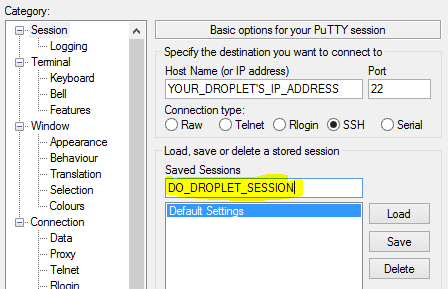
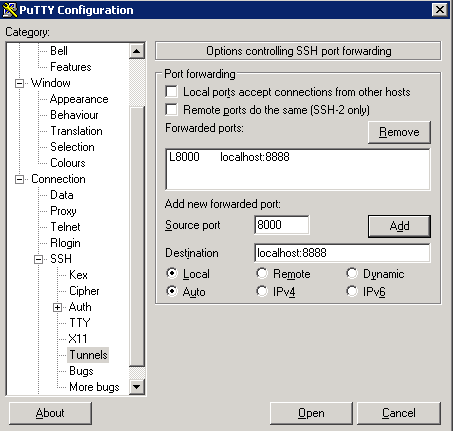

[toc]

### Server Config info

#### Enable firewall and open SSH port

    sudo ufw allow OpenSSH
    sudo ufw enable

#### Configure jupyter notebook on the server

How to install jupyter notebook on an Ubuntu 18.04 server and access it from another machine.

The Ubuntu server was built using [this](../python-ubuntu)

Begin by activating the virtual environment:

    source my_env/bin/activate

Now that you're in your virtual environment, go ahead and install Jupyter Notebook:

    python3 -m pip install jupyter

Look for a line similar to this for a successful install

    Successfully installed MarkupSafe....

Test the installation by running the Jupyter Notebook server, enter the following command:

    jupyter notebook

For now `CTRL-C` out of the jupyter notebook.

Set up the notebook config file so you can use a password for login

    jupyter notebook --generate-config

Now set a password

    jupyter notebook password

### Client config info

#### Configure your local machine to access the remote notebook

##### Linux

To access jupyter notebook from your desktop, set up an SSH tunnel on your desktop.

    ssh -L 8000:localhost:8888 ron@jupyter

where **8000** is the port on your desktop. Make sure that port is free.

This will log you on to the server. Now run the following commands to initialize the virtual environment and start the notebook server.

    source ~/environments/my_env/bin/activate

    jupyter notebook

Now open browser and go to http://localhost:8000

##### Windows

Create a new connection. First enter **jupyterphp** and port **22** for the HostName setup

 

Follow the next graphic and enter the **Source port** and **Destination** fields exactly as shown on the graphic.

Then click Open. This will popup a terminal asking for password. Log in as usual.

Once logged in, run:

    source ~/environments/my_env/bin/activate

 

Now run this:

    jupyter notebook

 

Leave the terminal as is. Open browser and go to:

    http://localhost:8000

Log on to jupyter with pw **nr**

### Use PHP in jupyter notebook

In jupyter, near top on the right is a dropdown that says New. Click it and select PHP.
